<h1>  Learn-Linux-Command-Line </h1>
As a developer we all need to know linux at some point in our career life.
And since I am a fresher in programming I thought why not give it a try and learn it for better understanding so that I can incorporate those learning in my projects and many more.

So for that I have taken a udemy course related to Linux, here is the link of the course just in case you are curious which course I am talking about here : [Link of the course](https://www.udemy.com/course/linux-mastery/) (not a affiliate link).<br>
This course is totally beginner friendly.

I have added all my learnings from the course here plus I have added extra things in every section which I found helpful and aren't part of this course.

Before starting you need Linux OS on your system, I am using **Ubuntu 22.04.02** (current latest LTS version of 2023), you can use different Linux distribution as per your choice.

You can dual boot your system in which you have windows and ubuntu installed side by side or if you do not want to dual boot your system then I recommend you to install vm(virtual machine) on your windows and run ubuntu on it, this way you do not need to worry about anything if things go wrong.<br>
Just look through any youtube video on how to install vm and ubuntu in it. After this you can start easily.

<div align="center">
<br>
</div>

# Index

- [Section 1 : Linux Terminal](#basics)

  - [Basics](#basics)
  - [Command Structure](#commandstructure)
  - [Manual Inside Terminal](#Manual)
  - [Command Input and Output](#command)
  - [Redirection of Input/Output](#redirection)
  - [Redirecting Standard Error and Output](#redirectionerror)
  - [Piping Fundamentals](#piping1)
  - [Piping : The "tee" Command](#piping2)
  - [Piping : The "xargs" Command](#piping3)
  - [Aliases](#alias)
  - [Assignment](#assignment)

- [Section 2 : Linux File System](#filesystem)

  - [Navigate the File System Part - 1](#navigate1)
  - [Navigate the File System Part - 2](#navigate2)
  - [Navigate the File System Part - 3](#navigate3)
  - [File Extensions in Linux](#extensions)
  - [Wildcards](#wildcard)
  - [Creating Files & Folders Part - 1](#cf1)
  - [Creating Files & Folders Part - 2](#cf2)
  - [Deleting Files & Folders Part - 1](#df1)
  - [Deleting Files & Folders Part - 2](#df2)
  - [Copying Files & Folders](#cff)
  - [Moving + Renaming Files & Folders](#mvrn)
  - [Editing Files using nano Command](#nano)
  - [The locate Command](#loc)
  - [The find Command](#find)
  - [Viewing Files](#view)
  - [Sorting Data](#sort)
  - [File Archiving + Compression](#arch)

- [Section 3 : Task Automation and Scheduling](#auto)

  - [Creating Bash Scripts](#script)
  - [Schedule Automation Using cron](#schedule)

- [Section 4 : Open Source Software](#opensource)
  - [History of Linux : The GNU Project](#gnu)
  - [Compiling Software from Open Source Code](#compile)
  - [Software Repositories](#repo)
  - [apt cache](#apt)
  - [Updating the cache & Upgrading Software](#updatecache)
  - [Install Software](#install-software)
  - [Uninstall Software](#uninstall-software)
- [Bonus commands](#bonus)

<hr>
<div align ="center">
<h2 id ="basics">Basics</h2>
</div>

Before learning new commands first we need to know how to open terminal.<br>
<br>
You might already know that.

One way is look through your all menus and find terminal.<br>
Second way is just hit windows key or cmd key and search "terminal" and open it.<br>
Now the last way is just hit <kbd><kbd>CTRL</kbd> + <kbd>ALT </kbd> + <kbd>T</kbd></kbd>

And of course you can change this shortcut in settings>keyboard.

Now lets start with basic command of terminal.

`echo` : After echo whatever comes that will be printed to the terminal.<br>


<br>

`ncal` : This command is used to show calendar in terminal<br>
Steps to install :

    1) Type "sudo apt -y install ncal"  in your terminal

    2) Press Enter

    3) Type in your password (nothing will show up, but its working [this is a security feature])

    4) Press Enter

Uses of ncal :

    1. By default ncal command behavior is to print current month (according to the system)

    2. We can print any year calendar by writing : ncal yearname
    e.g. ncal 2023
    OR
    We can change the command behavior another way : ncal -y
    e.g. ncal -y (This will print all the 12 months of current year)

**Later `ncal` is replaced by `cal`.But you can still use `ncal`.**

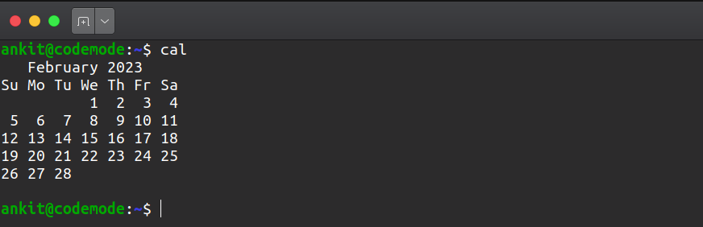

<br>

`date` : This command gives the current date ,month,year and time zone altogether in one single line.<br>
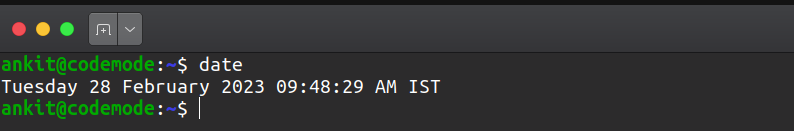<br>

We can clear the terminal screen by writing `clear` command in the terminal.<br>

> THE SHORTCUT KEY TO CLEAR THE TERMINAL IS : <kbd><kbd>CTRL</kbd>+<kbd>L</kbd></kbd> (_this shortcut not exactly clears your screen it just scrolled your screen to the top by shifting your previous content on the top, try it and you will get it what I mean_).

`history` : This commands gives us all the commands used so far in the terminal.

By default history capacity is set to store 1000 commands only after that all previous commands will not be stored.

<details>
<summary>If you want to change history capacity see this</summary>
<br>
For totally beginner this might be tricky. So it's up to you if you want to do it or not.

To make the history capacity infinite you need to change the values of variables HISTSIZE and HISTFILESIZE.

All you need to do is edit .bashrc file which is most likely will be present inside your home directory.<br>
Add these two lines at the last of .bashrc file

```bash
export HISTSIZE=-1
export HISTFILESIZE=-1
```

After that just restart the terminal and to check your changes use `echo` command

```bash
echo $HISTSIZE
echo $HISTFILESIZE
```

</details>

If you want to run anything again that you have typed previously and you find it inside the history then only thing you need to know is about the number (position) the command is showing.<br>
All you need to do it is : `!`NumericValue of the command that you want to run
Example,in the below image you can see `echo "Hello World"` is at 2002<br>
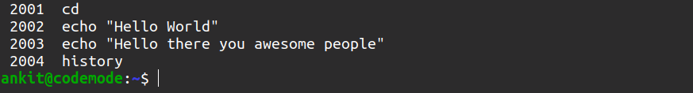<br>

Lets type `!2002`<br>
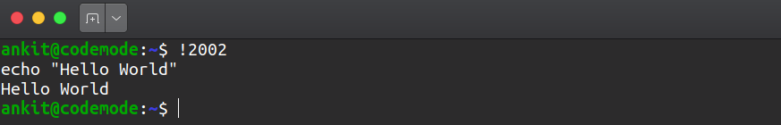<br>
In output, first line is the command and in the second line is the result of first line execution.

<br>

`!!` : This will run the most recent command.<br>
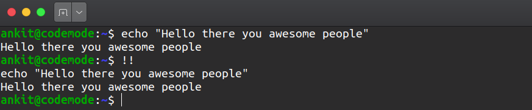<br>
As you can see in the top most line I used `echo` command and in the second execution I just used `!!` and this helps me to execute the most recent command .

`history -c; history -w` : This will clear the history.

<details>
<summary>
Breakdown of above command and explanation</summary>

<br>

The command `history -c` clears the command history list for the current shell session. This means that all previously entered commands will be erased and cannot be accessed again.

The command `history -w` writes the current command history list to the history file, which is usually located at ~/.bash_history. This allows the command history to be saved for future sessions, so that previously entered commands can be accessed and reused.

Together, the commands `history -c;history -w` first clears the command history list for the current shell session and then writes the current history list to the history file, effectively erasing the current history list and replacing it with a blank one.

</details>

Now as you can see I used `;` in the above command, it means that <q>Hey this command is ended here</q> and after that I can add another second command, there is no end of it, you can add as much as commands you want to run. The execution order will be **left to right**.

I can also write the above command in this way `history -c && history -w` too, it will work the same.

So always remember that whenever you wanted to use multiple command you can use either **`&&`** or **`;`**

`exit` : This will close the terminal.<br>
OR<br>
SHORTCUT KEY FOR exit : <kbd><kbd>CTRL</kbd>+<kbd>D</kbd></kbd>

<div align="right"><b><a href="#index">↥ Back To Top</a></b></div>

<hr>

<div align ="center">
<h2 id ="commandstructure">COMMAND STRUCTURES</h2>
</div>

<h3 align ="center">Command -Options Inputs</h3>

When we enter any command then shell search for that program on something called **SHELL'S PATH**, which is a list of folders which contains our programs

To print shell's all available path we use
`echo $PATH`<br>
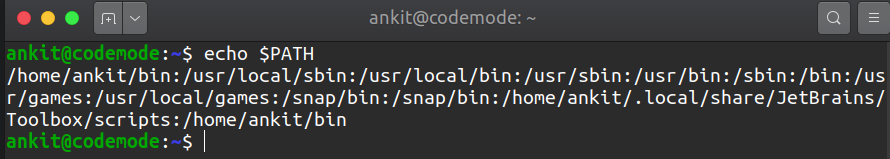<br>

Whenever we enter any command then our shell search those command from left to right folder(as you can see in the above line & every path is separated by `:`)

> NOTE : If we have a command which exist in two or more paths(or we can say folders) then in whichever folder shell find the command first that folder command will only run . Always keep that in mind.

`which` <q> _commandname that you want to search about_ </q>: If we want to know where a command is located .<br>
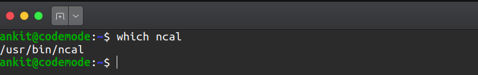<br>
This will show us where does ncal command exist. Using `which` command we can know any command location (we can only search those commands that are installed in our system).

<br>
<hr>

<h4 align ="center"><== OPTIONS ==></h4>

Using option we can customize the behavior of a command(Only if that is allowed in the command I think)<br>
e.g. `date` :This will give me my system current date and time according to my location.

We can get different time zone too<br>
`date -u` : This will show us date and time of UTC

There are two forms in options first is **short form** which we already saw in the above example and other is long form.<br>
e.g. `date --universal`

short forms denoted by single dash while long form denoted by double dash, long forms are more readable but using shortform is not bad if you already know what you are doing.

You can chain shortform together like date -abcdefg but not possible with longform.

Everything in linux is case sensitive.So date command will not work if we type like _DATE / Date_ etc.
Same goes with options e.g. **date -U** will not work.

Sometimes command don't need options <br>
like : `date` _(This will show the current date time of your system)_

Also we can give multiple inputs to an command(this may differ command to command)<br>
e.g. `cal 12 2023` : This will show the 2023 december calendar in the terminal.<br>
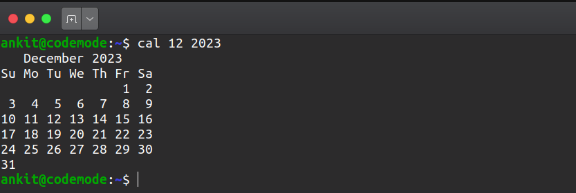<br>

<hr>

Commands also have their predefined inputs.<br>
For example, `ncal -A 1 12 2022` : So what we are conveying to the shell is : from Dec 2022 print next one month.<br>
This will show us two months as output on the terminal, first is Dec 2022 and other will be Jan 2023 .<br>
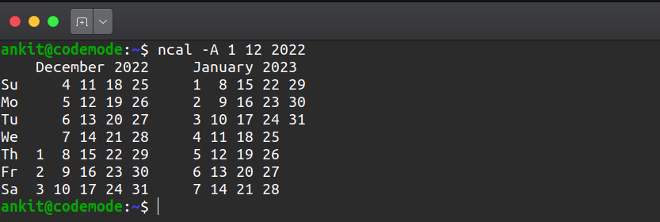<br>

- -A : means after month(this is predefined option by the command creator) <br>
- 1 is the input for -A it means after how many months from the current month need to be printed. Here "1" is variable it can be changed as per your requirements.
- Other is just 12 2022 which is month and year which is self-explanatory.

`ncal -B 2 12 2022` : This will show 3 months in total.<br>
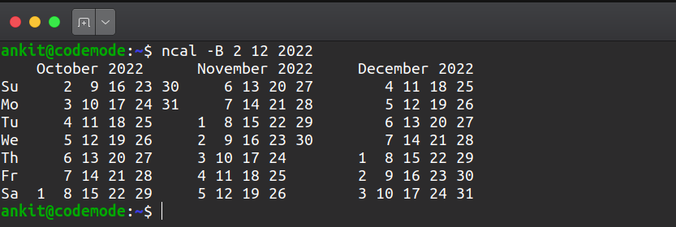<br>

- -B : means before month from the given current input month and year.
- 2 is input for -B, means before how many months from current month need to be printed. Here "2" is variable it can be changed as per your requirements.
- 12 2022 is self-explanatory.

You can see that whatever options `-A` or `-B` we are using shell's also print current month year .

<div align="right"><b><a href="#index">↥ Back To Top</a></b></div>

<hr>

<div align ="center">
<h2 id ="Manual">Manual INSIDE TERMINAL</h2>
</div>

Every command have its options and input to read them we use Manual.

Manual is divided into 8 sections.

```
1. User Commands: These are commands that can be executed by a regular user from the shell, without the need for administrative privileges.

2. System Calls: These are programming functions used to communicate with the low-level Linux kernel.
                 However, unless you are working on advanced tasks that require interaction with the operating system and hardware,
                 you may not need to use them frequently.

3. C Library Functions: These programming functions in the C language provide
                        interfaces to specific programming libraries.

4. Devices and Special Files: These are file system nodes that represent hardware or software devices.

5. File Formats and Conventions: This includes the structure and format of file types, as well as specific configuration files.

6. Games: This section covers the games available on the system.

7. Miscellaneous: This section provides overviews of miscellaneous topics such as protocols and filesystems.

8. System Administration Tools and Daemons: These are commands that require root or other administrative privileges to use,
                                            typically used for system administration tasks.

```

To search Manual pages for any command we use `man` command with `-k` option to search for the Manual pages related to the given command as input.<br>
e.g. `man -k date`
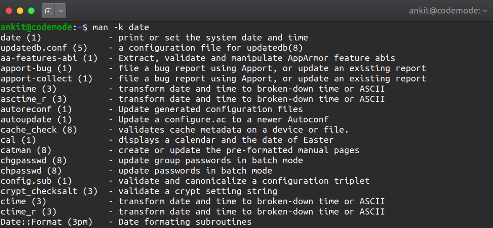<br>

We will get all the pages who contains "date" as a string/keyword.<br>
And each page will have a number in parenthesis which determine from which sections are those.<br>

We can check any section page by typing `man page_number command_name`(that is shown during using _-k_ option)<br>
e.g. `man 1 date`

Well since we mostly use section 1 i.e **User commands** we can write the above example in this way too.<br>
e.g. `man date` : This will generate the same result.

In Manual page if something inside brackets `[]` then that part is optional.

In Manual page if something inside angular brackets `<>` then that is MANDATORY.

In Manual page if any option is between pipe `|` then that means we can only use either this option or that option not both together.

If you come across a format like `{option 1|option 2}` in a manual page, it means that it is mandatory to use either option 1 or option 2. You cannot run your command without providing the required option(s) that are inside the curly braces. In other words, the curly braces `{}` signify that the options are required.

`...`(ellipses): this means multiple input is allowed.

<hr>

<q>_Anything written in double quotes will be taken as a single input inside terminal_ </q>

`man -k "list directory contents"` : This commands says list out all the available manual pages which contains this string => "list directory contents" .

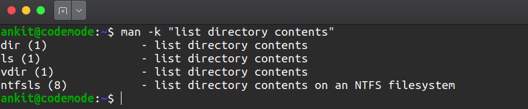<br>

Although we can find information on pretty much many commands with the help of `man` command .<br>

But we cannot get all of them. Some commands are defined directly in the shell and do not have man pages for them.<br>

For example one of them is `cd` command.<br>
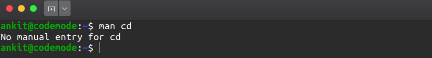<br>

So to find those commands information we need to use `--help` command instead of `man` command .<br>

To find information on cd command we will use `cd --help`<br>
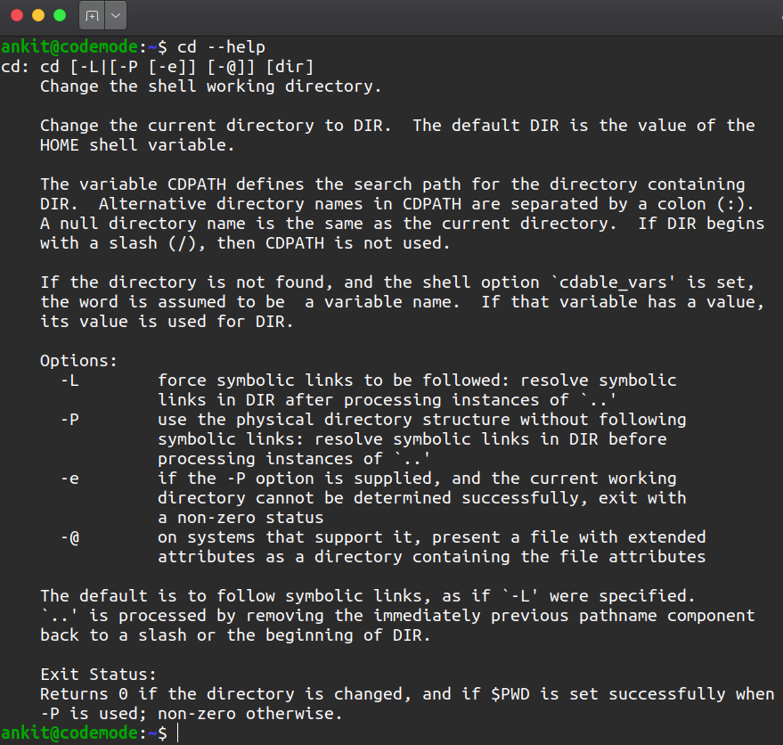<br>

So if `man` command don't work and you know your given command that you want to search about is correct then use `--help`.

<div align="right"><b><a href="#index">↥ Back To Top</a></b></div>

<hr>

<div align ="center">
<h2 id ="command">Command INPUT And OUTPUT</h2>
</div>

**Standard input**, **Standard output**, **Standard error**. These are data stream.

Data stream end bydefault is connected to our _terminal screen_ .

But one thing more is we can redirect these data stream wherever we like , like
**Standard error** is where all _error_ and _log messages_ goes.

**Standard error** and **Standard output** are separate _data streams_ but both results(end point) are connected to our terminal(our output screen).<br>
and since both are data stream it can be redirected anywhere we like.

There are two ways to get input : one is **Standard Input** second is **Command Arguments**.

**Standard Input** is a data stream which is by default connected to _keyboard_.<br>
And since Standard Input is a data stream we can redirect it too.That means we can tell a command from where it should read data.

For this example we can use `cat` command (use `man cat` to read the Manual page of cat command).

If we do not use options and filename (which both are optional by the way (in `cat` command case))

and if we directly write <br>
`cat` _press_ <kbd>↩️Enter</kbd> <br>
Then _cat_ command will start reading input from the _keyboard_ and since the output data stream is connected to the _terminal screen_.<br>
So whatever we will write it will directly show to our terminal screen.

Which sometimes lead to some confusion as a beginner that if the command is working or not.

E.g.<br>
`cat` _(press Enter)_ (now cat will read input from keyboard)

```
Hello(press Enter)
Hello(OUTPUT)
HEY(Input then press Enter)
HEY(OUTPUT)
```

This process will keep going to stop this press <kbd> <kbd>CTRL</kbd>+<kbd>Z</kbd></kbd> (this may differ in your case try <kbd><kbd>CTRL</kbd>+ <kbd>C</kbd></kbd> if previous command don't work)
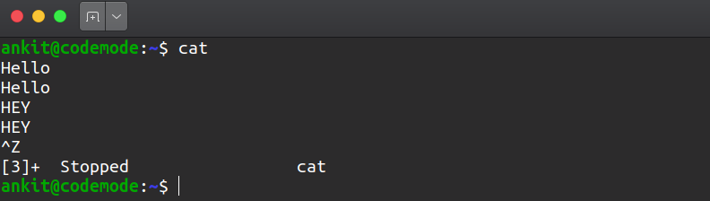<br>
As you can see whatever we will write and then _press enter_ it will directly show to us on the terminal on the very next line this was the confusion part that I was talking about.

Now because _standard input_ is a data stream, it can be redirected as well that means we can tell a command where it should read data from.

Now this could be a file where we already have some pre configured input or more powerfully it could be ANOTHER DATA STREAM.

This ability for data streams to connect together makes them so powerful, you can simply pass the standard output stream from one command to the standard input stream of another,<br> then pass
the standard output stream of that second command to the standard input stream of the third command
and so on until you build up a very powerful **pipeline**.

Now, connecting outputs to inputs in this way is known as piping together commands and is an incredibly
important concept in Linux as it's what makes working with the command line so powerful and effective.

Now, the difference between **command line arguments** and **data streams** is that : data streams can flow,
they can be redirected and piped together.<br>
Command line arguments only associate with the command or option that they're dealing with at the moment.

And still, there is one other key difference to keep in mind and that is : not all commands accept
standard input.<br>
e.g. the `echo` Command doesn't accept _standard input_.

But pretty much every command can accept command line arguments.

And if you want to know whether a command can actually accept standard input, just check its _Manual page_.
And if it's not there, just assume that it can't have standard input.

<div align="right"><b><a href="#index">↥ Back To Top</a></b></div>

<hr>

<div align ="center">
<h2 id ="redirection">REDIRECTION OF INPUT/OUTPUT</h2>
</div>

Now, piping and redirection allow us to create sophisticated command pipelines and move data around
our computer system with such unbelievable ease and flexibility that it's basically a super power.

So what if I wanted to change where the standard output goes instead of having it come to the terminal ?
In other words, how can I redirect standard output ?

To do that, I would use a special symbol `>`

Lets suppose we want to store our output in a file called "output.txt"

To do that we will write like this : `cat 1> output.txt` _(press Enter)_<br>

Then write whatever you like and when you enter you will see the output is not showing on the terminal anymore,that means ?<br>
Our output stream is changed(After that Press _CTRL + Z_ OR _CTRL + C_ after this the file will be saved automatically) .

You can open your file to see the changes.

But but there is a catch my friend when we will use : `cat 1> output.txt` again whatever was written will be erased by the shell
first before writing anything new
and the fancy word for that is called "**_truncation_**".

To avoid this erase we will use `>>` .

e.g. `cat 1>> output.txt` <br>
Now whatever was written previously will not be erased by the shell and now we can write whatever we want without worry of data loss.

<br>

```
-> 0 is for Standard Input
-> 1 is for Standard Output
-> 2 is for Standard Error
```

Standard Input is by default so we can avoid using "**1**" .
We can write like this too : `cat > output.txt` And `cat >> output.txt`

Spacing is allowed after using `>` but you cannot write `cat 1 > output.txt` ❌ like this at all shell cannot interpret this.

`cat >output.txt` AND `cat >>output.txt` (this is allowed ,space is not MANDATORY after using 1>>/1> ).

`1>` and `1>>` writing like this is compulsory (ofcourse you can avoid using "1" because "1" is bydefault behavior every command so we can avoid using "1" if we want).

Summary :

> 1. Data Streams have numbers associated with them.
> 2. Be careful while truncating.

<div align="right"><b><a href="#index">↥ Back To Top</a></b></div>

<hr>

<div align ="center">
<h2 id ="redirectionerror">Redirecting Standard Error and Standard Output</h2>
</div>

Lets begin with a example

`cat 2>> error.txt` : this will write all the error that was going to show on the terminal but because we have changed the output stream all the errors will be written in this **error.txt** file.

And also since we do not want our previous data to be erased by the shell before writing new data we will use `>>`

> 2 is for Standard Error output stream.

`cat` command don't have -k option so we write
`cat -k hey`

```
cat: invalid option -- 'k'
Try 'cat --help' for more information.
```

This is the error we will got . Since Standard Error output stream is connected to our terminal the output is shown to us on terminal.

So if we want to redirect this error into a file we will do like this<br>
`cat -k hey 2>> error.txt` <br>
Now what will happen is all the error that we will got in this case it will be stored inside **error.txt** file.

A common use for this kind is for redirecting standard error is to keep track of log messages coming from web servers and things like that.

And since we don't want to lost our previous errors entry in our file we will use `2>>` instead of `2>`

We can also redirect Standard Error and Standard Output at the same time.

For example , `cat 1>>output.txt 2>>error.txt`

Or we can avoid '1' `cat >>output.txt 2>>error.txt`

'2' cannot be avoided because there is no shortcut like that.

**Read input from a file**

To read input from a file we just need to write : `cat 0< filename`

For example, suppose you have a file name called "Input.txt" now to read this file by using `cat` command.<br>
We write like this : `cat 0< Input.txt` (press Enter) and whatever is written inside the file will be shown to our terminal screen <br>because we know output data stream is by default connected to terminal screen.

Since there is only way to take input data stream we can avoid using '0' if we want.

`cat < Input.txt` : This way of writing is fine too.

**Exercise time**

> You need to read input from one file lets call it "Input.txt" and whatever is written inside this txt file you will have to write that in another file we can call it "Output.txt" .<br>
> Means you need to read input from Input.txt and then whatever is written inside this file you have write that in output.txt make sure Output.txt previous data is not erased.

<details>
<summary>Solution</summary>
<code>cat 0< Input.txt 1>> Output.txt</code>
</details>


Everything in Linux is actually treated as a file, even terminals.

So what we do is we will read input from one file and output that file content into another terminal. Sound interesting right <br>

So what we first do is we will create an **Input.txt** file with content "Hello there you Awesome people!"

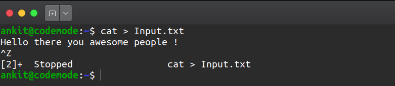<br>
( _Also same thing can be achieved via `echo` command like this : `echo "Hello there you awesome people !" > Input.txt`_ )

Now we will open another terminal (you can use shortcut <kbd><kbd>CTRL</kbd>+ <kbd>ALT</kbd>+<kbd>T</kbd></kbd> and also you can customize this shortcut in setting of keyboard shortcuts too).

In our new terminal we will write : `tty`<br>
This command will actually tell us where this terminal is located on the file system.

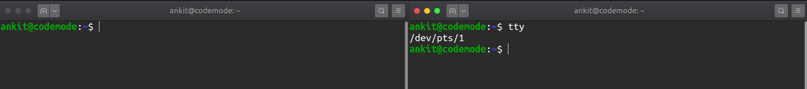<br>

So in my case the output is
`/dev/pts/1`

> If you want more info related to 'tty' you can use `man tty`

now in your previous terminal type : `cat < Input.txt >/dev/pts/1` <br>
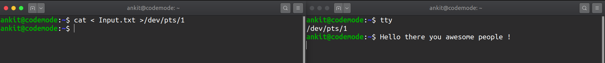<br>

And BOOM you get your output in your different terminal which was opened by you.

> Remember, to do the above practice you need to open more than one terminal at the same time .

**If you add any filename after cat then bydefault cat will read it as a input<br>
`cat Input.txt` this will give the same output as `cat < Input.txt` command will give.**

So if we take our previous activity of redirecting the flow of output stream in another terminal.<br>
We can write in this way too : `cat Input.txt >/dev/pts/1`

<br>
<b><u>Useful Resources Link</u></b>
<ul> 
<li><a href="http://mywiki.wooledge.org/BashGuide/InputAndOutput?#Redirection">Excellent Blog Post about Redirection</a></li>
<li><a href="https://www.gnu.org/software/bash/manual/html_node/Redirections.html"> Redirection in the Official GNU Manual</a>
</li>
</ul>

<div align="right"><b><a href="#index">↥ Back To Top</a></b></div>

<hr>

<div align ="center" id ="piping1">
<h2>Piping Fundamentals</h2>
<h3></h3>
</div>

If you want to connect the standard output of one command to another standard input of one command, then to accomplish this goal we use : **Piping**

Each Linux command is designed to do one task extremely well.

So if you can continually pipe these highly specialized commands together and pass data between them you can build advanced pipelines to do pretty much any task that you can think of.


> Piping is all about taking the standard output of one command and connecting it to the standard input
> of another command.

Lets start with a example.<br>
As we know if we type `date` (press Enter) <br>
then our terminal return us output like this :`Sunday 12 February 2023 07:32:16 PM IST`

And if we want to store this output in a file ,lets call it **date.txt**<br>
then we need to write in this way : `date >date.txt` (remember 1 is optional in output stream case).

Now suppose `Sunday 12 February 2023 07:32:16 PM IST` if we want cut this "Sunday" part and output it on the terminal screen what will you do ?<br>
Well to achieve that we will use `cut` command.

First let's read input from the **date.txt** file and we will cut the _Sunday_ part from it.<br>
`cut <date.txt --delimiter " " --fields 1`<br>
Or<br>
`cut <date.txt --delimiter " " --fields "1"`<br>
Output on the screen : `Sunday`

_delimiter_ and _fields_ are options of `cut` command and it can have multiple options and file name(you can read Manual page of cut command : `man cut`)

fields means column and to find out how each column is divided we will use delimiter , in above command you can see `--delimeter " "` means each column is divided by a space. `--fields "1"` means we want first column .

If we write like this : `cut <date.txt --delimiter " " --fields "2"`<br>
The output will be : `12`<br>
Since in `Sunday 12 February 2023 07:32:16 PM IST` "12" is the second column

One thing more if we are using longform(if you already read previous sections then I think you already what I am talking about) then we can use "=" with options like this :
`cut <date.txt --delimiter=" " --fields="1"`

> NOTE : But as far as I know not every command options allow using "=" with them. You can allows find out by reading Manual pages of the command.

By the way you can store the output of the `cut` command too.
`cut <date.txt --delimiter=" " --fields="1" >today.txt`

and yes position of filename doesn't matter.<br>
So yeah you can write in this way:<br>
`cut <date.txt --delimiter=" " >today.txt --fields="1" `<br>
Or this way<br>
`cut <date.txt >today.txt --delimiter=" "  --fields="1" `<br>
Or even in this way<br>
`cut  >today.txt <date.txt --delimiter=" "  --fields="1" `<br>
And to be honest I was amazed by the last one.

So yeah don't worry about filename position too much , for more readability we just use traditional way that's all.

Now comes the Second part : What if I want to take data directly from `date` command and pass it to the `cut` command and then give output on the screen.<br>
We will use `|` to pipe this process

`date | cut --delimiter " " --fields "1"`

`date` command will pass the output to the `cut` command and then as we know by default all output data stream are connected to our terminal screen.

And we can also pass this output of `cut` command to input of another command by using `|`

But we cannot store the output in a file and at the same time pass it to another command .<br>
What I mean is this : `date >date.txt| cut --delimiter " " --fields "1"` and then press Enter ,we will see no output.<br>
Because `date` command put the output inside _date.txt_ file so `cut` command didn't get any input from `date` command in the first place.

We cannot have multiple output data streams at the same time.<br>
So is there no way to do that ?
We will see that in next section.

<div align="right"><b><a href="#index">↥ Back To Top</a></b></div>

<hr>

<div align ="center" id ="piping2">
<h2>Piping :The "tee" Command</h2>
<h3></h3>
</div>

<div align ="center">

</div>

For better understanding of above image lets take an example.

Suppose if we want to store output of the `date` command and simultaneously passed the output of the `date` command into `cut` command. Then to achieve that we incorporate `tee` in our piping.

`date | tee fulldate.txt | cut --delimeter " " --fields 1`<br>
`date`will pass the data to the `cut` command and at the same time `tee` will take the snapshot(data/result/output given by `date` command) of the date command and will be stored inside the file called **fulldate.txt**.

Whenever we want to store the data of one command and at the same pass it as the input to other command we can use `tee` <br>
it will pass the data in the pipeline while also save your output inside your desired file too.

But suppose if we store the output of `cut` command into file **today.txt** in this way:<br>
`date | tee fulldate.txt | cut --delimeter " " --fields 1 >today.txt` <br>
then we cannot do piping further because our output stream is changed and also we didn't use the `tee` to make it further possible.

So another way of saying that is that once we have done redirection, we can't do any more piping.

So once you've redirected standard output like we have here in the _today.txt_, we can no longer do any
more piping down down the pipeline.

<div align="right"><b><a href="#index">↥ Back To Top</a></b></div>

<hr>

<div align ="center" id ="piping3">
<h2>Piping :The "xargs" Command</h2>
<h3></h3>
</div>

Now all commands don't accept **standard input** some only accepts _command line arguments_ so in this case piping would not be possible if we are redirecting our standard output into a command which don't accept **standard input** at all .

For example, `echo` command only accepts **command line arguments**

So if we try to pass our `date` command output into `echo` command like this `date | echo` it will not give error but output of `date` was not passed in this case. We will get nothing as output in this case.

So to make things possible and keep our pipeline going we will **`xargs`** . This works as a convertor you can say , a fix or a cover whatever you like. I see it as a convertor which converts **standard output** into **command line arguments**.

**`date | xargs echo`** _(press Enter)_

> Monday 13 February 2023 06:45:16 PM IST<br>

Tada we got our output✨.

So whenever we want to use a command which only accepts command line arguments and we want to use it in our pipeline then we can rely on **`xargs`**.

Now what if I write like this : `date | echo "hello"` what do you think about the output of this .<br>
`Monday 13 February 2023 07:04:13 PM IST hello` If you thought the output will be like this then you are wrong(I was in the same boat too).

The actual output will got from `date | echo "hello"` command is this
`hello Monday 13 February 2023 07:04:13 PM IST`.

You you can say that the `echo` prioritize his command line argument first and after executing the "_hello_" then it only takes the input from `date` which further converted by `xargs`. And this rule is same for every command.

Now comes a interesting part after this : Suppose you want to delete multiple files and yeah you can easily do this in GUI mode right ?

But what about in terminal means how can you remove multiple files only with the help of command line ?<br>
One way is by using `rm` command.

How to use `rm` command ?<br>
You just need to write `rm filename` and you are done and yeah `rm` accepts multiple filenames so you can easily delete multiple files.

But what if I say you can write all the files you want to delete in a single file and then pass it to the `rm` not a big thing but very interesting stuff right ? Because we haven't seen anything like this before(I never saw it as a beginner so I find it fascinating).

What you need to do is just write the files you want to delete and then read it with the help of `cat` command and then pass the output into the `rm` command but ,remember one thing, `rm` accepts only _command line arguments_ so we will use `xargs` too.

Lets understand this with an example.

I will create two file first where I will store `date` command output with name **fulldate.txt** and I will make second file where I will store the `cut` command output with name **today.txt**.

Of course we will do this with the help of piping .<br>
So here we go :<br>
**Step 1.**<br>
`date |tee fulldate.txt|cut --delimiter " " --fields 1 >today.txt`

**fulldate.txt** and **today.txt** file is created.

**Step 2.**<br>
Now I will create a file called **delete.txt** _(just a random name you can use whatever you like)_ where I will store the name of these both file.

I will do that in command line because I feel it is faster to do that in command line as compared to do that in GUI mode.

`cat >delete.txt` _(press Enter)_<br>
`fulldate.txt` _(press Enter)_<br>
`today.txt` _(press Enter)_<br>
(now press CTRL + Z or CTRL + C whichever works for you)<br>
File is saved and now we will move to next step which is passing this **delete.txt** file into `rm`.

**Step 3.**<br>
We will first read the file with the help of `cat` command then pass it to the `rm` command and we will use `xargs` because `rm` only accepts **command line arguments**.

`cat <delete.txt | xargs rm` (press Enter) and BOOM! you are done.

That's all for this section.

<div align="right"><b><a href="#index">↥ Back To Top</a></b></div>

<hr>

<div align ="center" id ="alias">
<h2>Aliases</h2>
<h3></h3>
</div>

Now, aliases are basically little nicknames for your commands or for your command pipelines that make
them a lot easier to remember.

So the first thing you need to do to start creating your own command aliases is to create a special
file called **Bash Aliases** in your home folder.

You can create this file via GUI mode . Let me walk you through that.

First go to your **show application** section , another way is just press windows key and search🔍️ _text editor_.<br>
Like this and you will see the text editor.

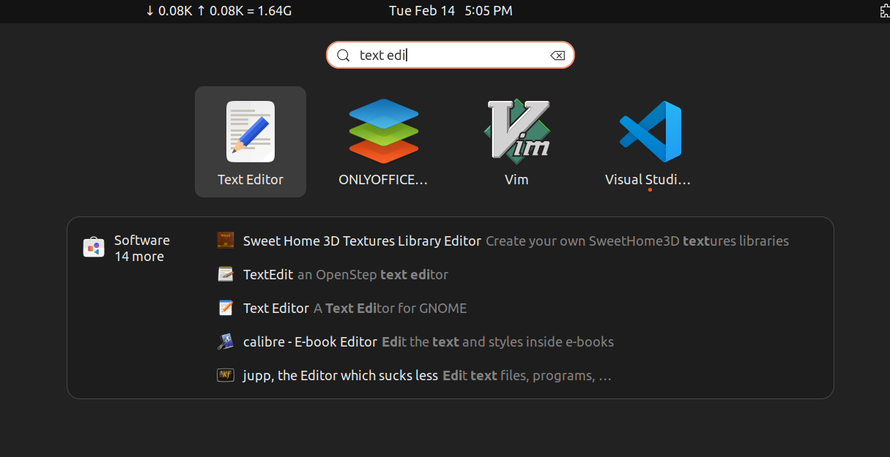

Open the text editor.

Then hit the **Save** option

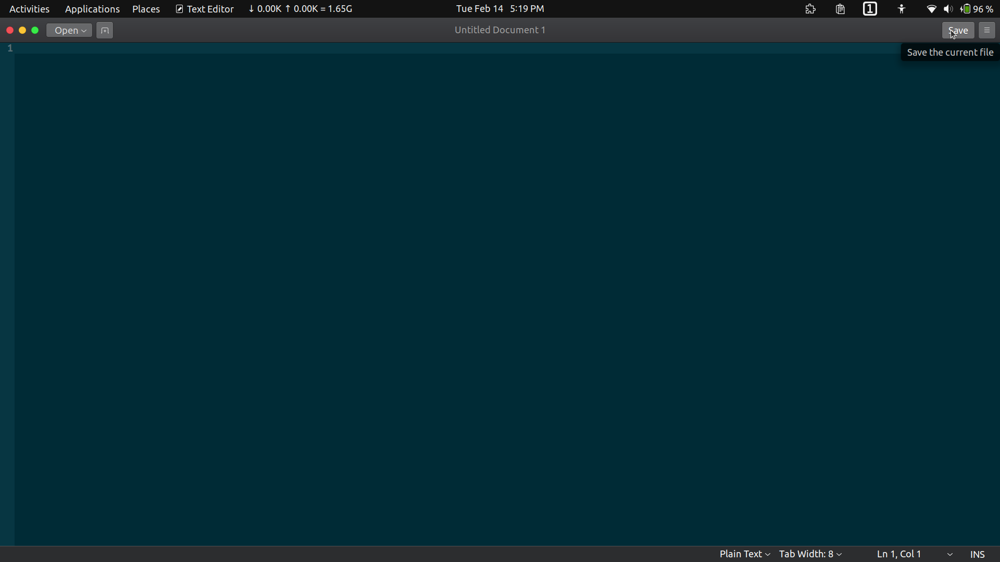

Rename the file as **.bash_aliases**

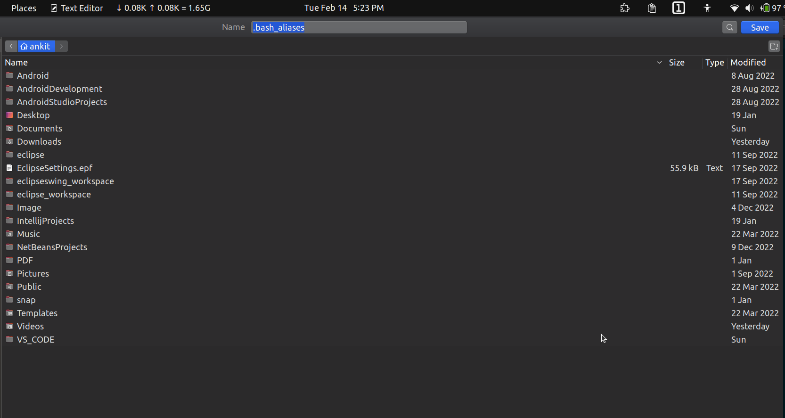

write the same name as it is and then save it at your home directory.

If you are new you may think why "**.**" is used before the _bash_aliases_ well this makes our bash file hidden

and if we don't add dot (we also call it 'period') in the starting of our _bash_aliases_ file then our aliases don't work at all (I already tested it on my Ubuntu 22.04.1 LTS version).

You can try this with any file or folder too just rename the folder and add "." in the starting of the folder name and when you enter you will see your file is gone. But you can easily see them.

Just go to the right most upper corner and click on the three lines and click the "Show Hidden Files" option.

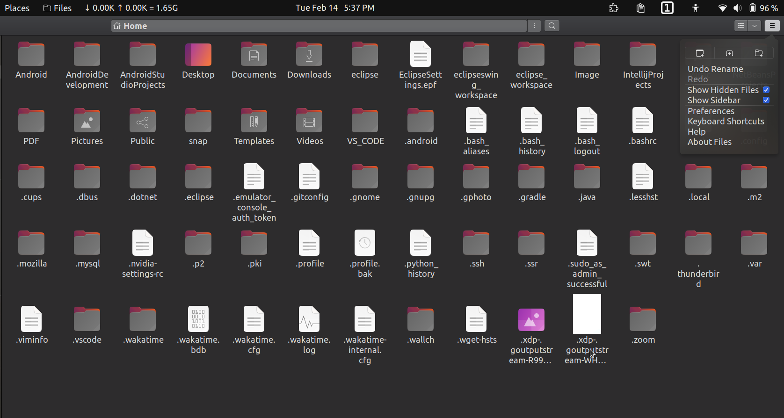

> There is also shortcut key for this just press CTRL + H.

And in second row you can see .bash_aliases which I created.

Now we can add all our aliases inside this bash file.

Lets create a pipeline using `date` and `cut` command and at the same time saving the output in the file and also passing the output with the help of `tee` command to `echo` command.

`date | tee fulldate.txt | cut --delimiter=" " --fields=1 | tee today.txt | xargs echo "hello"`

Now to make the above pipeline into aliases we need to follow a predefined format that is

**alias aliasName = 'your pipeline inside single quotes'**

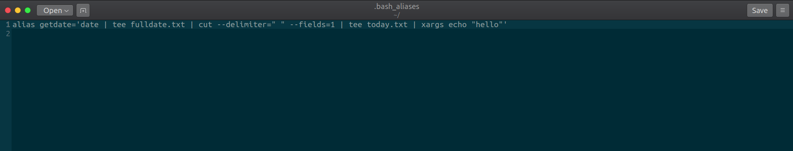

To run your very first alias all you need to do is save the file and go to the terminal and just type **getdate**

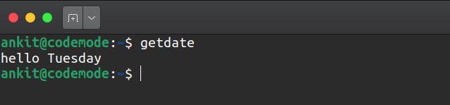

And also you can check in your home folder two file **fulldate.txt** and **today.txt** file will be created .

One thing you can also do is you can also define the path where you want to save your files.
Since our bash file was in home folder so `tee` command directly created the files on home folder and you can always change this behavior.

Let me show you how.


All you need to write the path of your folder where you want to save your file created by `tee` command.

> Always write your path name correct.

Lets make another alias where we will print one month after and one month before plus current month calendar with the help of `cal` command and also we will store the output into calendar.txt inside home folder.

Lets do one thing more lets now pipe the aliases technically we are just doing piping but using aliases so that we don't have to write it again and again.

After storing the calendar we will pass it to our another alias which will be using `echo` command

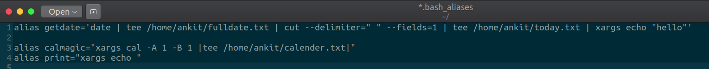

Since `cal` command don't accept standard input so we will use `xargs` in the starting to provide command line arguments.

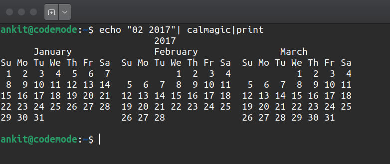

One important point that you always need to be careful about is **alias format**.<br>
**alias aliasName=`your pipeline inside single quotes`**<br>
Space is not allowed between aliasname of your alias and "=".

Means you cannot write like this : **alias print = "xargs echo"** this will throw error when you open your terminal. So always bear in mind that your alias format is always correct.

And yes you can use double quotes or single quotes whichever you like.

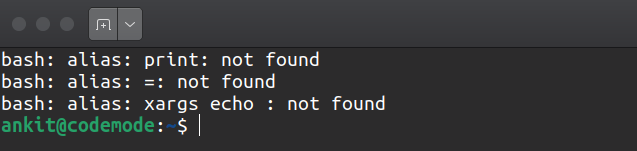

That's all for this section.

<div align="right"><b><a href="#index">↥ Back To Top</a></b></div>

<hr>

<div align ="center">
<h2 id ="assignment">Assignment</h2>
</div>

<br>

> This assignment was given by the instructor of the udemy course.

#### Task 1 :

In this task you are asked to use the ls command to list out all of the contents in
your `/etc` and your `/run` folders.

First, deal with the `/etc` folder. Use the ls command to list it's contents and redirect those
contents to a file called

Do the same for the /run folder but redirect the content to a file called **file2.txt** instead.

There should be 2 commands required to complete this.

> Hint: ls /foo will list the contents in the /foo directory.

#### Task 2

Once you have **file1.txt**
and **file2.txt** created, it is time to complete task 2 of the
assignment!

In Task 2, you are asked to use the cat command to combine together
(i.e. concatenate) _file1.txt_
and _file2.txt_ into another file called **unsorted.txt**.

But, in the same pipeline you are also asked to also use the `sort` command with the `r` option (take the help of `man` command)
to to reverse the output from the cat command and redirect that reversed output to another file
called **reversed.txt**.

Task 2 should all be completed in one pipeline.
Note: Solutions using the `tac` command (reverse of the `cat` command) will not be valid.

> Hint: Take a look at the `tee` command

Try from your side first then see the solution.

<details><summary>Solution</summary>
Task 1 :

```
ls /etc >file1.txt<br>
ls /run >file2.txt<br>
```

Task 2 :

```
cat file1.txt file2.txt |tee unsorted.txt | sort -r  >reversed.txt
```

</details>
<div align="right"><b><a href="#index">↥ Back To Top</a></b></div>

<hr>

<h1 id="filesystem">Section 2 : Linux File System</h1>

<br>

<div align ="center">
<h2 id ="navigate1">Navigate File System - I</h2>
</div>

Navigating in file system through GUI is quite normal for everyone but navigating in file system through terminal quite look fancy (as a beginner that is true for me).

Now, the first thing we'd like to know when navigating the file system is where we currently are and shell already tell us this.

So lets get into it and try to understand few things more before deep dive into navigating into file system.

Whenever we hit the terminal to open it up , the first thing it shows us the is the shell prompt(everything upto $ sign is shell prompt). <br>
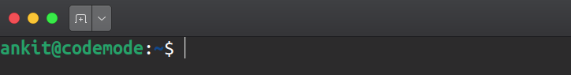

First of all, it tells you the user of who is logged in, in my case as you can see in `ankit@codemode:~$` is **ankit** which logged on this computer after **`@`** is the machine name which is **codemode** in my case (the name , yeah I know it is too much I know). After colon **`:`** we have squiggle sign **`~`** which is called **tilde** .

Now in the bash shell, which is the shell that we're currently using, that tilde is
a short way of representing the **current user's home directory**.

So whenever you see that, Tilde, it just means the path to the current
user's home directory.

So our shell prompt is basically telling us that we are in the home directory for the current user,
which we can tell is ankit (that's me).

So we can actually confirm at any time what directory or at what location our shell is currently operating in by using `pwd` command.

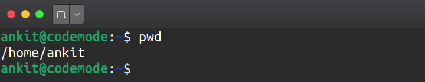

`pwd` stands for print current/working directory

Now `/` is the starting of base folder (which is the base area for our system) inside that root folder there is `home` folder ,inside which we have current user folder `ankit` .

Since the path start from very `/` slash sign(which is a base folder for our whole system) this whole path is called **absolute path**.

In GUI we can see all the folder of the current directory where we are , to do that inside terminal we will use `ls` command.<br>
It will list out all the files and folders of the current directory where we are right now.


In `ls` command bydefault blue color indicates it is a folder.

<br>

Now to figure out which is file or folder there is also an option inside `ls` which is `-F` option which means classify.

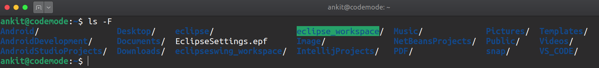

Every folder have `/` sign after its name on the otherhand ,file don't have it, this also help to classify between file and folders.

<br>

We can also list out any folder contents(files and other folders that its contain) without changing our current directory.
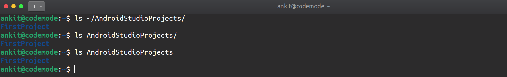

All the above ways work perfectly fine.<br>
First may look suspicious to you.

Well since we know `~` is short form of : current user home directory.<br>
So we can use tilde to reach our destination. You can see as just short form of `/home/username`

And others works perfectly fine because in the current user home directory these folders are present and our shell is in the same location so just writing the folder name is more than enough(but only possible with current location). And last 3 ways are called **relative path**.

There is many options in `ls` you can read them with the help of `man` command.

<br>

`ls` also have the power to list out all your hidden files(files whose name started with ".").
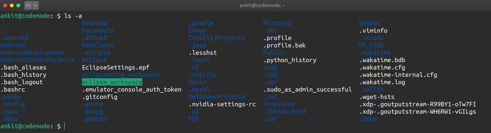

<br>

Now if we use `ls -l` it will list out the file and folder in list format.
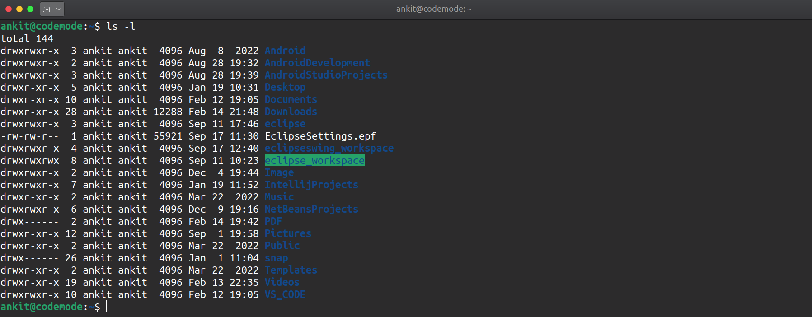

`drwxrwxr-x  3 ankit ankit  4096 Aug  8  2022 Android` <br>
`d` means directory, after that we are seeing file permissions ,rwx means : read, write, execute<br>
This part is divided into 3 parts first is **user**, second is **group**, third is **everyone**.

`rwxrwxr-x` for Android folder user have rwx access, for groups rwx, for everyone its only r-x means read and execute.

Here first 'ankit' means the file belong to which user, the second 'ankit' means the file belong to which group, inshort the first column was for user name , second column for group name.

**4096** is file size **Aug 8 2022** is the date when file is created or last edited.

To make the **4096** more readable we will use `ls -lh`(we know already that we can concatenate shortform together).<br>
`-h` means human readable (long form : `--human-readable`)

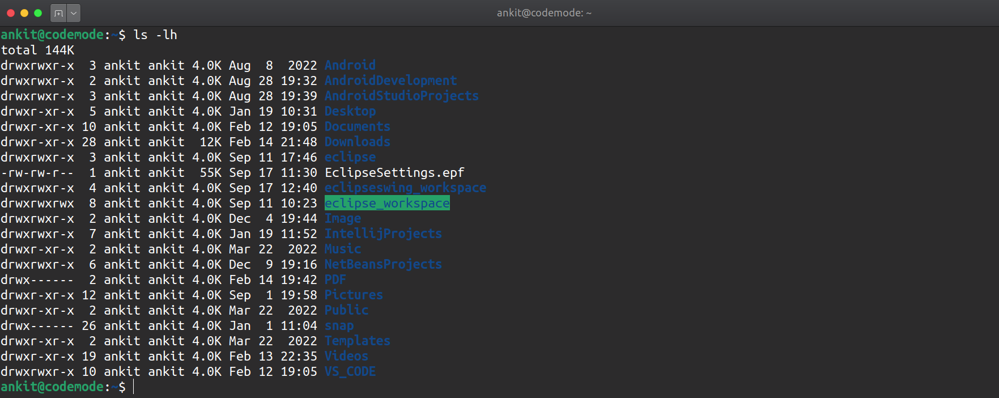

<br>

<div align="right"><b><a href="#index">↥ Back To Top</a></b></div>

<hr>

<div align ="center">
<h2 id ="navigate2">Navigate File System - II</h2>
</div>

To move around in our directories inside terminal we use `cd` command which stands for **change directory**.

So one way to move to different folders is by using _absolute path_ .
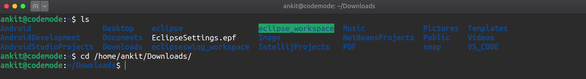

<br>

And second way is _relative paths_.
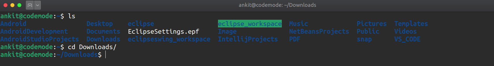

After entering inside the downloads folder can you see the blue text **~/Downloads** this shows us where we are currently are and as we know tilde(\~) sign means home directory then you can easily get it that this **~/Downloads** is your current location that shell is showing it to you.

You can use `pwd` to see the whole path.

The `.` folder means current folder we are in.<br>
And `..` means the parent folder or the folder above where we currently
Since we are in home directory of the user we can directly access the file so why hassle to use absolute path right ? This is same as using GUI mode when you are in home directory you are just one click away to get inside the folder you want from the options that are available in front of you(I am talking about GUI example you can also imagine this by using `ls` command).

So now the question is how will you get back from your current folder.

We will use `cd ..` this command work as just like you hit a back button inside a folder and now you are one folder back(Or I can say you are on the upper folder which we can also call Parent directory).
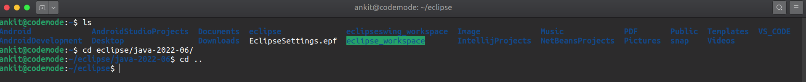

<br>

Now what if you want to go to the home directory irrespective of in which directory you are currently in, for that we will use `cd` only.
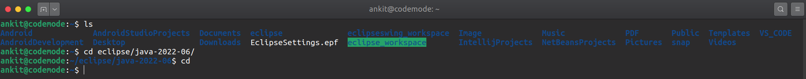

<br>

Now as you can see in our current directory except `eclipse` folder there is two more folders `.` and `..`
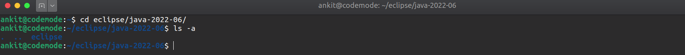
And these both two hidden folders exist in every folder.

These both are shortcut that allow you to move around easier.

The `.` refer current folder we are in. <br>
And `..` refer to the parent folder or the folder above from where we currently are.<br>
So whenever we hit `cd ..` command we just went back to the parent folder.
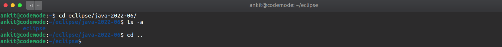

<br>

So now if we keep going back
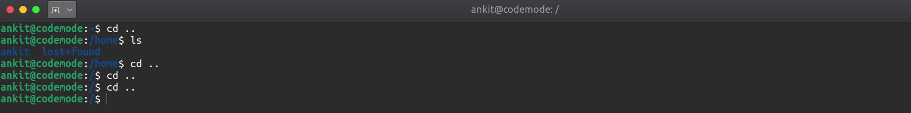
At the end we cannot go beyond the base folder `/` . That's the base folder for our whole system.

So to move around in the system through all you need three commands `cd` , `ls` ,`pwd`.

<div align="right"><b><a href="#index">↥ Back To Top</a></b></div>

<hr>

<div align ="center">
<h2 id ="navigate3">Navigate File System - III</h2>
</div>

Now the last and small part of this is "**tab completion**" and it's very useful.

Suppose we want to use absolute path but there may be chances that you may misspelled a letter or folder name etc.<br>
Now tab completion quite useful in this case.

I will just show you a example. For this I will be in base folder and will go into Downloads folder and for that we will use absolute path.

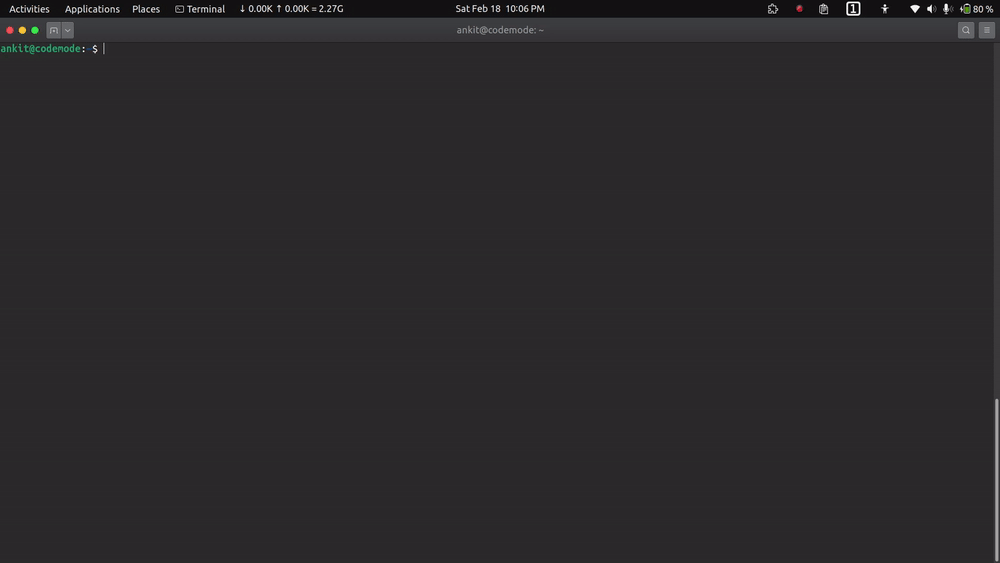

I just write the half name and then hit the **tab** button and shell autocompleted the most matching file/folder name with my given input and as you see when I write **_/home/ankit/Do_** the **tab** did not work because there is two folders Documents and Downloads both starting two words are same that's why it was a conflict .

Now whenever this type of file name conflict happen just hit **double tab** and all the possible matches will be shown by terminal and then you can easily find out what next words do you need to add and then hit **tab** for autocompletion.

That's all for this section.

<div align="right"><b><a href="#index">↥ Back To Top</a></b></div>

<hr>

<div align ="center">
<h2 id ="extensions">File Extensions in Linux</h2>
</div>

Now on operating systems such as **Windows** file extensions allow you to tell what type of file that you're dealing with at a glance.

For example, we know that files with names ending with **txt** are text files and files with names ending
with JPG or PNG are likely to be images.

But in **Linux**, file extensions usually don't matter and the
system tends to look at the contents of the file rather than just its name.

But sometimes file extensions really do matter.

Now to know what type of file we are actually dealing with we will use `file` command.

Now as you can see on my desktop I have right now three files.
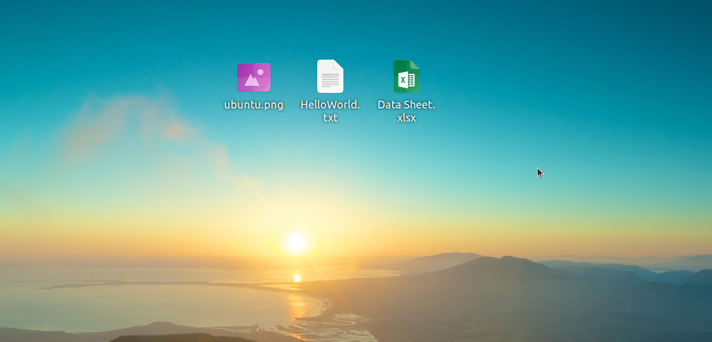

<br>

Now let's run `file` command to read these files .
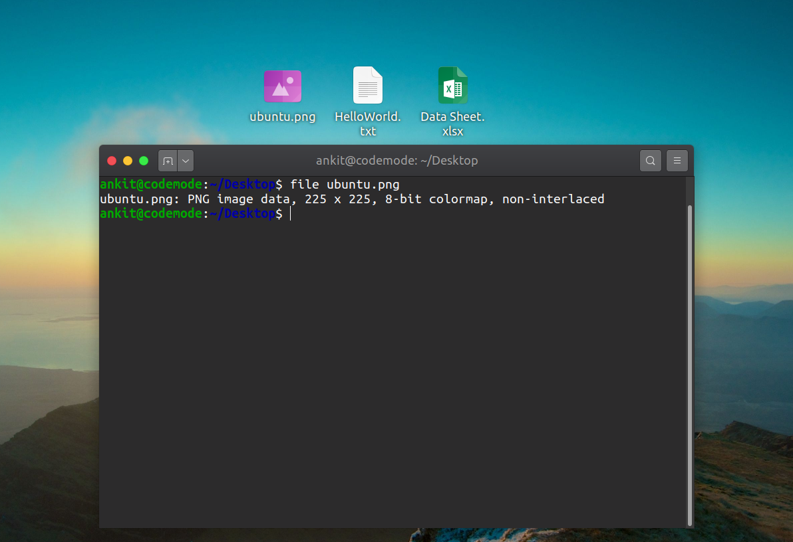

As you can see we get the information related to our _ubuntu.png_ image i.e it is a PNG image.<br>

But now what if I change it to _jpg_ will the output of the terminal will be changed ?🤔<br>
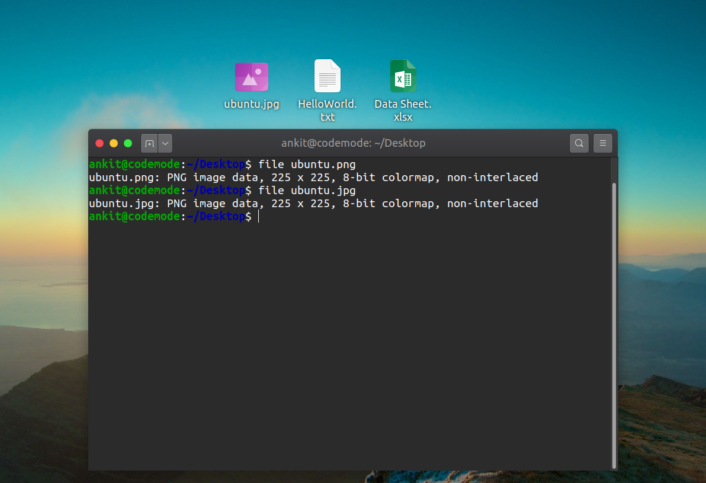<br>
Our result didn't change. But why ? Why it's not showing the "JPG image data" instead of png🧐

Now this is important point.<br>

> In Linux extension doesn't matter. Unlike Windows, Linux doesn't determine file type using the file extension, but instead it reads a piece of code inserted at the top of every file. <br>
> And that piece of code is known as a **header** and it serves as a kind of label for Linux to read.
> And when Linux reads that label, it knows the file type. <br>
> So changing just the name of the file won't make a difference because that file header won't have changed.

<br>

Now if you check for **HelloWorld.txt** file you may already know the output.
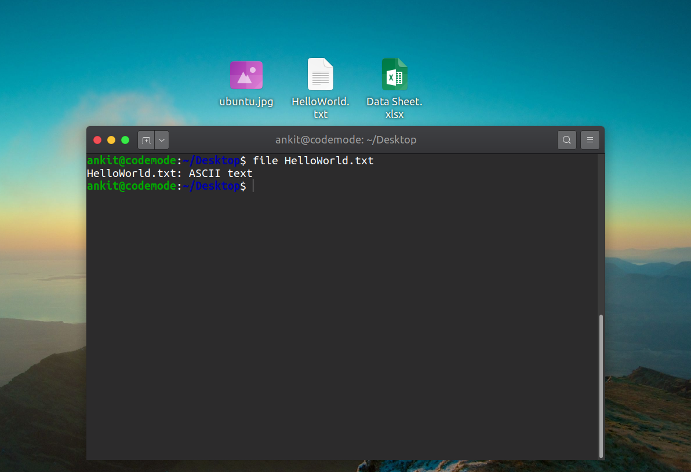

<br>

Now if I change the txt to pdf then you will notice (in your system too) that the text file icon is changed into kind of pdf
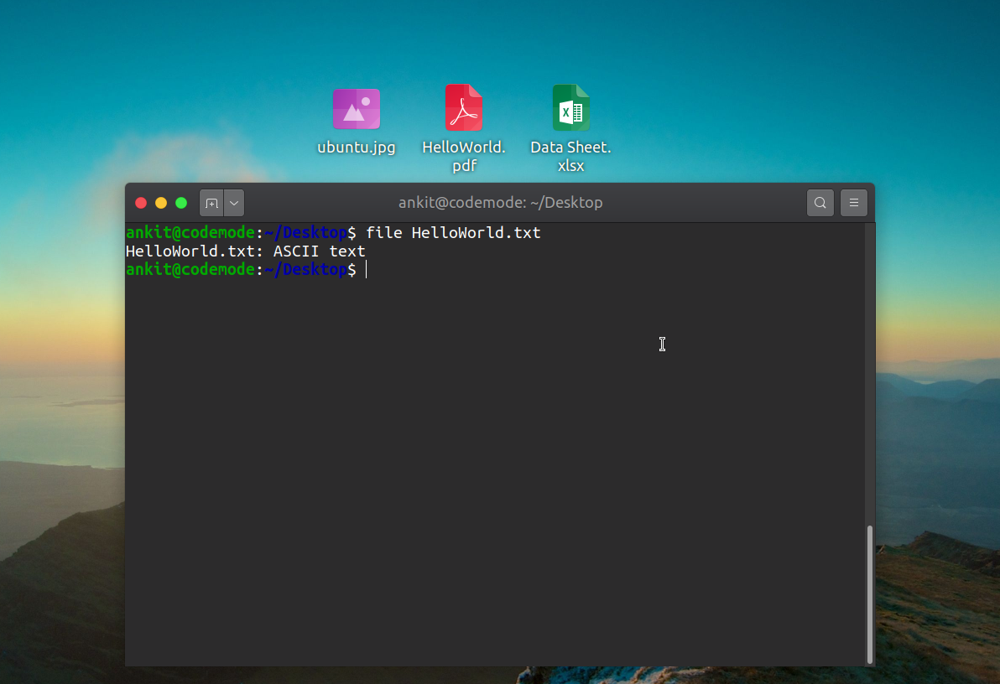

Now this happen because you have already installed some softwares like pdf readers so when they found like <q>**Hey , I saw a pdf extension, so I will make it easy for user to open it in a pdf reader and this must be a pdf file so why not change its logo look like pdf too**</q> _(sometimes pdf don't change their logos keep that in mind, sometimes your system just generate the first page as a logo for your file as thumbnail)_ just a small idea of backend working of the third party softwares that we install on our system.

But if we try to read this pdf file through our terminal
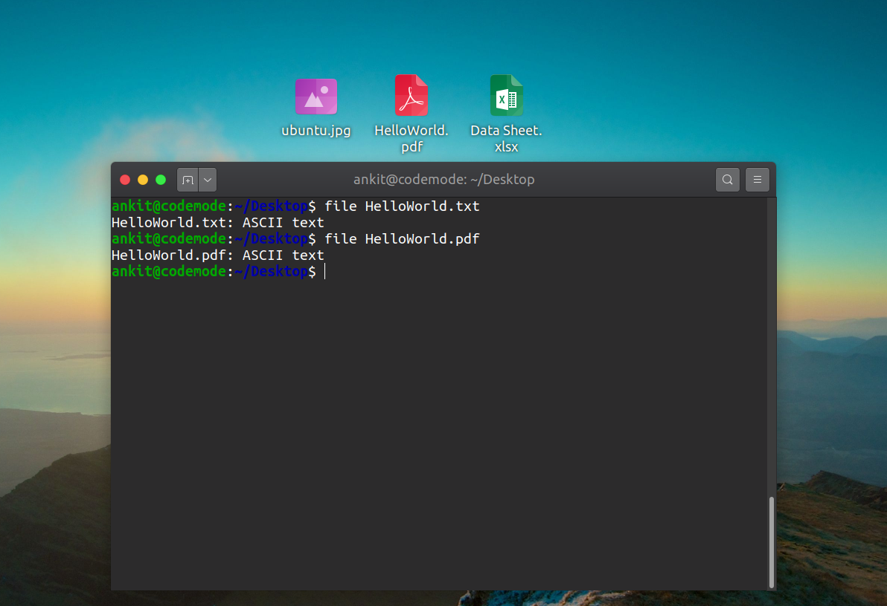<br>
Wowiee. Terminal still read this as text file all because of ? yup you gussed it right **header** label that is present at the top of this file.

But if we try to open this pdf which is actually a txt file then
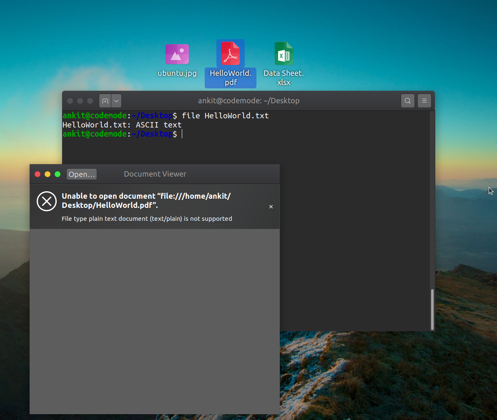

Then the pdf reader software that we have installed will try to open it like he said to OS : <q>**Hey OS I don't need your help to find out what type of file is this I already saw _pdf_ extension on the file end , I can handle it easily , just a piece of cake for me** .</q> But as you know already the
**"_HelloWorld_"** is a txt file originally and pdf reader are originally made to open pdf files only so pdf reader software won't be able to open this txt file.

> So yeah we can say OS already knows it is a text file, but third party software would not be able to recognize it directly.

Okay, so that's the important distinction to make there.
The programs that are installed on top of the operating system such as PDF viewers and stuff like that,
they might need the file to have a specific file extension in order to open them, but the operating
system itself does not care.

Now lets look at the next example<br>

What if I use my name "ankit" as a extension what will happen ? You already know that even though we will change the extension OS already know it what type of file it is and it will return the same answer when we will use the `file` command .

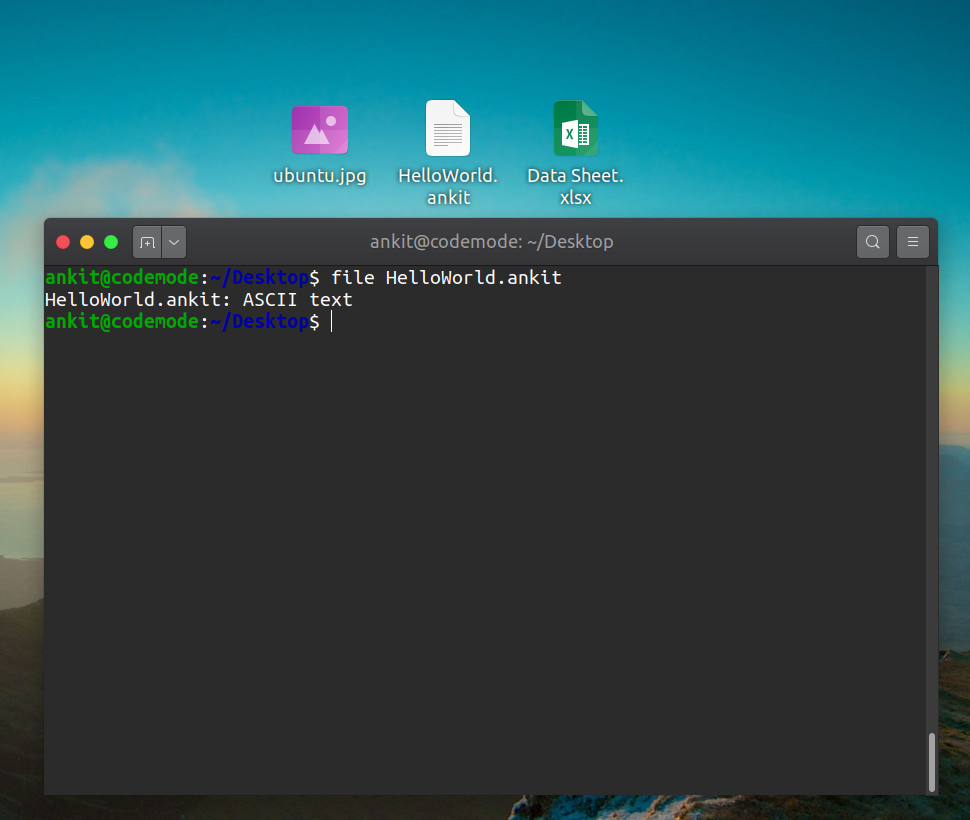

Now here is the interesting part which you won't be able to see on **Windows** at all(till now I haven't saw this in Windows 11 so far).
If I try to open this file it will work perfectly fine.
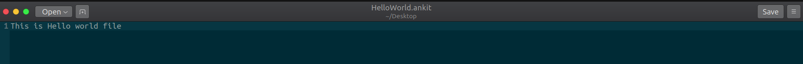

See at the center top, the file name is "**HelloWorld.ankit**".
Since there is no software present who can open ankit extension file so when we try to open it OS already knew it that it is a header file so OS will pass this file to your system default text editor to open this file. And yes you can change the name of the extension whatever you like, as long as there is no software present to open the extension file that you have given then it's OS job to pick the right software to open your files.

> I tried this with my ubuntu.jpg and excel sheet file but it doesn't work, in the course those file works fine but for me it doesn't. That's because not all softwares like to play that way, that's the only reason.

<br>

The file extension isn't important to the Linux operating system, but it might be important to the software packages that we install on top of Linux.

So do bear in mind that don't basically give your file names really weird file extensions that don't match their content because it might confuse third party software that is installed even though you don't necessarily have to.

<div align="right"><b><a href="#index">↥ Back To Top</a></b></div>

<hr>

<div align ="center">
<h2 id ="wildcard">Wildcards</h2>
</div>

If I want to list out contents of multiple folders we can use `ls` command like this.
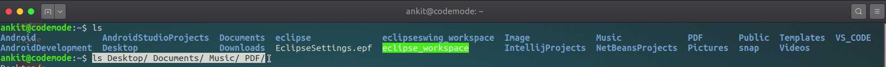

But what if I want to just list out the contents of all folders (which are in my current directory) whose name starts with letter 'D' then how can I do that ?<br>
This is where **Wildcard** come into picture to save us from this trouble.

Now wildcards are basically special symbols that the shell interprets to have a special meaning.

The idea behind wildcards is to build up powerful patterns known as regular expressions, so that instead
of typing out every command line argument manually, you can instead say something like <q> _Hey, Linux,
make this command act on anything that matches this pattern_ </q>.

The patterns are known as **regular expressions**, and you can think of wildcards as being some of the
useful building blocks for creating regular expressions.

Now, using wildcards to build regular expressions gives you lots of flexibility and control over how
your commands work and can save you from whole bunch of typing and using regular expressions makes your commands a lot more expressive.

So for example, instead of expressing the `ls` command like list out the contents of this folder and
this folder and this folder, which is the way that we would usually be using it with command line arguments.

So if I want to list out the contents of the folders whose name start with letter 'D' then we will use `ls D*` like this

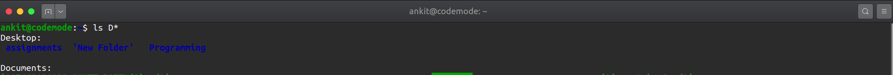 <br>
_(The command totally works well it's just I cannot disclose my system all folders to you)_

You can also use multiple wildcards too like this `ls D* P*`

And if you want to select all the folders just use `*` with whatever command you like. e.g. `ls *`

Now suppose you want the file names whose extension is _.txt_
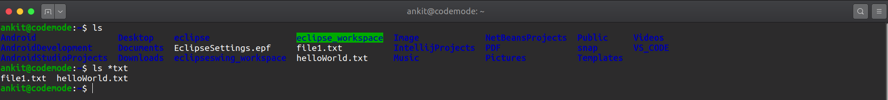
`ls *txt` will list out all the files whose name ends with txt.

Asterisk `*` symbol is just one of the most used wildcards there are more symbols which we can use as wildcard.

`*` : star wildcard matches any piece of text regardless of the length of that text.
And it also matches numbers.

<br>

`?` : question mark wildcard allows you to limit the length. The star doesn't put a limit on length, whereas the question mark does.

For example , suppose you want a txt file which only have one letter like _A.txt_, _1.txt_, _y.txt_ etc.<br> Then we will use question mark wildcard to work as a placeholder.

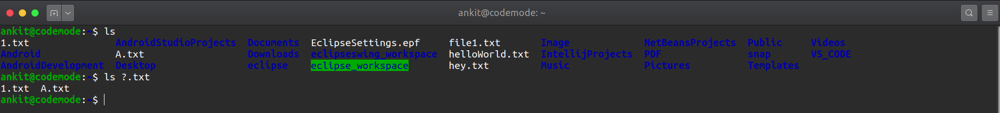

And if you want a file who only have two file in it but ends with _.txt_ then we will write in this way `ls ??.txt`

💬 We usually use the question mark wildcard when we want to build a general pattern but care about
the length of the file name.

<br>

`[]` : square brackets wildcard allow only the specific pattern and only match the letters or numbers if they belong to a given set of options.

Lets understand with example
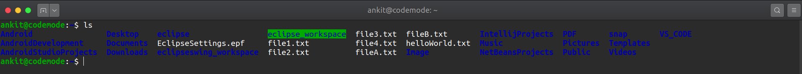

I want to list out file name which have number in it like **file1.txt** I don't want alphabet letters in file name like this one **fileA.txt** to achieve this goal we will use square bracket wildcard.
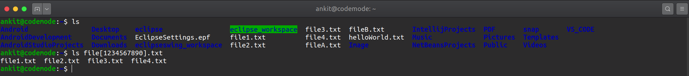
`ls file[1234567890].txt` will bring us the desired result that we wanted for our above task.

<br>

Now writing 123457890 is kind a small hassle right? For that shell provide us with the shortcut <br>
i.e we can write in this way too `ls file[0-9].txt` this will give the same result.
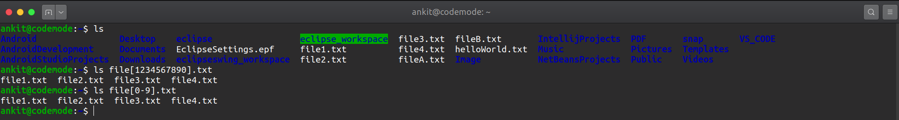

💬 One thing I want to point out is we cannot achieve our above result with the help of `*` or `?` wildcards, they are not going to be useful in this case. You can try to do that by your own.

<br>

Now, instead of writing A till Z alphabets you can also use A-Z like this `ls file[A-Z].txt` this will list out the file which have english alphabet in it at that specific position.
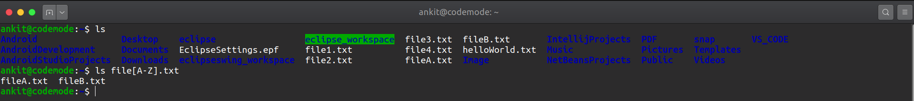

<br>

Now if I want want list out file names with 2 digits in it like **file21.txt**<br>
then again we will use square brackets wildcard by using [0-9] two times
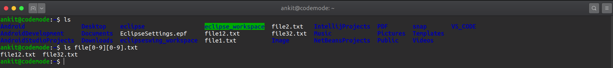
`ls file[0-9][0-9].txt`

<br>

Now lets go one step further what if I wanted a files which have name kind of in this way **file1Ac.txt** file then a number followed by a capital letter followed by a small letter
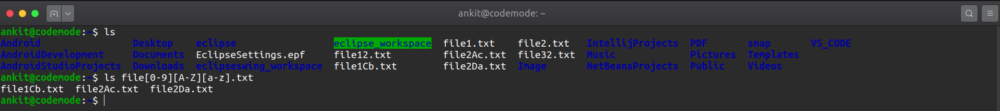

<br>

Now what if you want files which have number like **file1.txt** and also you want to list out those files which have capital alphabet like **fileA.txt** I know it can be easily achieved with the help of `?` wildcard but I want to do this with the help of square brackets.
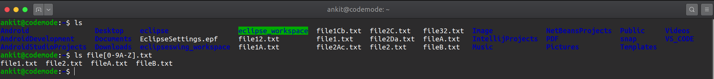
So for that one placeholder we can write in this way `ls file[0-9A-Z].txt`<br>
But if I change it to lowercase like this way `ls file[0-9a-z].txt` then the result will be different.<br>

<br>

And one thing more, if you already know the number of letters you already have , I mean like this **fileA.txt**, **fileB.txt**
since we know we have A and B files in our system then we can use that directly in our wildcard like this `ls file[0-9AB].txt`

<br>

Now suppose what if I don't want to list out a specific file from above result (see above image) in my case I will take **file2.txt** how will I do that ?
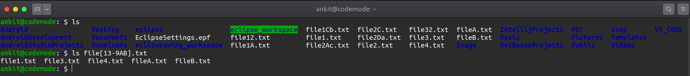
Just write `ls file[13-9AB].txt` and you will get the result.

Try and test as many as combinations you can think of so that you get a better understanding of regular expressions and wildcard usage.

<details>
<summary><span style="color:#474747;">This may be not so Important for you, just saying</span></summary>

<br>
<span style="color:#8B4513;">
Many of the above examples wasn't included in the course, yes I have done those by my own so yeah I am practising too , and I think you should also try it because these regular expressions knowledge will be really useful for string based problems in programming sometimes, I am not kidding at all.
</span>
</details>

Wildcards can make your commands a lot more expressive and give you much greater control
over how the commands work.

💬 And using wild cards in this way to search for file names actually has a funny name and it's
called **Glomming**.

So if you ever hear the word _glomming_ floating around, it just means using wild cards to look for filenames.

<br>
<b>Summary</b>
<ul>
<li>Wildcards are used to build patterns called "<b>regular expressions</b>".</li>
<li>Anything that matched the pattern will be passed as a <b>command line argument</b> to a command.</li>
<li><code>*</code> matches anything, regardless of length.</li>
<li><code>?</code> matches anything, but just for one place.</li>
<li><code>[]</code>matches just one place, but allows you to specify options.</li>
</ul>

<br>
<ins><b><u>Useful Resources Link</u></b></ins>
<ul> 
<li><a href="http://www.linfo.org/wildcard.html">Blog post about Wildcards</a></li>
<li><a href="https://tldp.org/LDP/GNU-Linux-Tools-Summary/html/x11655.htm"> Detail Explanation of Wildcard</a>
</li>
</ul>

<div align="right"><b><a href="#index">↥ Back To Top</a></b></div>

<hr>

<div align ="center">
<h2 id ="cf1">Create Files and Folders - I</h2>
</div>

In this section we will learn how to create files and folders through terminal.<br>
Here we will use two commands `touch` for creating files and `mkdir` for creating folders.

`touch` command is used to create empty files. It also have many functionalities check manual page of touch command.

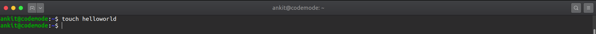

Since I am inside home directory this command will create the `helloworld` file.

<br>

Now if we want to create the file in the different folder we don't need to change our directory first with the help of `cd` command then create file.<br>
We can do it in this way too
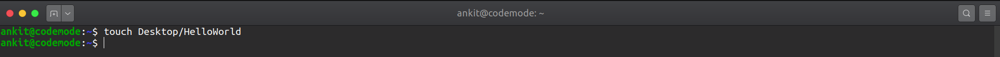
By using relative path we can do it (_you can also use absolute path no issue in that_)

<br>

Lets create **folders** now , for that we will use `mkdir` command .
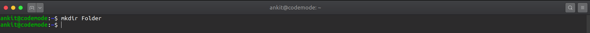
Above command will create a directory which is called "folder" inside my home directory.

We can also create directories at different location by passing relative path or absolute path.
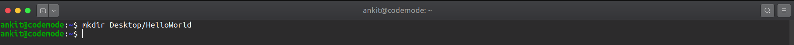
This will create a directory with name "HelloWorld" inside my _Desktop_ directory.

Now what if I write **`mkdir blahblah/blacksheep/mountain`**<br>
Well the answer is quite obvious its not possible at all because we don't have a directory or to more precise we do not have any path inside our machine with this name.<br>
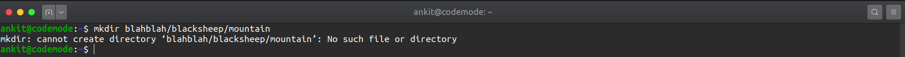
But what if I say to you, it is possible to create this whole path inside our machine with the help of terminal. That's very interesting right?

All we need to add is **`-p`** option in our command (_you can read the details inside `man mkdir`_)
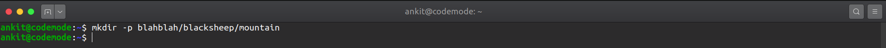
We don't get any error message ? That means the whole path is created ?  absolutely buddy.
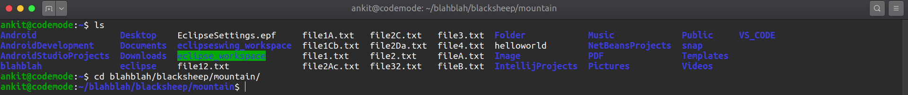


Now what you need to keep in mind that while creating file or folder do not add space between the names, see below example.
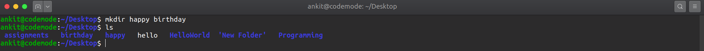

When I typed `happy birthday` both _happy_ and _birthday_ taken as two command line arguments instead of one. One way to create folder with spaces is by putting the folder name inside single or double quotes this makes the shell to read it as single command line argument, see below example.
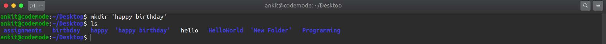

<br>

Or you can add "**\_**" instead of space like this : `mkdir happy_birthday` and in this way you don't need to put the folders name inside quotes, so you can go with underscore.<br>
But this is not the end why I suggest you to go with _underscore_ is because when you want to access your files or folders you always need to make sure you are writing in correct way while using escape character "**\\**"(_escape character is used to indicate that the character immediately following it has a special meaning_), see below example
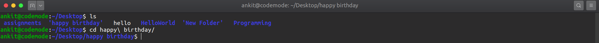
As you can see to get inside the **happy birthday** folder we need to type in this way `happy\ birthday/` because we need to tell the shell that space is also considered as a part of the given folder name. That's why use underscore with folder name, they are more easy to use.

`cd happy_birthday` this is what it will take to get inside the folder whose name is **happy_birthday**
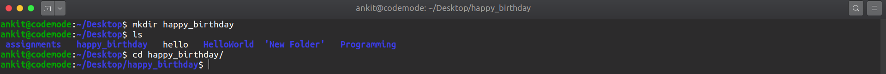

> Since Linux is case sensitive means _happy_birthday_ and _HAPPY_BIRTHDAY_ are two completely different folders while in Windows it's not because Windows is not case sensitive so you cannot create same name folder with different lower or upper case letters they will be considered same so Windows will not let you to create the same name folder with different case.

<div align="right"><b><a href="#index">↥ Back To Top</a></b></div>
<hr>

<div align ="center">
<h2 id ="cf2">Create Files and Folders - II</h2>
</div>

Since we already learned how to use `mkdir` and `touch` command. Let's go one step further.

Suppose you have given a task to create folders like Jan_2020, Feb_2020 till Dec_2024 for a five year project and you also have to create 100 memo files like file1 , file2 till file100 in each of these folders so it means you need to create 100 files in each of these folders too.

So in total you have to create 60 x 100 = 6000 files + 60 folders overall.

I know I know quite tough task right? Well if you use GUI method of course it is but with terminal the story is totally different. It will just take 1 command to create these all folders and files.<br>
That's the power of terminal✨, that's why I love terminal, it makes so many things easy which will be a hassle if I try to do the same thing in GUI mode.

Let's understand how we will achieve our above task. For the given task we are going to use "**brace expansion**".

I think instead of explaining it, showing on the terminal is faster way to learn things.<br>
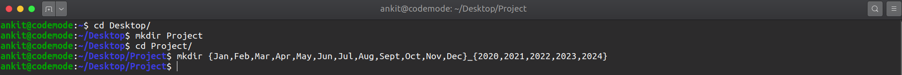<br>
That's all you need to write this will create 60 folders now this just half part of the task.

First lets try to understand how above command is working.<br>
It's just like maths, example : (2 x 4) x (2 x 5) = (2x2) x (2x5) x (4x2) x (4x 5)

In the same first Jan till Dec goes with 2020 then Jan till Dec goes with 2021 and so on just like you do in an algebra class.

Now as you can see 2020,2021,2022,2023,2024 they are in continuous manner or you can also they follow a pattern and since it follows a pattern we can write **`2020..2024`** in this way and it will work the same, see below example.<br>
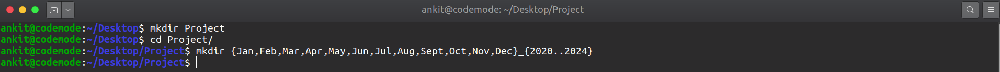<br>

Now to create 100 files in each folder we will use `touch` command, see below example.<br>
<br>
So basically we are going in each folder like Jan till Dec 2020 and in each folder we are creating 100 files with name like file1, file2 ... till file100.

And your task is done.<br>
You have created **60 folders & 6000 files** in just two lines

And by the way **brace expansion** is not limited to `touch` and `mkdir` commands, brace expansion is actually usable across the whole shell.<br>
For example, list out all the contents of **Project** folder using `ls` command.<br>
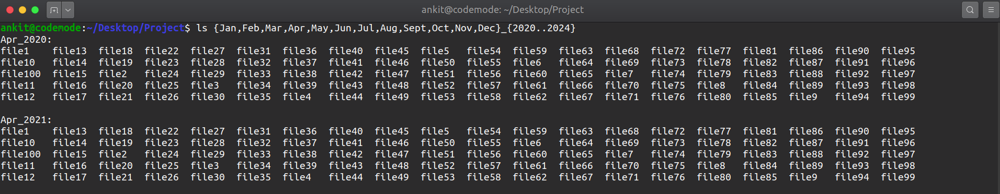<br>
Also we can use wildcards in this way `ls *` it will generate the same result.

That's all for this section.

<div align="right"><b><a href="#index">↥ Back To Top</a></b></div>

<hr>

<div align="center" id ="df1">
<h2>Deleting Files and Folders - I</h2>
</div>

In this section we will use `rm` command, `rm` command is used to remove files and folders.

**rm** commands accept multiple command line arguments so you can delete multiple files or folders at once.

Lets first create a file called _deleteme.txt_ then we will use rm command on it.<br>
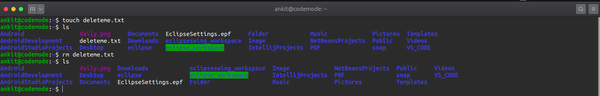<br>
As you can see, first I created the file with `touch` command.<br>
Second, I list out the contents of the folders so that I can confirm that the file is created.<br>
Third, I used `rm` command to remove the file and then list out the contents to confirm that.

Now as you know you can create files on multiple location without changing the current directory, same can be done with `rm` commands.<br>
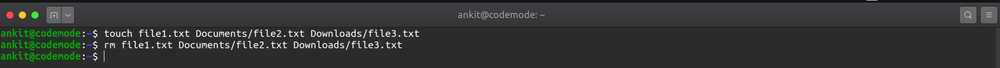<br>
As you can see I created files in three locations i.e Current directory, Documents directory, Downloads directory.

And I did the same with `rm`, I deleted multiple locations file without changing my current directory.<br>

> In Linux folder means directory.

<br>

Using brace expansion with **rm** command.<br>
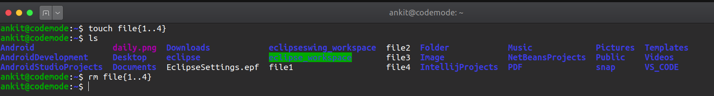

<br>

Now lets use `rm` command with **wildcards**.<br>
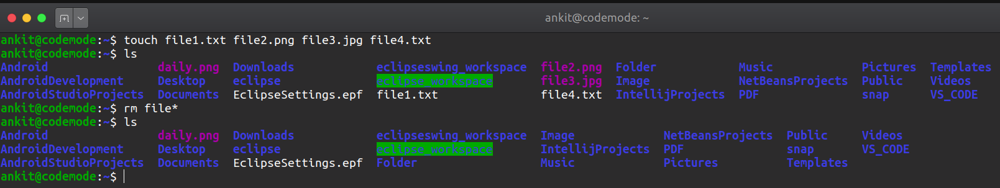<br>
file names which started with **`file`** are all gone.

<br>

Now if I say I just want to delete txt files only, I think you already know the answer by now.<br>
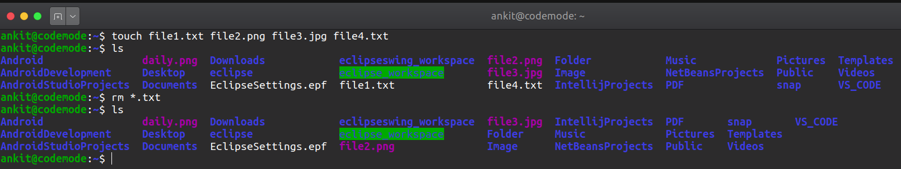<br>
**txt** files are gone.

<br>

Now if I want to delete a file which have **2** in it e.g. _file2.txt_, _hey2.png_.<br>
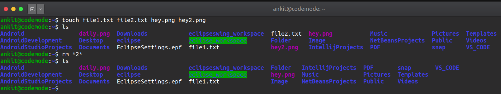<br>
So to delete files which have 2 in their name we will use `rm *2*`

<br>

If I want to remove files which have 2 and 3 in their name like _file2.txt, file3.txt, hey2.png, hey3.png_ for that we will use `[]` square bracket with star `*` wildcard<br>
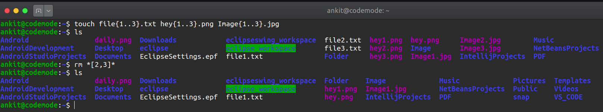<br>
As you can see any file which contains 2 or 3 in their name are removed by just writing `rm *[2,3]*`

That's all for this section.

<div align="right"><b><a href="#index">↥ Back To Top</a></b></div>

<hr>

<div align="center" id ="df2">
<h2>Deleting Files and Folders - II</h2>
</div>

In this section we will learn how to delete directories and use of `rmdir` command.

Lets start first by creating a folder with `mkdir` command.<br>
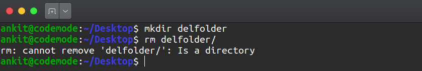<br>
As you can see I created a folder called **delfolder** and when I tried to delete it I get an error because I cannot directly delete a file with `rm` command, to delete the folder I have to use `-r` option with **rm** command.

**`-r`** means recursively. So when we say delete a folder with _-r_ option we are saying delete that files in that folder with everything else too which means deleting the folder too.<br>
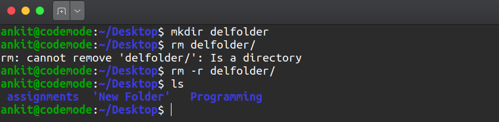<br>
As a result, you can see by using **-r** option the folder is delete easily.

<br>

Now lets create folder inside folder and in each folder we will create multiple files.<br>
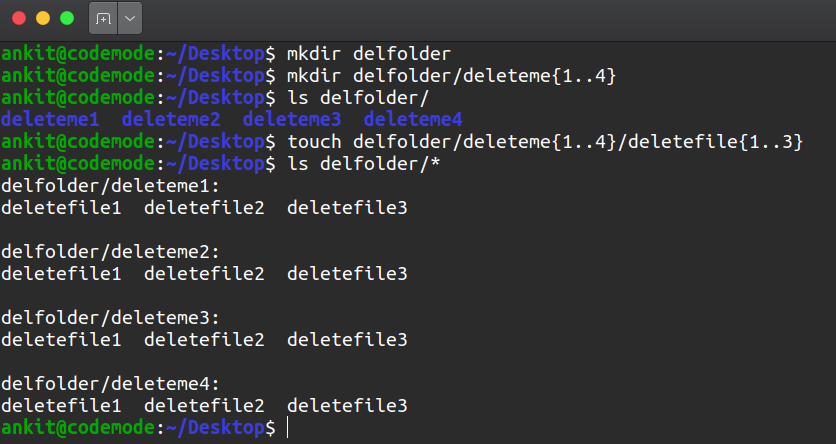<br>
What I did is I created a folder called **delfolder** and inside this folder I have created four other folders called deleteme1 to deleteme4 and in these all 4 folders I have created 3 files called deletefile1 to deletefile3.

Now as I mentioned before that when we say delete recursively it means **delete it and also everything inside of it**.<br>
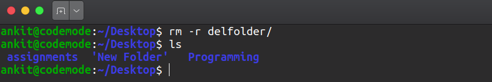<br>
As you can see all the folders inside delfolder and files are deleted including delfolder itself too.

Now as you can see `rm -r` is a very powerful command and if we accidentally did `rm -r *` this will delete all the folders inside your current directory that your shell is. <br>
So to prevent this mistake we can **`-i`** option whenever we use **-r**.

**`-i`** means interactively, this will make the shell to ask you first before deleting the files and folders.

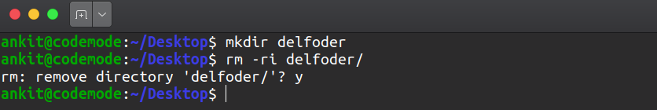<br>
As you can see first it asked for confirmation and to confirm that I typed **y** and pressed Enter.<br>
_y_ for yes and _n_ for no.

> We can use `-ri` together because shortforms can be chained together.

I will create multiple folders and multiple files and then lets see what happens if I will use -ri.<br>
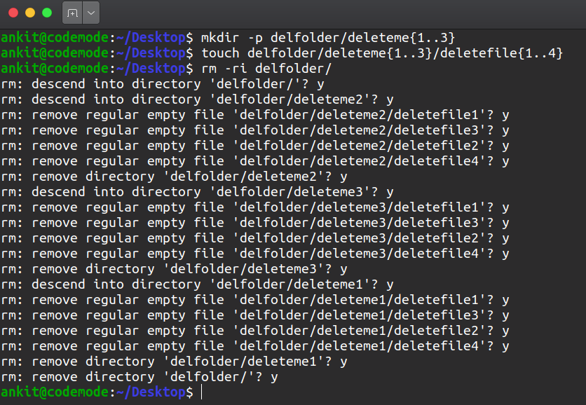<br>
As you can when I used **`-i`** with **`-r`** option it will keep asking if the shell should remove this file or not.<br>
As you can see the flow, first it asked me to enter into the directory then again asked should shell go inside the first folder or not then inside it the shell asked the permission to delete the files after deleting each file from first folder then shell asked for the permission to delete the directory also after that all the steps are repeating again and again.

If I want to keep a file or directory I can just type _n_ and the shell will not delete it.

<br>

Now sometimes you want to delete all directories which are empty for that we will use `rmdir` command, this commands delete only empty directory.<br>
See below example<br>
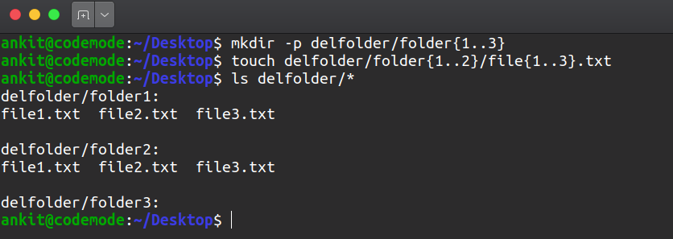<br>
First I created the folders inside folder then only in _folder1_ and _folder2_ I have created 3 txt files, and I left _folder3_ empty.<br>
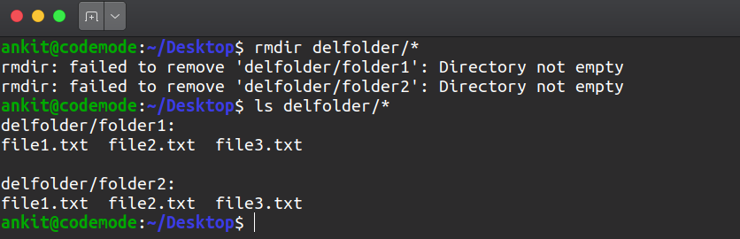<br>
After running rmdir on inside **delfolder** and shell says <q>_Hey I cannot delete folder1 and folder2 because it contains files inside it but folder3 do not contains any files,I can delete that for you._</q> (_hope so you get the idea👀_)

<div align="right"><b><a href="#index">↥ Back To Top</a></b></div>

<hr>

<div align ="center">
<h2 id ="cff">Copying Files and Folders</h2>
</div>

Now to copy files we use **`cp`** command.

So the structure of **cp** command is

```
cp <what you want to copy>...<Destination>
```

> ... means ellipses and it means multiple input allowed. So you can copy multiple files or folders.

Let me show you with example<br>
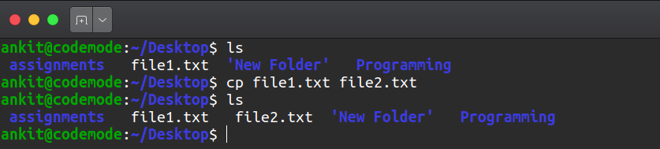<br>
I want to copy the _file1.txt_ in my current directory which is Desktop right now.<br>
As you can see the content of file1.txt is copied inside file2.txt and if you look carefully, in the starting we have only _file1.txt_ file inside Desktop and when I tried to copy it to the file2.txt which you can see was not created yet, the cp command created the file2.txt and copy the content of file1.txt into file2.txt.

In short if you try to copy a file in a location where the file does not exist the cp command will create it for you.

Now imagine this whole work inside GUI mode, what you will do ?

1. First you will click on file1.txt and then you will hit <kbd><kbd>CTRL</kbd>+<kbd>C</kbd></kbd> to copy the file1.txt .
2. Then you will paste the file by hitting <kbd><kbd>CTRL</kbd>+<kbd>V</kbd></kbd>.
3. Then you will rename the new file that you just pasted.

And the `cp` command did all these steps for you easily in one line

Now lets try something else.<br>
Right now I have **file1.txt** and a folder called **copy_me**, what I will do is I will copy the file1.txt inside **copy_me** folder.<br>
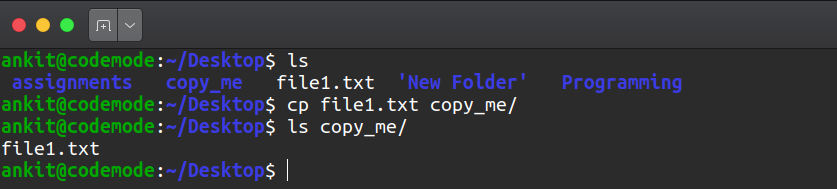<br>
You can see file1.txt is copied inside the folder copy_me.

<br>

Now I want to copy the _file1.txt_ with name _hey.txt_ inside **copy_me** folder<br>
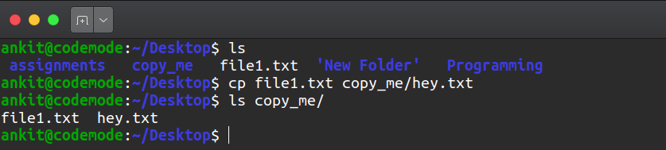<br>
So now you may already know what I wanted to tell you, if you want to copy the file and paste it with the different name then you can give the name and if you do not want to rename the file you can just copy the file and give the location where you wanted to copy it but of course you cannot have two files with same name inside any folder, that's the simple rule.

> And if you tried to break this rule the only thing happen is that the new copied file will replace the existing file which have same name as copied file.
> <br>

How to copy files from different location ?<br>
Here is an example for this<br>
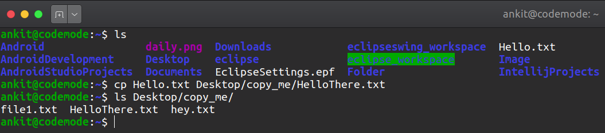<br>
In the above example, I have **Hello.txt** file in my current home folder and I have copied this file into Desktop's **copy_me** folder and I rename it as "**HelloThere.txt**" .

<br>

You can copy multiple files (_read the manual page of cp command_)<br>
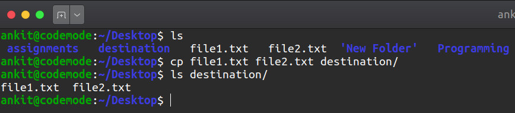<br>
So I can copy as many files as many I want the last part will be treated as my location where I want to copy the files.

<br>

Lets use **wildcards** with **`cp`** command.<br>
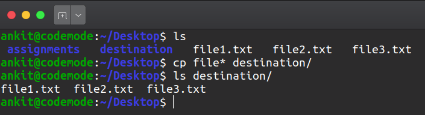
<br>

Now copy all those files from destination folder to copy_me folder using wildcard.<br>
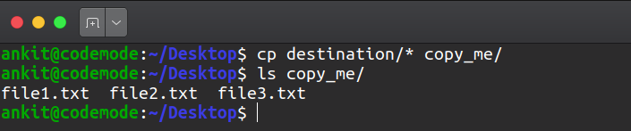

<br>

Lets see how to copy a whole folder and paste it inside another folder<br>
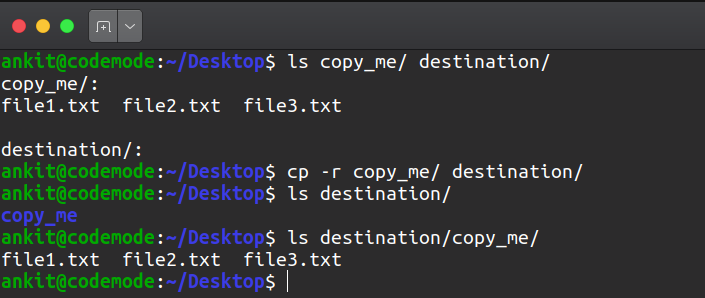<br>
At starting **copy_me** folder have 3 files and **destination** folder is empty.<br>
After doing `cp -r copy_me/ destination/`all the files inside **copy_me** including copy_me folder itself is copied inside the **destination** folder.

> `-r` means recursively, just like in `rm` command case, this option doing the same thing in `cp` command, it's just instead of deleting we are copying all files recursively including the folder too.

<div align="right"><b><a href="#index">↥ Back To Top</a></b></div>

<hr>

<div align ="center">
<h2 id ="mvrn">Moving + Renaming Files and Folders</h2>
</div>

To move and rename files or folders we use `mv` command.

Lets see an example<br>
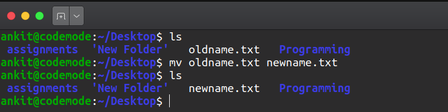<br>
In the above example as you can see I have _oldname.txt_ file which is now rename to _newname.txt_ via the help of `mv` command.

<br>

Same thing work for directories.<br>
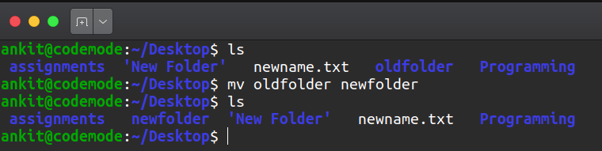<br>
I have a **oldfolder** which is now renamed as **newfolder**.

Now to move folder or files the structure is same as cp.

```
mv <what you want to move>...<Destination>
```

> ... means ellipses and it means multiple input allowed. So you can move multiple files or folders.

And also if you want to move the file and at the same time rename it then the process is same as `cp` command.

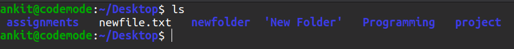<br>
In the above image I want you to focus on two folders **newfolder** & **project** the next thing I will do is I will move this **newfolder** inside **project** folder and rename it as **hellofolder**.<br>
See the below example.<br>
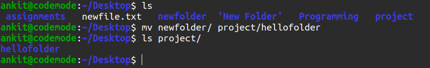<br>

Command structure to move files and rename them at the same time or just want to rename the file & folder.

```
mv <what you want to rename>...<Location + New Name>
```

<br>

💬<strong>If you want to rename multiple files at once then</strong> <a href="https://www.webservertalk.com/rename-files-in-linux">refer this resource</a>

<div align="right"><b><a href="#index">↥ Back To Top</a></b></div>

<hr>

<div align ="center">
<h2 id ="nano">Editing Files using nano Command</h2>
</div>

`nano` is an command line editor tool which is used to edit files inside terminal.<br>
We can also use `nano` command to create files too.

Lets create a file using nano, I will name it as Diary.txt.<br>
After entering `nano Diary.txt` this is the output that will be shown by the command line.<br>
The top line is nano version, right now in my system it is 6.2<br>
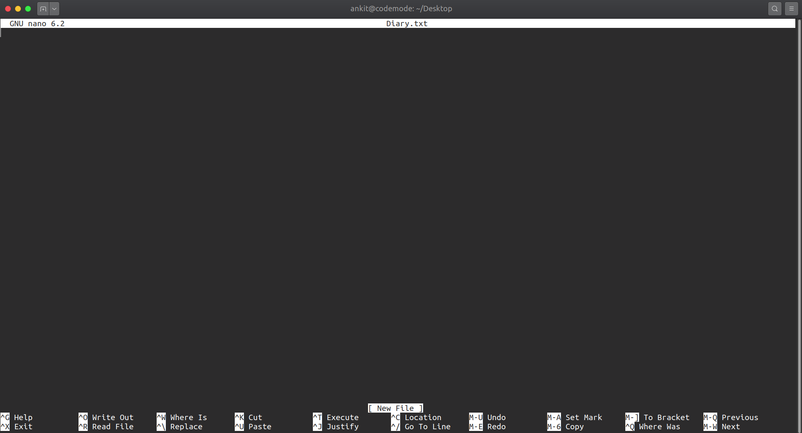<br>

Now lets observe the bottom part first.<br>
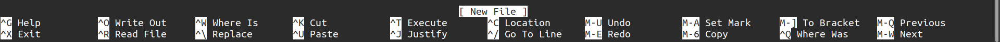<br>
The **`^`** symbol means <kbd>CTRL</kbd> button in your keyboard.So **`^G`** exactly means is <q>_Hey if you want help then you can hit <kbd><kbd>CTRL</kbd> + <kbd>G</kbd></kbd> on your keyboard and the help section will appear_ </q>.

As you can see there is also options like `M-U`, `M-E` etc the `M-` part means <kbd>Alt</kbd> key of your keyboard. So if you want to use `M-U` then hit <kbd><kbd>Alt</kbd> + <kbd>U</kbd></kbd> on your keyboard.

> `M-` = Alt, Esc or Cmd(depending on your layout).

Now write whatever you like inside this file and then save it. Now how to save it 🤔? Well we will use **Write Out** feature which we can use by hitting the <kbd><kbd>CTRL</kbd> + <kbd>O</kbd></kbd> keys .

> Write Out is just a fancy name for "save file".

I have written some text and then I went to save it by hitting <kbd><kbd>CTRL</kbd> + <kbd>O</kbd></kbd> on my keyboard and this is how it shows.<br>
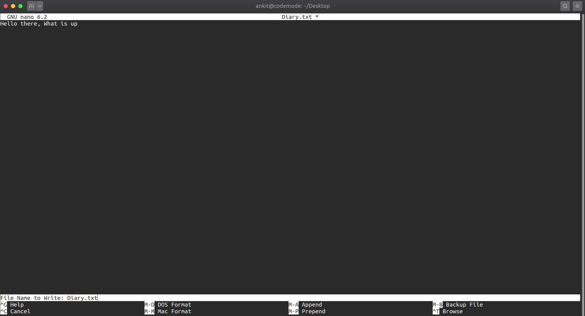<br>
Now on the bottom part you can see `File Name to Write: Diary.txt` right now I can change it to any other file name if I want. Since I do not want to change the name of the file I just pressed <kbd>↩️Enter</kbd> and tada✨ file is saved.<br>
And you can still edit the file and then save the changes or you can directly exit by pressing <kbd><kbd>CTRL</kbd> + <kbd>X</kbd></kbd> after that type **`y`** to save the changes and exit from file OR **`n`** to do not save changes and exit from file .

<br>

You can now edit files without needing to load up graphically intensive editors and plus working with
files like this will work pretty much anywhere.<br>
Even if you have remotely accessed a server that might not have a graphical user interface installed,
text editors such as Nano will still work.

Now what other features `nano` command have. Lets try **Read File**.
<br>

I will create a file happybirthday.txt<br>
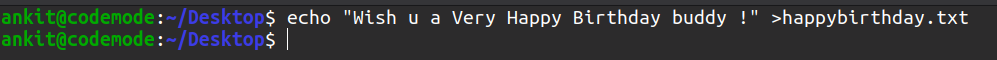<br>

Now I will open the _Diary.txt_ file and then insert the text of _happybirthday.txt_ file into this file.<br>
To do that I will hit <kbd><kbd>CTRL</kbd> + <kbd>R</kbd></kbd> and this is how it will look like.<br>
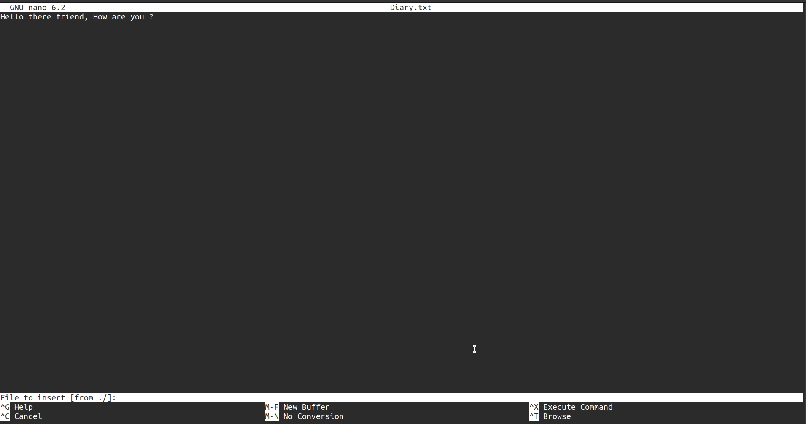<br>
See the bottom part, there you can see `File to insert [from ./]:` now **`./`** means inside current directory. So I can directly add my birthday file here because right now my file is on my Desktop folder.<br>
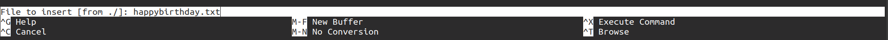<br>

After typing _happybirthday.txt_ and press <kbd>↩️Enter</kbd> I get this. <br>
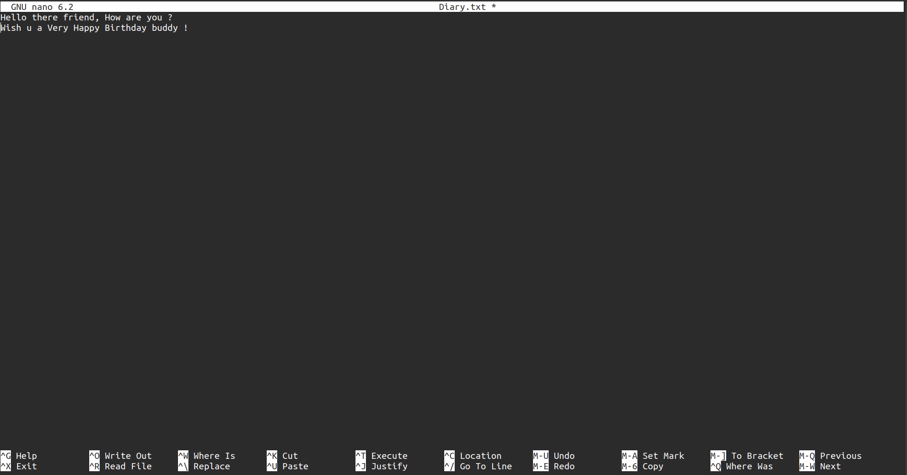<br>
That's very good right ? When you want to copy text of one file into other file you can use this option.

<br>

Now **Where Is** option helps to search🔍️ any text inside your file. And one important thing to keep in mind is **Where Is** by default is not case sensitive so it means for **Where Is** option **birthday** and **BirthDay** are same.<br>
But you can change this behavior by using `M-C` option which is on your keyboard is <kbd><kbd>Alt</kbd> + <kbd>C</kbd></kbd> and this will make your searches case-sensitive.

**What Is** by default searches from forward means from top line, now to reverse this you need to use backward and to use it you have to hit <kbd><kbd>Alt</kbd> + <kbd>B</kbd></kbd> keys on your keyboard.

> NOTE : These all keyboard shortcuts may changes according to version so always read on the bottom what shortcut key you need to use for a specific task and also you can use help option.

There are many features you can use inside `nano` .

> Small info : Nano's configuration file is inside /etc/nanorc

<div align="right"><b><a href="#index">↥ Back To Top</a></b></div>

<hr>

<div align ="center">
<h2 id ="loc">The locate command</h2>
</div>

Sometimes we want to search for a file or folder but do not know or remember location of it. So to make this task easier we can use `locate` command.

Installation : <br>
`sudo apt install locate`<br>

The first thing that you need to know about the `locate` command is that it works by searching a
database file that's on your system.<br>
And this database holds location information about every file that's on your system.<br>
And the way that the `locate` command works is that you will give it some pattern to look for and then
`locate` will search the database for every path that matches that pattern and give it back to you on
standard output.

Lets take an example. Suppose you want to list out all the files which have _.txt_ extension on your system. Now `ls` command would not be a good option for us. We will use `locate` command instead to search in our entire system.<br>
So the answer is we just need to type : `locate "*.txt"` _press_ <kbd>↩️Enter</kbd> and all the txt files will be list out on your terminal screen. I cannot show the output because it's too long, there are 100's of txt files on my system.

Now `locate` command searches through its own database and this database updated once a day or week. So your recently created file would not gonna show if try to search it through locate command.<br>
To update database whenever you want run `sudo updatedb` command.

Lets create an file with _.hello_ extension inside home directory and Desktop directory.<br>
After that we will run the `sudo updatedb` to update database.

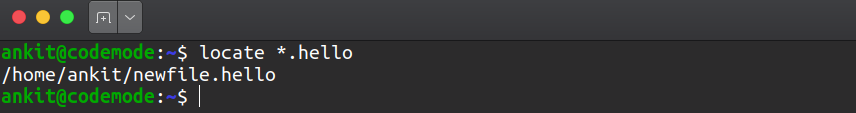<br>
Why we are seeing only one result ? When I already said that I have created two _.hello_ files on two different location ?🤔<br>
The two solution I can give you for this is to run the regex pattern in the the below demonstrated way.<br>
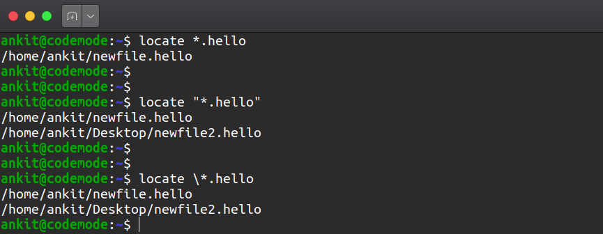

<details>
<summary>Explanation for above commands result </summary>

The reason we get different results when we run `locate *.hello` versus `locate "*.hello"` is because of the way the shell handles the arguments before passing them to the locate command.

When we run `locate *.hello`, the shell expands the <strong>_.hello</strong> pattern to match any file in our current directory that ends with the _.hello* extension. So, we are effectively running the command locate file.hello (assuming there is only one file with a *.hello\* extension in our home directory), which only searches for files with that specific name in the database.

On the other hand, when we run `locate "*.hello"`, the quotes prevent the shell from expanding the pattern, so the `*` and `.hello` are treated as literal characters to be passed to the `locate` command. This means that `locate` searches for any file that contains the string in its path or filename, which is why we get results from across our system.

To summarize, when we use quotes around the pattern, the shell treats it as a literal string and passes it directly to the `locate` command, whereas when we don't use quotes, the shell expands the pattern before passing it to `locate`.

</details>

> Small advice whatever regex pattern you want to search always put that pattern inside double quotes, this will be better.

Since everything is case sensitive in Linux, so if we try to run `locate "*.Txt"` then we are not going to get the same result. To make the result same irrespective of case we will use `-i` option e.g. `locate -i ".Txt"`.

We can limit the number of results we want from `locate` command by using `--limit` option.<br>
Example, `locate --limit=3 "*.txt"`

You can also count your total number of files that you have searched for.<br>
Example, `locate -c "*.txt"`

<div align="right"><b><a href="#index">↥ Back To Top</a></b></div>

<hr>

<div align ="center">
<h2 id ="find">The find command</h2>
</div>

`find` command is much better than `locate` command because `find` command do not need database. We can perform many sophisticated search tasks with the `find` command.

The by default behavior of `find` command is to search files and folders or to be more precise, list out all the files and folders from the current directory we are in. All means all, when I say list out I mean each file and folder including folder inside folder and files that are part of current directory.

So this is one of the main difference for us between the `locate` command and the `find` command.

The `find` command will list out files and folders, but the `locate` command will only list out files and
the `find` command does not need a database in order to work.<br>
So `find` is always up to date because it directly operate on our file system.

But the only one downside of `find` command is that it is a bit slower because it do not have database.<br>
That's the only tradeoff of `find` command, so bear that in mind.

Now if you want list out every folder and file of a specific directory then we can pass our location path just after find command.<br>
Example, `find ~/Desktop/` this will list out each folders and folder inside folder plus their files too.

<br>
<br>

Now, you can also control the search depth behavior of `find` command and what it searches for.

Lets start with an example, inside of my _Desktop_ folder I have created folders inside folders starting **Level1** till **Level5** and you can see I have also created files.<br>
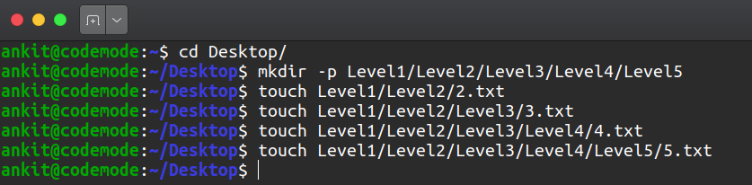<br>

Now if I want to depth of search to 1 then I will write in this way.<br>
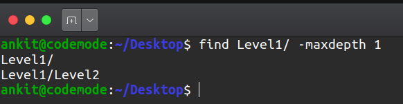<br>
Now the above output in GUI mode just look like below image.<br>
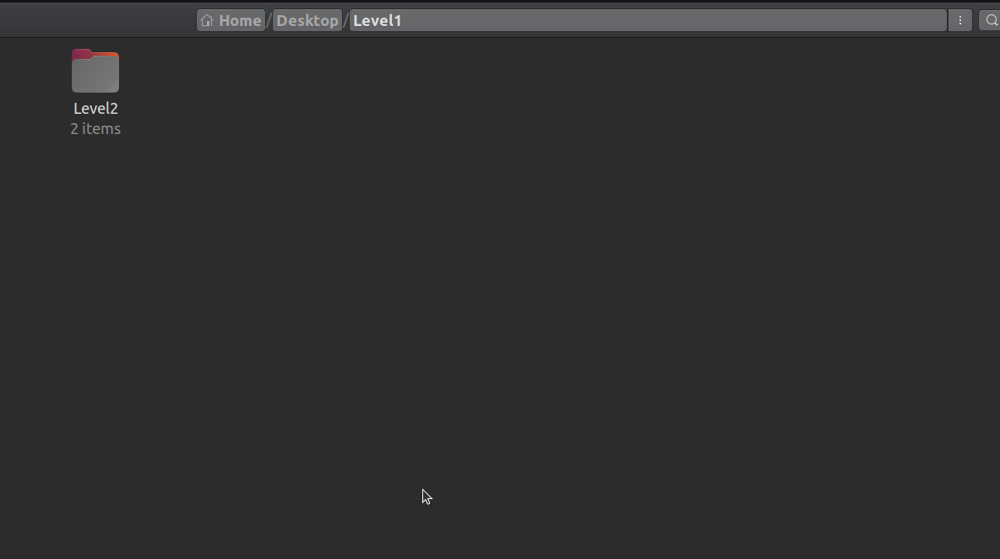<br>
It only shows you what is inside the current directory.

<br>

Now if we go one level down means -maxdepth=2<br>
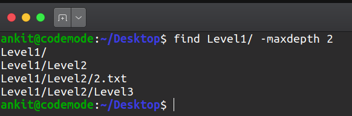<br>
Now the above output in GUI mode just look like below image.<br>
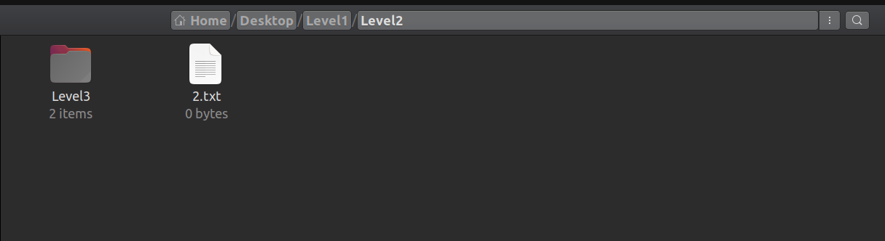<br>

<strong>NOTE : </strong>You may be thinking why long form with single dash ? Well that's how the `find` command is made.

Now there is another great option and that is `-type` option, this allows you to search for
just files or just directories.

Notice by default the `find` command lists both files and directories but `-type` option helps you to limit your searches for only one type.

Lets apply -type inside our Levels folders and list out only files.<br>
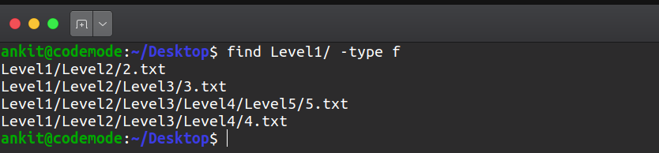<br>
And if you want to list out only directories then use `-type d`.

So `-type f` is for files and `-type d` is for folders.

<details>
<summary>
-type c
</summary>

              File is of type c:

              b      block (buffered) special

              c      character (unbuffered) special

              d      directory

              p      named pipe (FIFO)

              f      regular file

              l      symbolic link; this is never true if the -L option or the -follow option is in effect, unless the symbolic link is broken.  If you want  to  search
                     for symbolic links when -L is in effect, use -xtype.

              s      socket

              D      door (Solaris)

              To search for more than one type at once, you can supply the combined list of type letters separated by a comma `,'.

</details>
<br>

Now, if we want to search for a specific file then we will use `-name` option. Lets take an example.<br>
In my **Level5** folder I have _5.txt_ file and I want to search it. Lets see how to accomplish this task.<br>
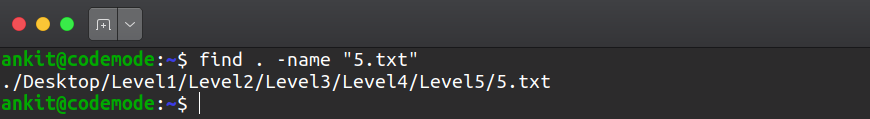<br>
We learned previously that `.` refers to current directory. `find` command gave the exact path from my current directory to _5.txt_ file.

<br>

Another interesting way to search files using `find` command is by file size. For this we use `-size` option.<br>
Example, if I want to search files in my whole system who are more than 100kilobytes in size then the command will be <br>
`find / -type f -size +100k` if I want less than 100k then I will use `-100k`<br>
<br>
I can also define the search size to search between, example, search for files greater than 100k but less than 5mb for that I will write<br>
`find / -type f -size +100k -size -5M`

<br>

<details>
<summary>
-size n[cbwkMG]
</summary>

      `c'    for bytes

      `b'    for 512-byte blocks (this is the default if no suffix is used)

      `w'    for two-byte words

      `k'    for kibibytes (KiB, units of 1024 bytes)

      `M'    for mebibytes (MiB, units of 1024 * 1024 = 1048576 bytes)

      `G'    for gibibytes (GiB, units of 1024 * 1024 * 1024 = 1073741824 bytes)

       100k indicates 100kibibytes (or 100*1024 bytes).
       Remember that a kibibyte (KiB) is different to a kilobyte (KB).
       1 kibibyte is 1024 bytes, but 1 kilobyte is 1000 bytes!

</details>

<br>

Now, if you try to run command inside `/` base folder then there are many folders for which you do not have access as a user, to tackle this we use `sudo` : "super user do" this is an administrative privileges command.<br>
`sudo find / -type f -size +100k`

Suppose now you want to list out files which are less than 100kb OR files which are greater than 5Mb, to make this searching possible we use `-o` option. The `-o` option of the `find` command in Unix/Linux is used to combine multiple search criteria using **logical OR**.<br>
Example, `sudo find -type f -size -100k -o -size +5M`

<br>

Well you can also store the result using **piping**, for example see below image<br>
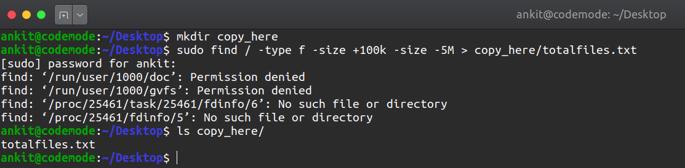

<br>

<hr>

Now what if I want to copy all those files which `sudo find -type f -size -100k -o -size +5M` return on the terminal output screen ?🤔

Well there is a way to do that and for that we use `-exec` option, means execute, this option helps to run multiple command on each result given by find command. One thing keep in mind that `-exec` options always end with `\;` never forget that.<br>
`sudo find / -type f -size +100k -size -5M -exec cp {} ~/Desktop/copy_here/ \;`

In above command `{}` means whatever output given by find command execute it on each result that we got from it.

One thing I want to tell you is that `-exec` is not the safest option so we can use `-ok` option instead of `-exec`. The `-ok` option works same as `-exec` option with small flexibility.

<br>

`sudo find / -type f -size +100k -size -5M -ok cp {} ~/Desktop/copy_here/ \;`<br>
What `-ok` options do in this case is that it will always ask you first before copying any file inside copy_here folder. So with `-ok` option we can say we got choice power. <br>
Of course doing this with thousand files will be a pain but it will be useful if we want to delete, copy or move only few files or folders.<br>
So if you don't care about choice power then go ahead with `-exec` option no problem with that.

<br>

So that's what the `find` Command is.<br>
It doesn't use a database, it operates directly on your file system.<br>
So it's a bit slower than the `locate` command, but it's incredibly powerful.

<br>

Lets do an activity,<br>
we're going to create a folder called **Haystack** that contains 500 other folders.<br>
And in each of those folders, we're going to make another 100 files.

And this will be very easy using our knowledge of and knowledge of a _brace expansion_.<br>
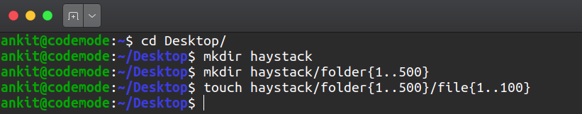<br>
But inside one of those folders at random, we're going to create a file called **_needle.txt_**, and
then we're going to use the `find` command to find the needle in the haystack and move it into our desktop
directory.

Lets create the **_needle.txt_** file in a random folder.<br>
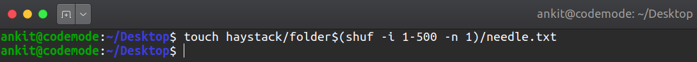

<details>
<summary>
Here's a breakdown of the command:
</summary>

- `touch` is a command that creates an empty file. In this case, it's being used to create the "**needle.txt**" file.
  _haystack/folder_ specifies the path to the "**haystack**" directory, and "**folder**" is the name of a subdirectory within that directory where the "**needle.txt**" file will be created. The exact name of the subdirectory is determined by the output of the `shuf` command, explained below.

- `$(shuf -i 1-500 -n 1)` generates a random number between 1 and 500 (inclusive) using the `shuf` command. This number is used to choose a random subdirectory within the "**folder**" directory to create the "**needle.txt**" file in. The `-i` option specifies the range of numbers to choose from, and the `-n` option specifies that only one number should be generated.

- `/needle.txt` specifies the name of the file that will be created inside the randomly chosen subdirectory.
</details>

Now out of about 50,000 possible files, we're going to find that one **_needle.txt_** file and copy it exactly where we need i.e on the Desktop directory.<br>
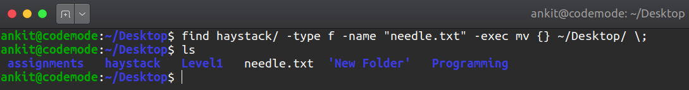

<hr>

<strong>`find` command options that we discussed in this section are :</strong>

1. `-maxdepth`
2. `-name`
3. `-i`
4. `-type`
5. `-size`
6. `-o`
7. `-exec`
8. `-ok`

You can see `man` page of `find` command there are tons of options available in `find` command.

That's all for this section.

<div align="right"><b><a href="#index">↥ Back To Top</a></b></div>

<hr>

<div align ="center">
<h2 id ="view">Viewing Files</h2>
</div>

In this section we will discuss about 5 commands which will help us to read the file, reversing the file,sticking the content together, take a peak on the content inside an file and also how to manipulate their content .

Lets start with first command and that's `cat` command. Well you already see in few examples how `cat` command is used to read files or take input from keyboard.<br>
Well `cat` stands for concatenate which is fancy word for stick together.

Lets understand with an examples. On my Desktop directory I have 5 files.<br>
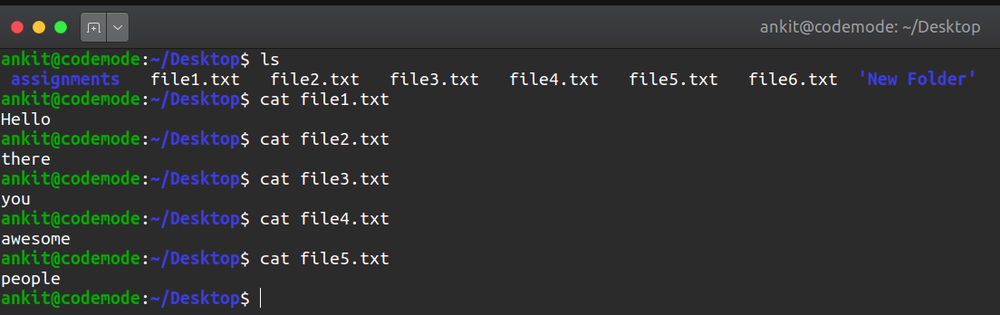<br>
In those 5 files "Hello there you awesome people" text is divided.

Now lets use `cat` command what it is made for, means stick the content together.<br>
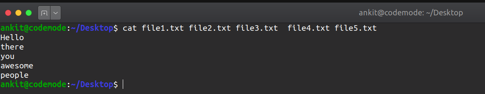<br>
As you can see all the content from each file is stick together then show the result to the standard output stream that is by default our terminal screen.

Now writing each file name is quite tedious task right? Well if you see pattern in file naming then one thing might click in your mind "wildcard". Lets use it now.

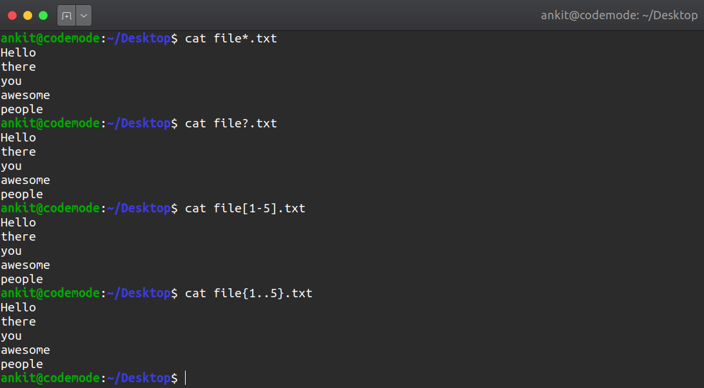<br>
Use any wildcard you like all will give you the same result.

And of course we can redirect this output into another file.<br>
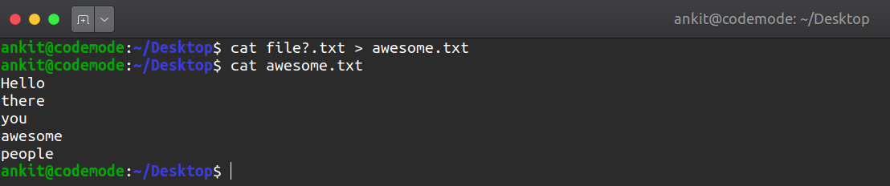

So the `cat` command is basically used to stick the content of multiple files together or read the multiple files.

<br>

<hr>

Now lets see `tac` command, if you see carefully this `tac` command is just spelled backward of `cat` command.<br>
Well the work of `tac` command is also to display content backward too (kind of funny right😂).
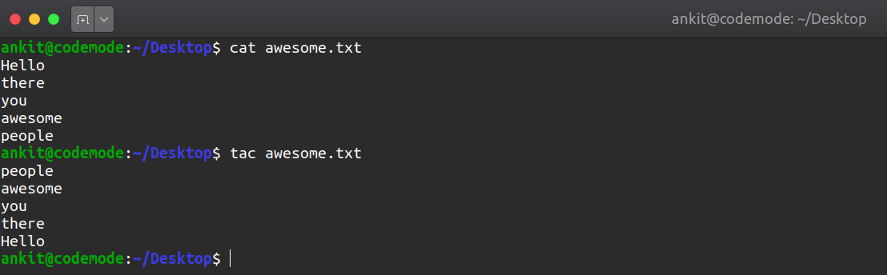<br>
Well the image is self-explanatory, I don't think any further description needed.<br>
`cat` command start reading file from first line.<br>
`tac` command start reading file from last line.<br>
That's the only difference.

<br>

Now lets see `rev` command, the rev command actually reverse the content of each line. Lets apply `rev` on awesome.txt<br>
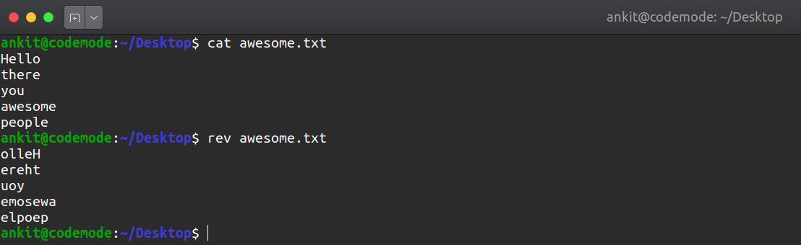<br>
`rev` command reverses the content of each line.

Another example<br>
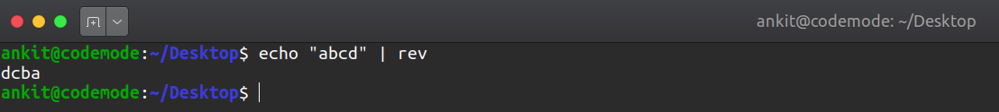<br>
I think by now it is clear now how `rev` command works.

<br>
<hr>

Now, suppose your content inside your file is too long and if you try to read the file with `cat` command it will show the output on your terminal screen by default. And when you scroll through the terminal it may become a hassle to search for the previous command you have used _(this happened with me many time)_.<br>
For these types of problems Linux have pager programs that allow you page through large output to make it easier for you to read. And one of the program I am going to cover in this section is `less` command.

`less` command is an pager program, just like we use `cat` command to read files, we can also use `less` command to read files.

The difference is that `less` command opens the file into different screen, you can navigate the file using upper and downward arrows keys and when you want to quit the screen you can by hitting the <kbd>q</kbd> key which will get back you to your main terminal screen and all the content of the file which is shown by `less` command will not be showing on your terminal screen.

This helps to make your terminal screen more cleaner and don't end up clogging your terminal screen with lots of file contents(basically filing your terminal with lots of file content which may make your screen a mess to search for other things).

Just type `less your_filename` and you will get my point.
<br>

<hr>

Now, sometimes you want to work on some files but before doing operations you just want to take a peek of the first few lines or last few lines content of the file. For this purpose we have two commands `head` & `tail` .

`head` command by default read the first 10 lines of the file.<br>
`tail` command by default read the last 10 lines of the file.

We can edit this behavior by using `-n` option.<br>
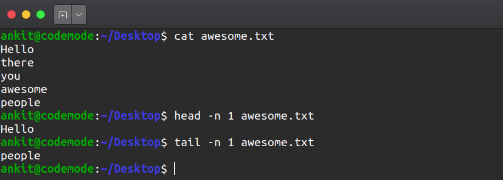

You can also these command in pipeline for example, `find | head -n 5 ` this will list out the files and folders but only first 5 will be shown on the output screen.

But do you know what interesting thing you can do with these two command ? You can also list out a specific line range as a output too.<br>
Let me show you with an example, as you know I have 5 lines in _awesome.txt_ file, now what if I just want the 3rd line i.e **_you_** on the output screen?<br>
This is the solution<br>
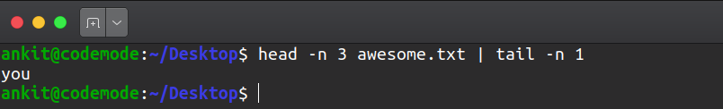<br>

OR

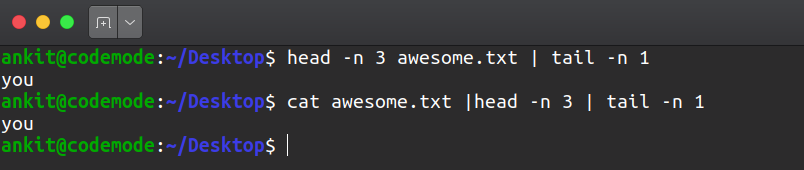<br>
Generated the same result.<br>
So you can see these two commands to cut specific lines. Very useful combination.

<hr>

**5 commands discussed in this section are**

1. `cat`
2. `tac`
3. `rev`
4. `less`
5. `head` & `tail`

<div align="right"><b><a href="#index">↥ Back To Top</a></b></div>

<hr>

<div align ="center">
<h2 id ="sort">Sorting Data</h2>
</div>

Many times we have files which have data but it's not actually sorted which may lead to a lot of time consuming to sort the data manually. To get out of this dilemma we can use `sort` command to sort the data of any file.

- To sort the data alphabetically we use `sort filename` .
- To sort the data alphabetically but in reverse order we use `-r` option like this `sort -r filename`.
- To sort the numerical data we use `-n` option like this `sort -n filename`

- While sorting the data you only want unique values then use `-u` option, for example you want to sort the data numerically but do not want the repeated values then use the `-u` in this way `sort -nu filename`.

You can combine these options as you like, the order of options doesn't matter.

<hr>

You can also sort tabular data using `sort` command `-k` option. <br>
`-k` option is used to sort the data according to the column number you want.<br>
All you need to do is provide key definition for `-k` option.

Lets take an example, I have list out top 20 file name which I will sort.<br>
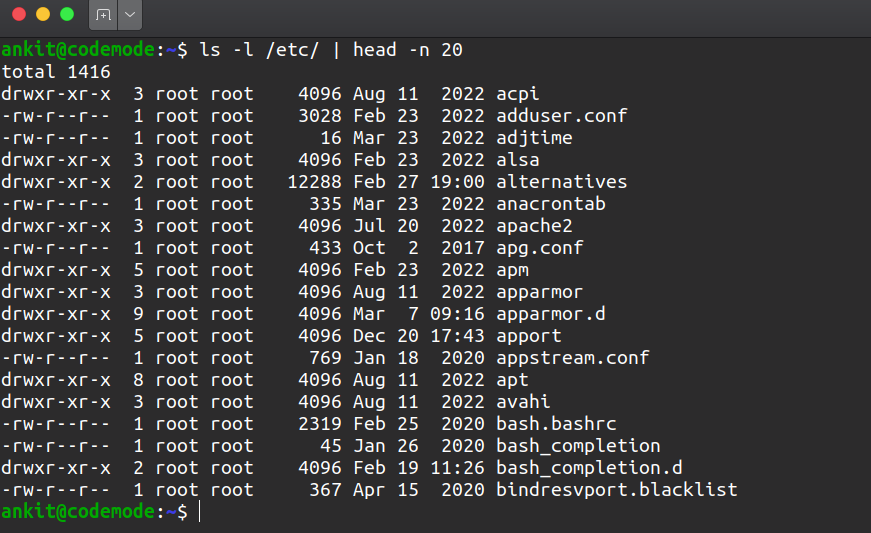

Lets first sort the data according to file size (5th column) in ascending order.<br>
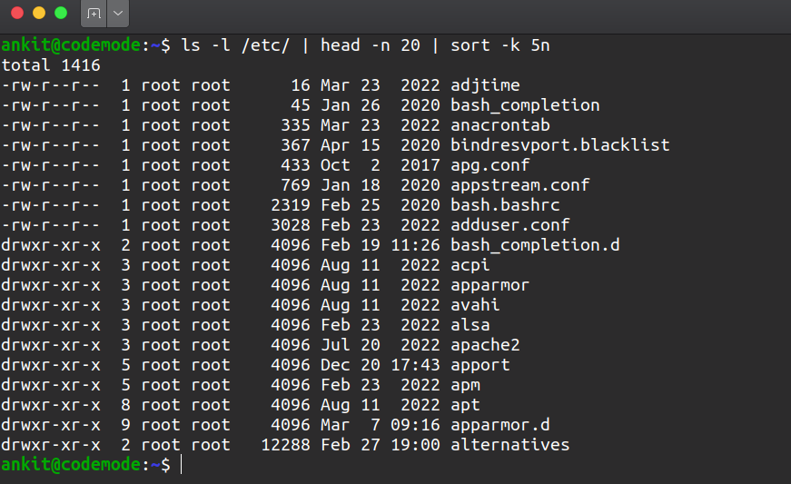<br>
`ls -l /etc/ | head -n 20 | sort -k 5n` the `5n` means sort according to the 5th column and use `-n` option.

Now to reverse it we will use `-r` option like this : `ls -l /etc/ | head -n 20 | sort -k 5nr`

This whole number are not very readable lets use `-h` option with `ls` .<br>
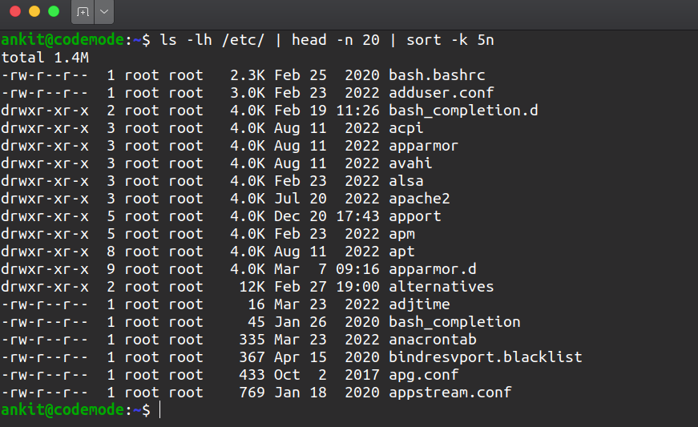<br>
Hmmm 🤨 why my sorting looks weird, it doesn't look like it sorted in ascending order.

Well the reason for that is, for `-n` option,the 5th column is now not a numeric type value anymore.<br>
So to sort this human readable format we use `-h` with `sort` command too.

Like this<br>
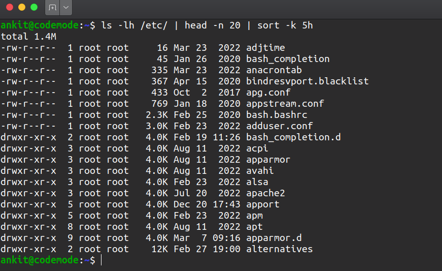<br>

So always use `-h` option to sort human readable data, not `-n` option.
<br>

We can also sort the this table in month wise too by using `-M` option and since we are using `-k` option we do not need to add dash with our column number, means `5h` and `5 -h` will be treated as same in `-k` option.

In month case we will use 6th column with `-M` option. Like this <br>
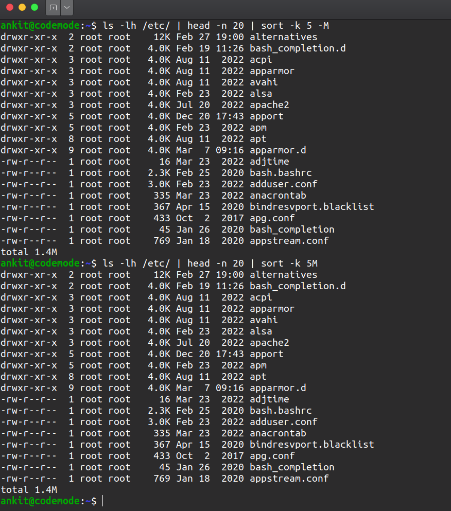

As you can see in the above image<br>
`ls -lh /etc/ | head -n 20 | sort -k 5 -M`<br>
OR<br>
`ls -lh /etc/ | head -n 20 | sort -k 5M`<br>

They both generate the same result.

And of course the order of these options doesn't matter in key definition but `-k` option need to come first always when sorting the table column wise.

<strong>`sort` command options we discussed in this section are : </strong>

1. `-r`
2. `-n`
3. `-u`
4. `-k`
5. `-h`
6. `-M`

<div align="right"><b><a href="#index">↥ Back To Top</a></b></div>

<hr>

<div align="center">
<h2 id="arch">File Archiving + Compression</h2>
</div>

We all know how to make an archive file on GUI mode, right? But do you know how to make an archive on terminal ? Lets discuss it into this section.

> Whatever I am going to explain is going to in terms of linux

**What exactly is archive ?** <br>
Lets understand with it an small example.<br>
You went on a shopping to buy apples and if you want to hold many apples you need an bag to store it right.<br>
Our archive is same thing. All we do is we put files of our choice into a single bag which is called archive (_this is an simple analogy hope you able to understand_).

So when you are archiving and doing compression one thing you need to know about is **tarball**.

**What is tarball ?** <br>
Google search result => A tarball is a set of files packaged together into a single file, then compressed using the gzip compression program. “**Tar**” is short for “tape archive,” which tells you something about how long this particular mode of packaging files has been around.

This definition is more than enough to explain about tarball.

So creating a tarball is way of putting your files into a bag. Simple as it is.<br>
The tarball itself doesn't do any compression, but tar balls can be compressed using compression algorithms.

So archiving files is basically a two step process.

1. You make tarball.
2. You compress the tarball by using any compression algorithm.

Lets get into practical. On my Desktop I have three files.<br>
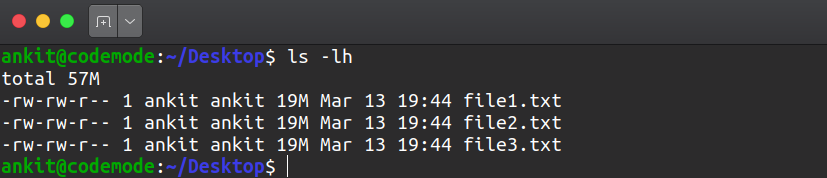<br>
As you can see I have 3 files each file is of 19MB.

Lets make archive of these 3 files <br>
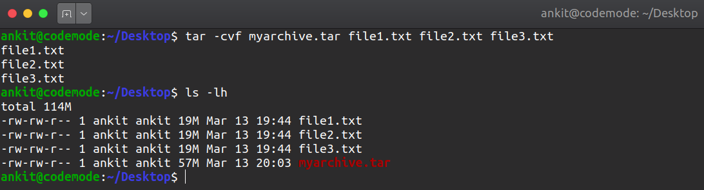<br>
We create tarball with the help of `tar` command.<br>
`tar -cvf myarchive file1.txt file2.txt file3.txt` <br>

The `tar` command structure is `tar -options your_archive_name.tar files_you_wanted_to_add ...`

Well adding _.tar_ extension is an convention, means it is not necessary to put _.tar_ with the archive name but it is an good practice in order to classify files for us humans why I said humans because Linux already know it is an tar file.

Lets create another archive with name **archive2** without adding _.tar_ extension in it.<br>
 <br>
After creating **archive2** I just run the command on bot the tar files and you can see `file` command easily able to find out what type of file it is.

Now, lets talk about `-cvf` options we used

- `-c` means create, this tells the command to create an archive.
- `-v` means verbose, in short meaning, we are telling the command to not stay silent tell me what is going on.
- `-f` means files, this option enables to add files into tar file.

`-c` & `-f` are mandatory to use if we want to create an archive, `-v` is just optional, it is up to you if you want to use it or not.

Let me show you the difference between `-cvf` and `-cf` usage result.<br>
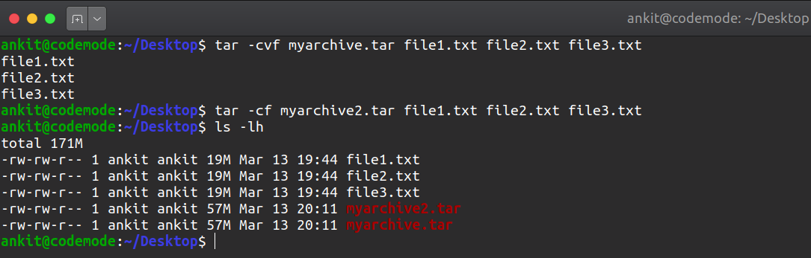<br>
As you can see in the above image when I created **myarchive.tar** it shows me the result of the files that are added inside tar file. But when I created **myarchive2.tar** without using `-v` option I do not get the same result even though my tar file is created.<br>
So by now you get the point of using `-v` option. It's a good practice to use `-cvf` instead of `-cf` .

One thing more just like you can use wildcard in any command, you can do this here too.<br>
`tar -cvf myarchive.tar file*.txt` this will add all the 3 files in my case.<br>
You can use bracket `file[1-3].txt`, brace expansion `file{1..3}.txt`, question mark `file?.txt`, whatever you like.

<br>

Now one thing you need to notice here is each file is 19MB so 3 x 19 = 57MB <br>
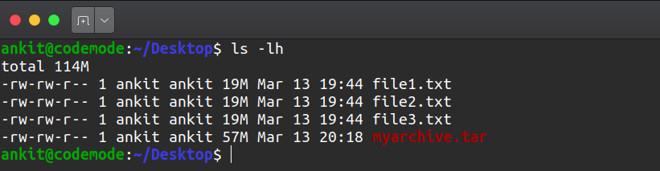<br>
**myarchive.tar** file size and 3 txt files total size are same. The reason is the compression algorithm is not applied yet.

> In some cases the tar file size is more than the total files(that you have added) size, because tar file stores some additional information.Think in this way, when you store many apples inside an bag and weigh them the total weight you will get is not just apples right ? bag weight is also added.<br> This is before compression.

Now, what if you downloaded an archive tar file from and want to look what is inside it, for this purpose we use `-tf` option.<br>
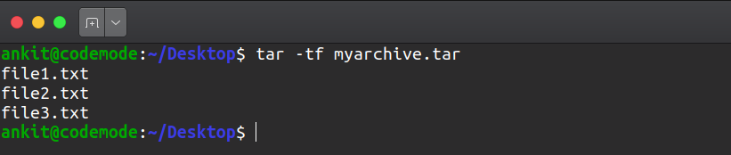<br>
`-t` means test label, basically it lets you check what's inside an tar file.<br>
`-f` means files, this is mandatory to use in order to pass an tar file to the `tar` command.

Now what if you want get the files outside of the tar file ? in normal language I mean <q>unzip</q> the tar file.<br>
For this we use `-xvf` option, `-x` means extract.<br>
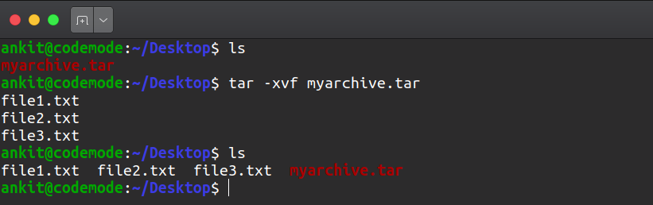<br>
And just like when you extract files from zip file the zip file doesn't go empty, same thing happen with tar file.

<hr>

Now, lets talk about compression algorithms, in this part we will discuss two algorithms:

1. gzip
2. bzip2

The main difference between these two is

- `gzip` much faster than `bzip2`
- `gzip` do less compression than `bzip2`
- `bzip2` make much smaller files than `gzip` but `bzip2` requires more computation power.

Conclusion, `bzip2` is better than `gzip` but it requires more time and computation power than `gzip` that's the only tradeoff.

Lets start with `gzip`.<br>
Command structure `gzip your_tarfilename`

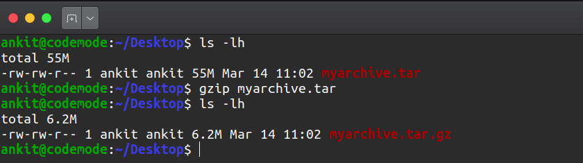<br>
my gzip file is created _.gz_ is the extension.

Now lets run the `ls -lh` and `file` command on this gzip file.<br>
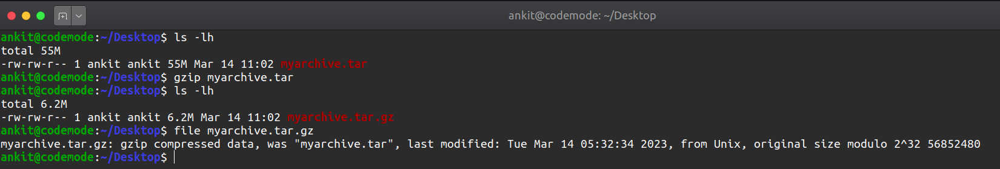<br>
As you can see `file` command is telling us that previously data that this file was an tar file and when it is modified
plus it is also recognized as gzip compressed file as you can see in the starting of the output of `file` command.

Previously, **myarchive.tar** file was 55Mb and now it is 6.2Mb, awesome right.

Now how to get back our tar file ? For that we will use `gunzip`. <br>
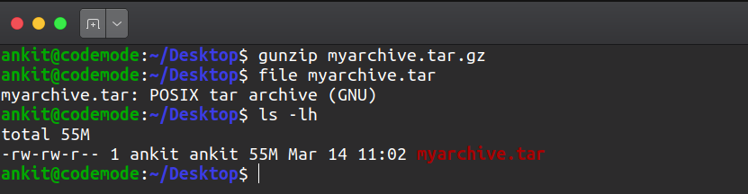<br>

<hr>

Lets look at the `bzip2` command now, usually(not always) `bzip2` command return more compressed file than `gzip` .<br>
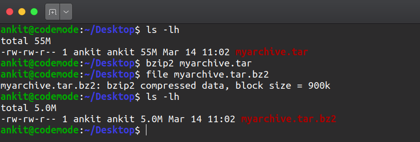<br>
As you can see **myarchive.tar** was 55Mb which is now compressed to 5MB, better than `gzip`.

_.bz2_ is the extension name of `bzip2`.

But you can notice `file` command only tells us that it is an bzip2 compressed file, but our _modified time_ and what this .bz2 file was(means tar file), is gone gone now, because bzip2 removed extra unnecessary information from tar file like what

To unzip _.bz2_ file, we use `bunzip2` .<br>
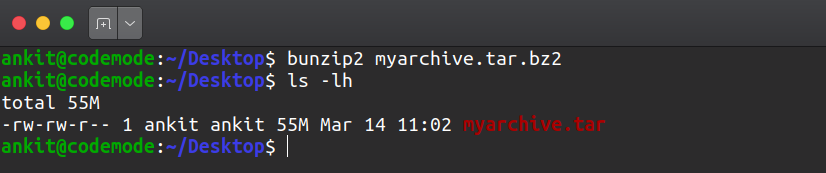<br>

Well there is not much difference you can say on 6.2MB .gz file and 5MB .bz2 file, but you will notice the large difference when you apply these two command on large videos and files.

<hr>

So far we see creating a compressed file is two step process : first create tar file, then apply compression algorithm.

Is there anyway to do all this in one step ?<br>
Well yes, we will use `tar` command's `-z` option for `gzip` and `-j` option for `bzip2` .

What you need to do is instead of using `-cvf` use `-cvzf` for applying `gzip` compression & `-cvjf` for applying `bzip2` compression.<br>
One thing you always need to remember is that when you create your compressed file always add the
_.gz_ or _.bz2_ extension with _.tar_ that's very important.

Example, creating archive and applying gzip compression.<br>
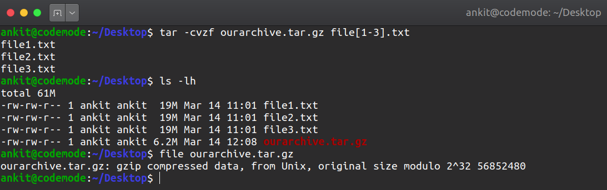<br>

Example, creating archive and applying bzip2 compression.<br>
<br>
And as I said earlier, `bzip2` not always give most compressed file, you can see the result, difference between gz and bz2 file, _.gz_ file size is smaller than _.bz2_ . But one thing I also said previously, apply both these algorithm on big files and you will see the large difference.

Now, decompress these files in one step is also possible ? <br>
Yes, for this we use `-xvzf` for extracting _.gz_ extension compress file and we use `-xvjf` for extracting _.bz2_ extension compress file.

<hr>

💬Now one thing you need to keep in mind is that tar files and these _.gz_ and _.bz2_ compressed files are not supported on **Windows** or **Mac** by default. To unzip or decompress these files you need third party softwares like winrar, 7rar etc.

Well in windows and mac usually **_.zip_** files are supported.<br>
To create zip file in Linux terminal all you need to use is `zip` command.<br>
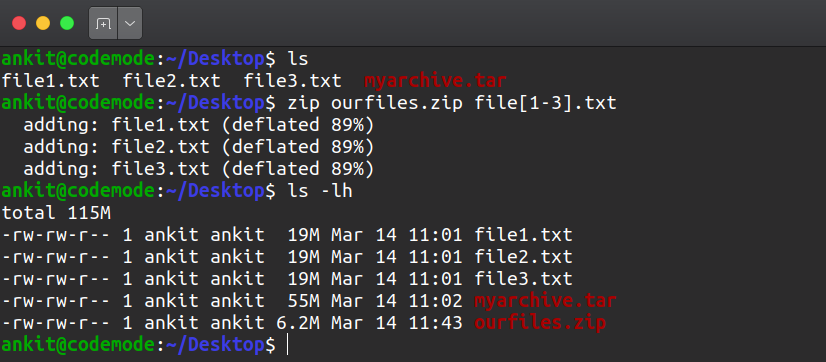<br>
6.2 Mb zip filehmmm, nice.

To unzip we use `unzip` command.

<hr>

`tar` command options we discussed in this section

- `-cvf` to create tar file
- `-tf` to look contents inside an tar file
- `-xvf` to extract content from tar file

Applying compression algorithms in one step

- `-cvzf` & `-xvzf` for gzip, file extension `.tar.gz`
- `-cvjf` & `-xvjf` for bzip2, file extension `.tar.bz2`

`gzip`& `gunzip` | `bzip2` & `bunzip2` | `zip` & `unzip`

Additional info

- `xz` for applying xz algorithm on tar file
- `xz -d` for decompress the file.

Applying xz compression algorithm in one step using `tar`

- `-cvJf` & `-xvJf` for xz, file extension `.tar.xz`

There is another compression algorithm i.e **`xz`** I tried it and I found out that **`xz`** is slightly better than `bzip2` but of course `xz` also takes more computation power than `bzip2`, to know more you can refer to the given below resource.

[📍Blog Post on Comparing Performance of Compression Algorithms](https://www.rootusers.com/gzip-vs-bzip2-vs-xz-performance-comparison/)

That's all for this section.

<div align="right"><b><a href="#index">↥ Back To Top</a></b></div>

<hr>

<h1 id="auto"> Section 3 : Task Automation & Scheduling</h1>
In this section we will learn about bash scripts fundamentals to automate and schedule our tasks .

<br>

<div align ="center">
<h2 id ="script">Creating Bash Scripts</h2>
</div>

To create bash script all you need to do is create an text file.<br>
One thing you always need to keep in mind that bash script file have _.sh_ extension.

To create an bash script you can use any text editor, but since this whole repository is all about to do things inside terminal so in that case I am going to use `nano` which is an command line editor tool.

Lets start with creating an empty **our_script.sh** and pass it to the `file` command.<br>
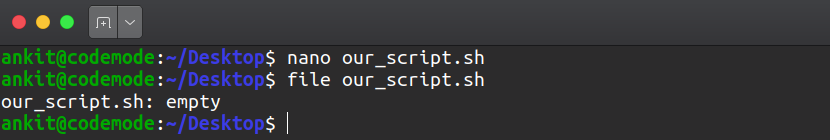<br>
Even though our file have _.sh_ extension it's still just an normal file .

Now the first line which we always need to add inside a bash script file is `#!/bin/bash`

> Interesting thing : `#!` symbol is called **shebang**. <br>
> Google info : In computing, a shebang is the character sequence consisting of the characters number sign and exclamation mark .<br> > `#!` is used to let the shell know that the file isn't a normal text file and that it should be interpreted as code using the interpreter defined in the shebang line.

`/bin/bash` is the path of our bash interpreter.<br>
Lets add this line in our script file, after that print the content of the file with the help of `cat` command and then see the result what does the `file` command now says.<br>
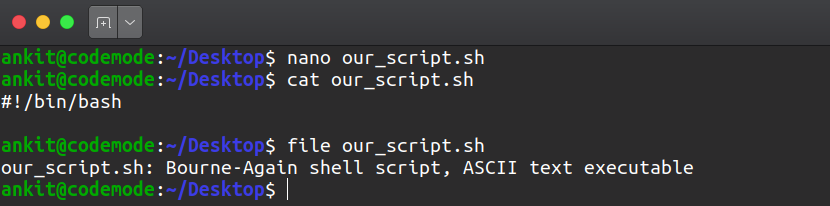<br>
Now it says _Bourne-Again shell script_, short form : **BASH script**

<br>

If you know python you may have heard about scripting with python language. Well lets see how it works.
First I will use `which` command to find my python interpreter path. And then I will add that path inside the script file .<br>
<br>
And you can see now bash script is python script.<br>
There are many programming languages inside which you can do scripting.

But here we will stick to the bash for scripting.

> `which` command is used to know the path (or you can also say location) of any command which exist on your system.

Now lets do some more examples in bash script.<br>
Before that one thing you need to know is to run any bash script in the terminal we need to use `bash script_name.sh` .In the below example you will understand it.<br>
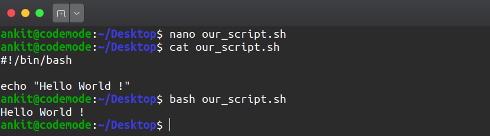<br>
Inside the script I have added `echo "Hello World !"` and then run it with the `bash` command.

We can do anything with script, which was possible to do inside terminal so far without using script.

Lets go one step further and create a directory called "**Magic_Folder**" inside the Desktop and add 100 files inside this newly created folder. And then use `ls` command to list out all those files from the folder and store the output of it into another **information.txt** file. Bunch of tasks right ? Lets bind all these task inside a single script. <br>
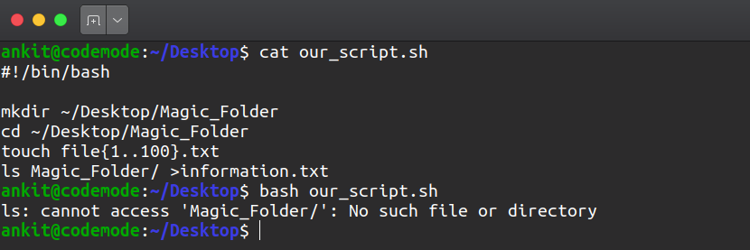<br>
Hmmmm there is one error we got here.

Well the reason is on the 2nd line `cd` changes the directory and get inside the **Magic_Folder** and after that in the 3rd line we created 100 files and in 4th line when we try run `ls` we got an error the reason is currently we are inside **Magic_Folder** so it is not possible to apply `ls` command in this way because inside **Magic_Folder** there is no other folder inside it with same name.

We can fix this in two ways first : just use `ls >information.txt` command and it will run on the current directory which is **Magic_Folder**.<br>
Second way, type whole path : `ls ~/Desktop/Magic_Folder/ >information.txt` and then store it inside information.txt.

But do you notice what will happen to information.txt if we use any of these options. The _information.txt_ will be created inside **Magic_Folder** because of the 2nd line of `cd` command that we used before.
So we need to specify the location of the _information.txt_ file too.

So the best solutions are<br>
First : `ls > ~/Desktop/information.txt` <br>
Second :`ls ~/Desktop/Magic_Folder/ > ~/Desktop/information.txt`

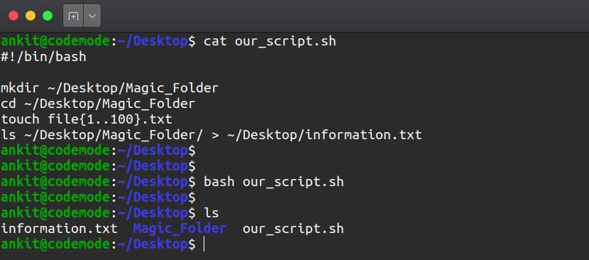<br>
We learn by mistakes right ? so create your own scripts and do tasks that you want to do with script and improve your script again and again whenever you encounter any mistake/error.

<br>

Now lets create a backup script which creates tar file for our chosen backup folders.<br>
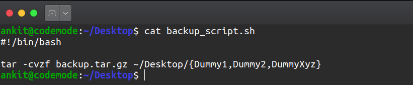<br>

This is one small script I have written inside the **backup_script.sh**. Lets run it and see the result.<br>
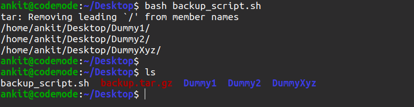<br>
tar File is created now lets remove the `-v` option and then run the file.

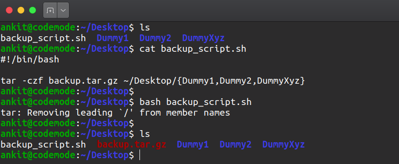<br>
You can see the backup tar file is created but there is still this error is coming _( its not a big thing that you should be concern about, its normal you can ignore it)_.<br>
Now one thing may comes in mind what if I do not want to see this error ? well one way is to redirect this error into an file, but what if I say I do not want to create a file for just an error which is not actually need to fix. There is a solution for this, you redirect the error to `/dev/null`, its a very interesting thing inside linux.

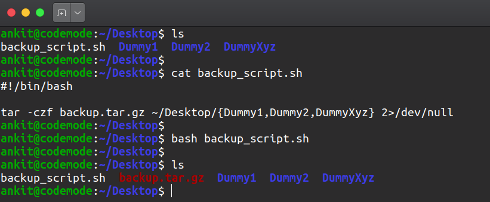<br>
Now the error is also gone from the terminal screen.

<details>

<summary>Explanation of <code>/dev/null</code> by google search</summary>

<br>

In Linux, `/dev/null` is a special file that serves as a "black hole" or a "sink" for data. It is a virtual device file that discards any data written to it and provides no data when read from.

When a program writes data to `/dev/null`, the data is simply discarded without being saved anywhere. This is often used to suppress the output of a command or script that would otherwise print to the console. For example, if you want to run a command but don't want to see the output, you can redirect the output to `/dev/null` like this:
**`command > /dev/null`**

Similarly, if a program needs input but you don't want to provide any, you can use `/dev/null` as a source of input.<br>
For example: **`program < /dev/null`**

Overall, `/dev/null` is a useful tool for discarding data and can be used in a variety of situations where you don't want to save or use the data being generated by a program.

</details>

<hr>

Now so far in this section we have seen how to create bash scripts and run those scripts, but till now we are running our **backup_script.sh** from the desktop directory that's kind of hassle.

What if from any location I can run this script ? Well this is quite interesting thing, after learning this you will know the power of bash scripts.

So the first step I need to do is make an directory called **`bin`** inside your home directory.

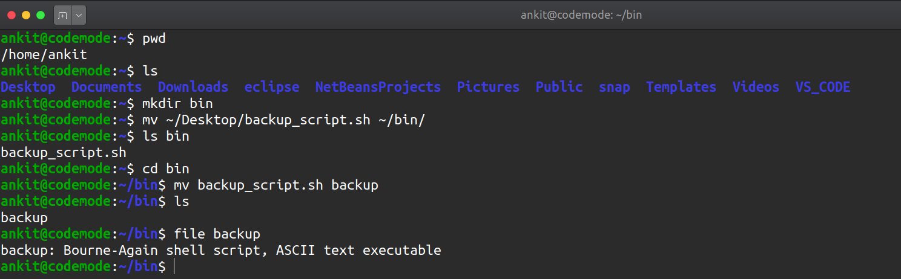

After that I need to move my all shell scripts (means bash scripts in this case) inside this `bin` folder.

Then I will rename my **backup_script.sh** to just **backup**, well extensions doesn't matter much here because OS still going to recognize this file as bash script file and we can also confirm this with `file` command.<br>
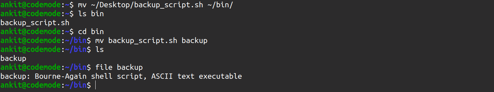<br>

Now I need to turn this **backup** file into an program so that it can run through command line or GUI(by double clicking it).

One way is to do is through GUI : select file -> right click -> select properties -> go inside permission and enable "Allow executing file as program" <br>
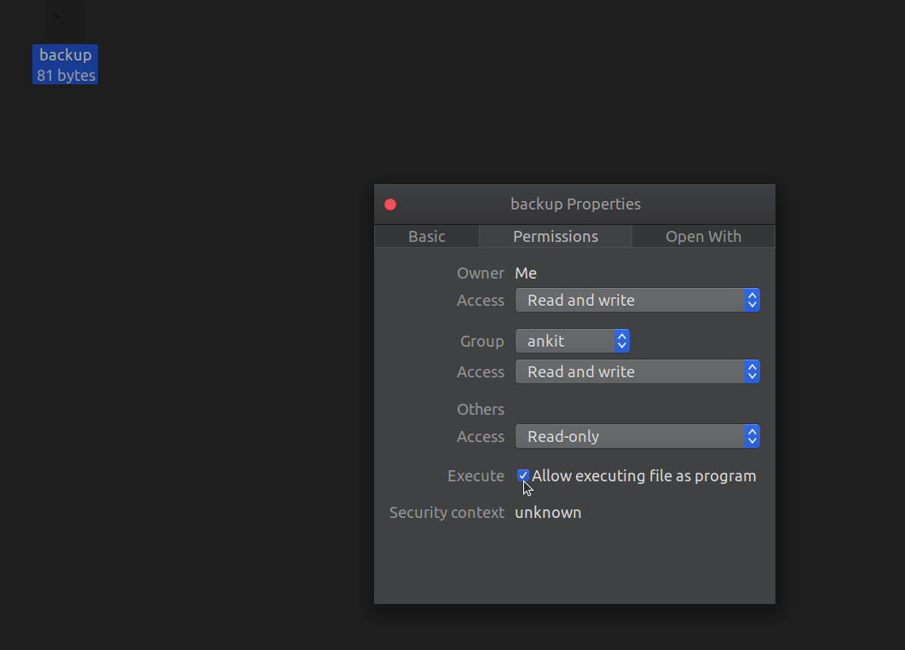<br>

The second way is through terminal by using `chmod` command.<br>
`chmod` stands for change mode : basically it manipulates file permissions like read(r), write(w) & execute(x).

And I am going to give **backup** file execute permission using `chmod`.<br>
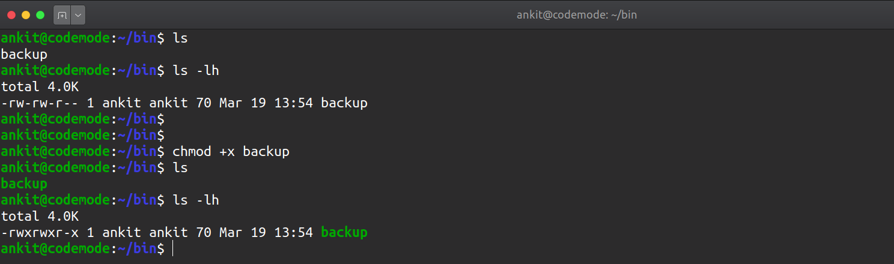<br>

Can you see the difference ?<br>
Before using `chmod` : the file color was white & and there was no execute (x) permission on this.<br>
After using `chmod` : the file color is changed into green and the execute (x) permission added on this file.

By the way this is my **backup** script file.<br>
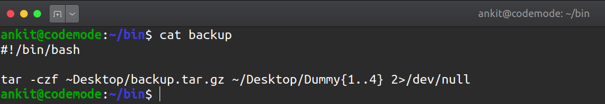<br>
I am saving backup tar file inside Desktop directory.

Now if I run **backup** file lets see what happens.<br>
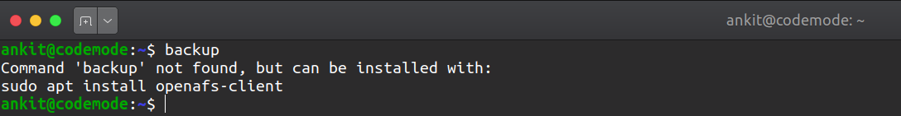<br>
Hmmm we are getting an error, according to shell backup is till now is not recognized as program.

💬Well the reason is : When shell says it cannot find something, that means that something/command/program is not present inside the shell's search path.<br>
So we need to add my recently created **`bin`** inside shell's search path.

To do that, we need to edit **`.bashrc`** file that is currently present inside our home directory(usually it's always there).

After opening the file go all the way down and add this line there : **`PATH="$PATH:$HOME/bin"`** type as it is.
<br>
Save it. Then close the terminal and start new one (this step is must because this helps to refresh the shell and if you do not do it, you will not see the added path).

Now to check if my path is added inside the shell search path I will use `echo` like this : `echo $PATH` this will print out all available paths.<br>
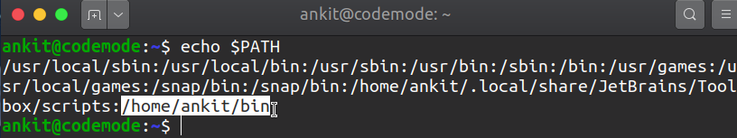<br>
My path is added.

<details>
<summary>Small hack</summary>

To list out all paths in separate line we can use `tr` command
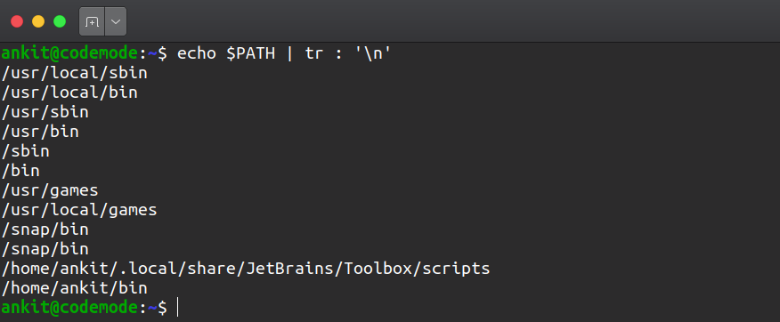<br>
For more info you can refer to bonus section 9th point or use `man tr`

</details>

Now lets run our **backup** script.<br>
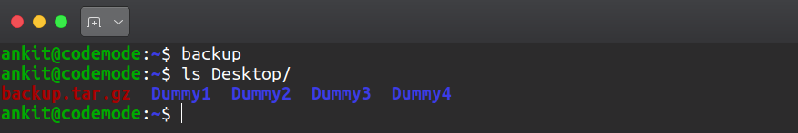<br>
Tada✨ our tar file is created inside the Desktop and I do not need to go inside the **bin** folder first to run this script.

> Since backup is now an program it doesn't need `bash` command

So like this you can create multiple scripts and use `chmod` to make it executable from the command line and it doesn't matter in which directory you are currently in, you can run those scripts from anywhere.

That's the power of 🦾scripts.

Now **aliases** and **script** may look same to you but they have very different usecase. Aliases are good for single line commands, example pipeline. But script can do more stuffs other than aliases, in script we can also use loops and if statements and many more, scripting is like programming, you can do bunch of stuffs with it.

And one more thing is you can schedule your scripts but you cannot do that with aliases.

<div align="right"><b><a href="#index">↥ Back To Top</a></b></div>

<hr>

<div align ="center">
<h2 id ="schedule">Schedule Automation Using cron</h2>
</div>

`cron` is a command line tool which is used to schedule tasks.

> `cron` get its name from greek word **Chronos** which means _time_ .

Each user has what is known as a **`crontab`**, which basically is just a text file, and each
`crontab` lists which commands or scripts will be run automatically by that user.

And it also lists when they will be scheduled to be run.

Now to edit the `crontab` for your user, you just need to open it by using `-e` option which measn edit.

And if you are opening `crontab` for the first time just like me, then the terminal might ask you for which editor do you want to use.<br>
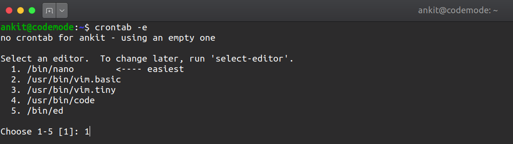<br>
I will go with `nano` and for that I will give 1 and press <kbd>Enter</kbd>

This is how it will look like.<br>
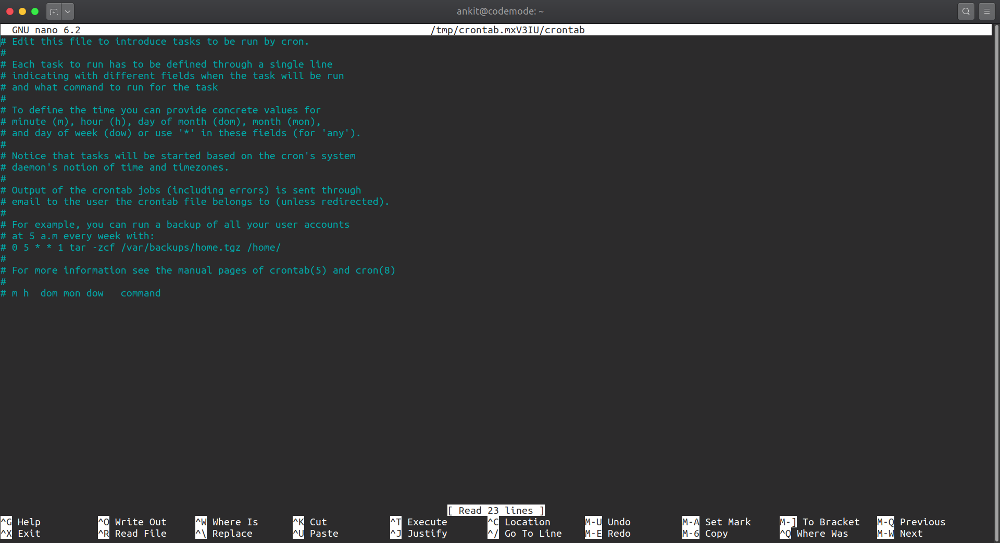<br>
Bunch of pre-written text for us so that we can understand how to use `crontab`.<br>
All these lines are commented out using # symbol that means interpreter not gonna read these lines so it's up to you if you want to keep this or not. For me I will keep that so that I can refer to it whenever I want.

Now comes important part🚨 : Down the bottom, each crontab is broken up into **rows** and one row is for each
command or script that you want to schedule, and each row will have **six columns** and each column is separated by some blank space (_spaces between each column matter here but number of spaces doesn't you can have as many as space you want between two columns_).

So the first **five columns** are scheduling information, and the **final sixth column** is the command or
script to be run at that scheduled time.

So you need to get into the bottom to enter your information.

**Structure that you need to follow** : m h dom mon dow command

```
            	m             h           dom(date of month)     mon(month)      dow(day of week)           command

Allowed	 	0 to 59 min		0 to 23 hr		1 to 28/30/31		  1 to 12			0 to 7	            The command you want to run
parameters												   (First 3 letters     (0 or 7 means sunday
														   to use names)	 first 3 letters use allowed)
```

_For more information refer `man crontab` or use the resource provided at the end of this section_

Now lets do an activity for automation task : I will automate a small task and that is I will print the hello world at each minute doesn't matter the day and month and keep appending it into another file on my desktop.

It is better to show you rather than just talking and talking.

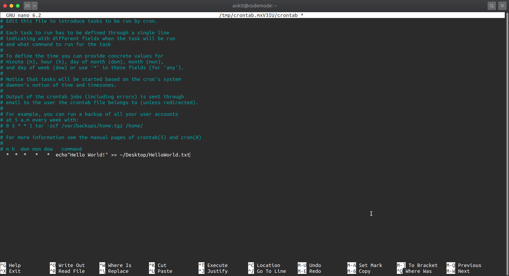<br>
So I used `*` here, it means every time it doesn't matter what is the day, month or time is.

And no this is doesn't mean you can use wildcards in `crontab` it is just the star have a special meaning in this case.

And I will show you the result after 2 minutes.<br>
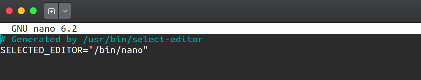<br>
As you can see 2 minutes have passed and the text is keep adding every minute.

You can also change your editor any time you want. One way to do it is open `.select_editor` file on your home directory.<br>
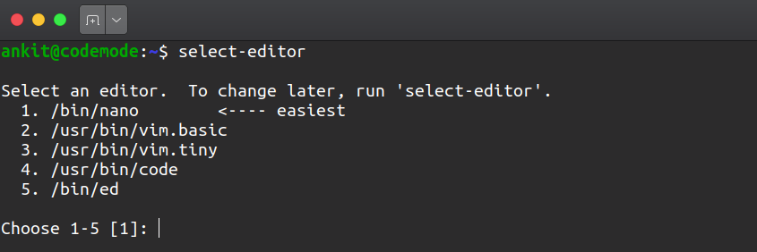<br>
Edit this file, you just need to change the editor path.

Another way is use `select-editor`<br>
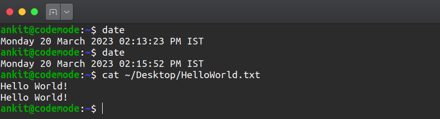<br>
Choose whatever you like,input the value and press <kbd>Enter</kbd> , nowadays vim is famous editor too, you can try that.

<hr>

Now lets do some advance stuffs. And by the way you can add as many rows as you like all will work separately you do not worry about conflicts between which row to first execute.

Suppose you want to store "Hello there" inside an file on every hour's 5min, 15min & 45 min for this we will use commas `,`
like this : `5,15,45   *  *  *  * echo "Hello there" >> ~/Desktop/Hellothere.txt`<br>
Now one thing you need to keep in mind that no spaces is allowed between commas because the whole columns are separated through some spaces and since we want 5,15,45 work as minutes then we need to make sure no space is present between them.

So next thing is what if I want to do the same task but I want to store "Hello there" in every 5 minutes, for that we will use `*/` star and divide symbol together like this : `*/5   *  *  *  * echo "Hello there" >> ~/Desktop/Hellothere.txt`<br>
`*/5` is an single unit, spaces not allowed.

Now I have changed my mind I want to run this command on every 5 minutes every 3 days, that will be a piece of cake now.
All you need to add `*/3` on **dom** column like this : `*/5   *  */3  *  * echo "Hello there" >> ~/Desktop/Hellothere.txt`

And if you want to stop an automation just simply remove that row from the `crontab`.

<br>

Now to schedule and automate our script all we need to do is add our script path where it is present inside the **command** column.

Example : `*/5   *  */3  *  * bash ~/bin/backup`

Since it's an bash script we need to add `bash`.

That's all for this part.

[📍cron resource](https://crontab.guru/)

<div align="right"><b><a href="#index">↥ Back To Top</a></b></div>

<hr>

<h1 id="opensource">Section 4 : Open Source Software</h1>

<div align ="center">
<h2 id ="gnu">History of Linux : The GNU Project</h2>
</div>

When we heard the word "**Linux**", we probably think of a whole operating system that we use as being the Linux operating system, but in reality it's not true. Actually, Linux is just a piece of whole operating system, the **Kernel**.

Let me explain, on 27th September 1983, a person called **Richard Stallman** announced that he was going to begin developing a operating system that was similar to the Unix operating system, but made of entirely free software and the operating system was called the GNU operating system, which stands for **_GNU's Not UNIX_**, which they like to call a recursive acronym.

In January 1984, Richard Stallman quit his job in the artificial intelligence lab at MIT to work on the GNU project full time in the aims of creating an operating system made of completely free software.

Now, the term free software actually refers to several freedoms that the software gives the user rather than being free as in money.<br>
So when you hear the term free software, think "free speech" and not "free lunch".

<inst><u><h3>The 4 freedoms</h3></u></inst>

1. The freedom to run the program as you wish, for any purpose.
2. The freedom to study how the program works and change it so that it does the computing
   as you wish(i.e freedom 1). Access to the source code for a program is a precondition for this.
3. The freedom to redistribute copies of the software so that you can help your neighbor.
4. The freedom to distribute copies of your modified version to others(freedom 3). By doing this you can give the whole community a chance to benefit from your changes. Access to the source code is a precondition for this.

Now there's a license that legally provides a user of software with these freedoms, and it's known
as the new **GNU public license** or the **GPL**.

<br>

In 1991, the GNU system was almost finished. But there was still one part missing from the GNU operating system, and it was an important part.
This final piece is a major part of every operating system, and it's called the _kernel_.

**kernel** is responsible for allocating the resources on the computers hardware that is required
by the software that it's running.

So in other words we can say _kernel_ is the interface layer between a computer's hardware and the applications that it's running.

Now, at this time in 1991, a man called **Linus Torvalds** was completing his MSC thesis at the University of Helsinki in Finland.<br>
And as part of this work, Linus invented a Unix like kernel called Linux, and it was called Linux after his own name.

The reason is everything in the Unix world kind of ends in an x, so Linus ending in an x is Linux.

And after being invited by a fellow student to go see a talk by Richard Stallman, Linus released the Linux kernel under the version two of the new public license or GPL, thereby making the Linux kernel free software in 1991.

So thanks to the Linux kernel, the new operating system was complete and was a fully reasonable operating system made of entirely free software.

And it's in fact the Linux kernel that is used today on on Android devices and even Chrome OS.<br>
So if you ever hear people say, <q>oh, Android runs a Linux or Chrome OS runs Linux</q>,<br>
what they mean is they use the Linux kernel to interface between the software layer and the hardware layer of your
computer.

<br>

But because the Linux kernel was the final piece, it kind of got a whole lot of attention and the rest
of the work that went into the GNU operating system was kind of forgotten.

But because what we run when we run a distribution like Ubuntu or any other Linux distribution is
actually the GNU operating system and the Linux kernel.

It is recommended that in order to give the new project its credit, instead of just calling the whole
thing Linux,<br>
we should call it <q>**GNU + Linux Operating System**</q>.<br>
Because when you download Ubuntu or when you download any other type of Linux distribution, what you're
actually downloading is a version of the GNU plus Linux operating system.

So henceforth we won't just call it Linux, we'll call it the **GNU Linux operating system**.

And in fact, there is a command called the `uname` command that will actually tell you lots of information
about your computer, such as what hardware it has and what operating system that it's running.

So if you run `uname -o` command it will tell you about your operating system.<br>
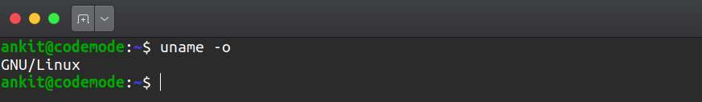<br>

So with that history, understood.<br>
We now know pretty much all of the commands that we've used so far in this whole documentation, such as the `ls` command
and the `find` command and so on, are all part of the GNU project.

And to give the users the freedoms that free software provides, the source code needs to be available
to read because access to the source code is a precondition for those freedoms, right?<br>
So in other words, the software must be open source.

So how can we have a look at the code that our OS runs?<br>
Well, it's actually all freely accessible on the GNU project's official website : [gnu.org](https://www.gnu.org/)

Go to the website => click on **Software** section => scroll down and look at the **All GNU packages** section.

There's basically links to every bit of code that is run on a GNU system, including a free software version of the Linux kernel itself, which we can find under the _linux-libre_ package. That's the full downloadable folder that contains all of the source code for the Linux kernel itself and that's pretty awesome.

And all the commands that are used so far in this course like `ls`, `find`,`mkdir` etc. are inside **coreutils** package.

<hr>
One of software that has openly accessible source code, it is known as open source software.
So you can say that free software is open source, but not all software or I can say not all open source software
is free software.

Because even people might let you see the source code, that doesn't mean they necessarily give you
the freedoms required to modify and distribute it.<br>
They might just let you see the source code.

But the free software does required to be an open source software(means source code is publicly accessible + 4 freedoms also included under GNU public license).<br>
So it works one way, but not the other.

<div align="right"><b><a href="#index">↥ Back To Top</a></b></div>

<hr>

<div align ="center">
<h2 id ="compile">Compiling Software from Open Source Code</h2>
<h4>Modifying and installing from source code</h4>
</div>

So for this section we are using **[coreutils](https://www.gnu.org/software/coreutils/)** package. After opening the link click on the download link that's available on the page, I choose the _viaHTTPS_ option you can use whatever option you like.

After clicking on the download link we redirected to the page where all versions of coreutils package are available.

Scroll down and download the <q>_coretutils-8.32.tar.xz_</q> file (you can try other version if you want).

As can you see the downloaded file is an compressed archive which we need to decompress first before using it.

We will use `tar` command `-J` option (not `-j`🙅‍♂️ option, `-j` option is for _.bz2_ type archive files).

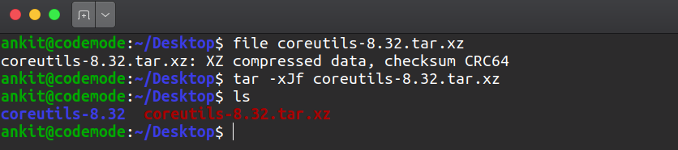<br>

There are bunch of files and directories inside coreutils package
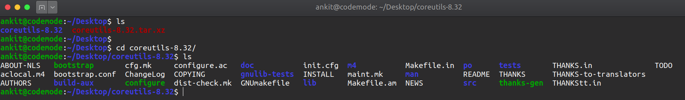<br>

but for now we will focus on **src** directory(shortcut word of Source) , this is where source code is available.
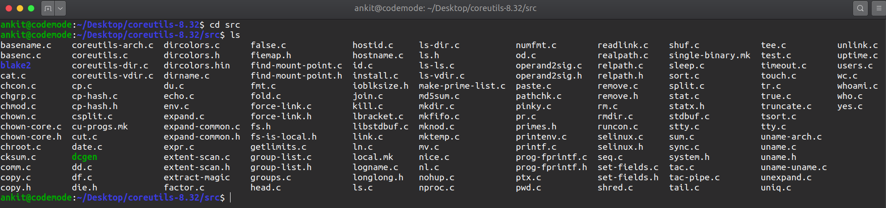<br>
And you can see almost all programs are written in C programming language which is very common language to written new softwares in, given the date when it was written in 1980s, 1990s (just an example).

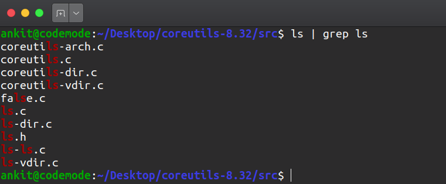<br>
You can checkout `ls` command using nano edior (just in case you do not know what `grep` is refer this [link](https://www.geeksforgeeks.org/grep-command-in-unixlinux/))<br>
And you can read all the code.

Lets do a small tweak in `ls` command. Since it is written in C language, it does have a entry point(you cannot have multiple main functions because you cannot have multiple entry points simple as it is) which is called **main** function. So I will add a print statement <q>Hello there you awesome people !</q> inside this **main** function and whenever I will use the `ls` command this statement will also be printed.

It is a very long file so we will use <kbd><kbd>CTRl</kbd> + <kbd>W</kbd></kbd> and search for "main" .

After that we will add our print statement `printf("Hello there you awesome people !\n");` (`\n` because we want to print it on the next line)<br>
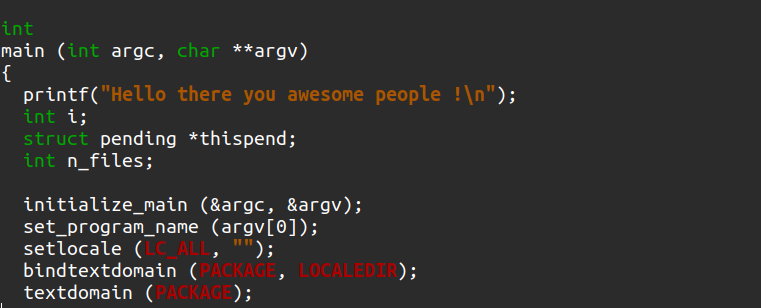<br>
Save it. Then compile it to make it work. SInce it is written in C we need C language compiler.

Now the **GNU C Compiler** or shortform GCC which is used in GNU Linux system. <br>
Well usually by default comes during installation of GNU Linux OS.

To check it just type `gcc` in your terminal and you will get `gcc: fatal error: no input filescompilation terminated.` that's the sign that gcc is installed on your system so no worries.

Just in case it is not present you can easily download it via command line and internet access.<br>
Installation:

```
sudo apt install gcc
```

Now because different computers have different architectures, we need to configure the installation of this code to our specific machine. And there's a script that is comes with that called **configure**.

Lets go inside coreutils package<br>
<br>
You can see **configure** file with green color and the reason is because it's an script and to run an script we use bash.<br>

```bash
bash configure
```

this might take few seconds or minutes depend upon your machine.<br>
And what this is doing is it's configuring the GNU C compiler, the GCC, to make sure that when
it compiles all the software that we tell it to, it's going to do it in a way that's appropriate
for our computer's architecture.

And the important thing that this configure script does besides configuring the GNU C Compiler is that
it creates a new file called the **Makefile**.<br>
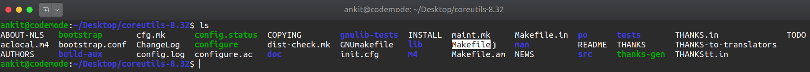<br>

Now the Makefile is responsible for the installation of this new software package, but to make the

Makefile work, we need a new command called **make**.

```
sudo apt install make
```

So we are in current directory that is **coreutils-8.32** run the make command by just typing it and press the Enter and all the source code will be compiled including our modified `ls.c` too.<br>
Now one thing you need to understand that till now we only just converted the C programs to MACHINE CODE they aren't installed yet so to install it we again use the make command like this

```
sudo make install
```

Close the terminal and start new one . This is important.

And we are done.<br>
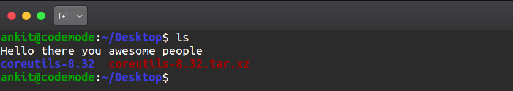<br>
Hooray! for open source and free software.

<br>

Now to undo the changes all we need to do is remove that printf statement and run the `make` and `sudo make install` both and that's all. You can also run write both command in single line `make && sudo make install`. <br>
While executing this command make sure you are inside your coreutils folder for me it is **~/Desktop/coreutils-8.32/**<br>
And yes you do not need to run **configure** script again and again. You need to execute it once.

So hopefully you can see how having open source free software running on your computer is a great asset.<br>
And also you can appreciate the effort that the pioneers of such a system took to build it.

But the process that we went through in this video is relatively lengthy, and sometimes you just want to install software and get on with what you were doing.

So for this, there are massive bodies of maintained and pre compiled code in, that are known as the **software repositories**.

<div align="right"><b><a href="#index">↥ Back To Top</a></b></div>

<hr>

<div align ="center">
<h2 id ="repo">Software Repositories</h2>
</div>

So the first thing we need to know is **what a software repository is ?**

So think of a software repository as a big library filled with software.

Now, when you go to a library, you can search for books, you can read about the books, you can look
at different versions of the books, and you can compare which books that you might want to borrow and
then check them out at the library.

And a software repository is like a library, except you don't have to give the software back.

And even better, when a new version of the software comes along, you can automatically update that
piece of software and all the software on your entire system to the new versions that are available with a simple command.

And this helps keep your system secure and reliable.

In Ubuntu there are **four different repositories** and each repository stores a different type of software
and they are described on the main website of Ubuntu which is a ubuntu.com also you can refer this [link](https://help.ubuntu.com/community/Repositories/Ubuntu) for detail information on these 4 repositories.

The four main repositories are:

1. Main - Canonical-supported free and open-source software.

2. Universe - Community-maintained free and open-source software.

3. Restricted - Proprietary drivers for devices.

4. Multiverse - Software restricted by copyright or legal issues.

> Canonical is the company who created Ubuntu.

**Main** repository is the main repository that contains the software that is supported by Canonical and it is the default repository that is enabled when you install Ubuntu.

**Universe** repository contains the software that is maintained by the community and not by Canonical.

**Restricted** and **Multiverse** repository contains the software that is not free and may or may not be an open source.

Sometimes people like to only use open source software while some fine with using non-free software. Ubuntu leaves that choice up to you. So if you want to use only open source software then you can disable the **Restricted** and **Multiverse** repository.

But unlike Ubuntu there are other distributions of Linux like **Fedora** which only includes free and open source software in their repositories.

[packages.ubuntu.com](https://packages.ubuntu.com/), here you will find all the package lists of every version of Ubuntu. And you can check any version you like.

The code name will change for every new release of Ubuntu in alphabetic order. The current LTS(Long Term Support) version of Ubuntu is 22.04 **Jammy Jellyfish** .

And you can also see the code name of your distribution by using this `lsb_release -a` command.<br>
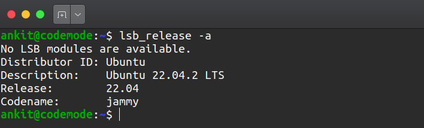<br>

Now lets go inside the **Jammy Jellyfish** version.<br>
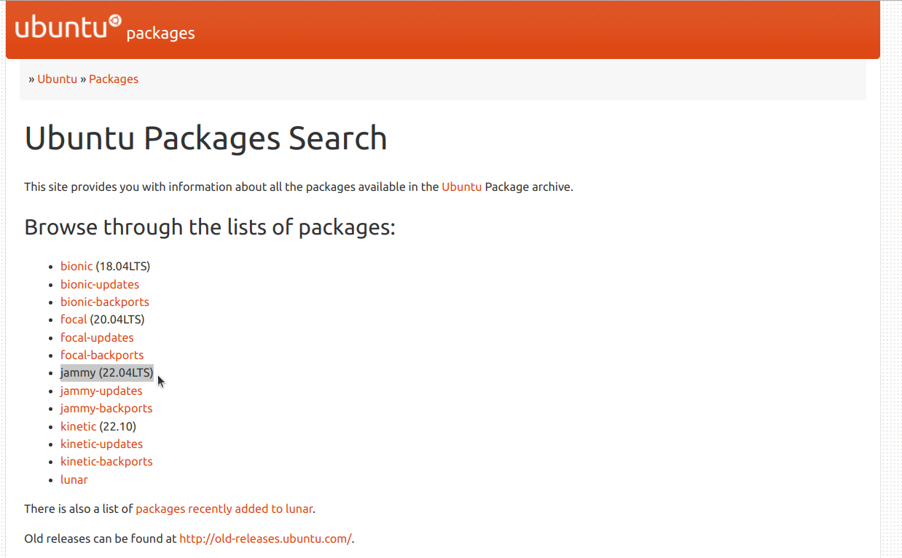<br>

After going inside, scroll to the bottom and click on the **All packages**<br>
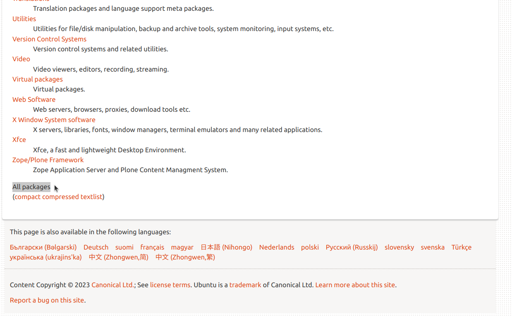<br>

Inside that you will see all the 4 repositories packages. And how can you differentiate between these repositories packages ?<br>
By looking at the square brackets.<br>
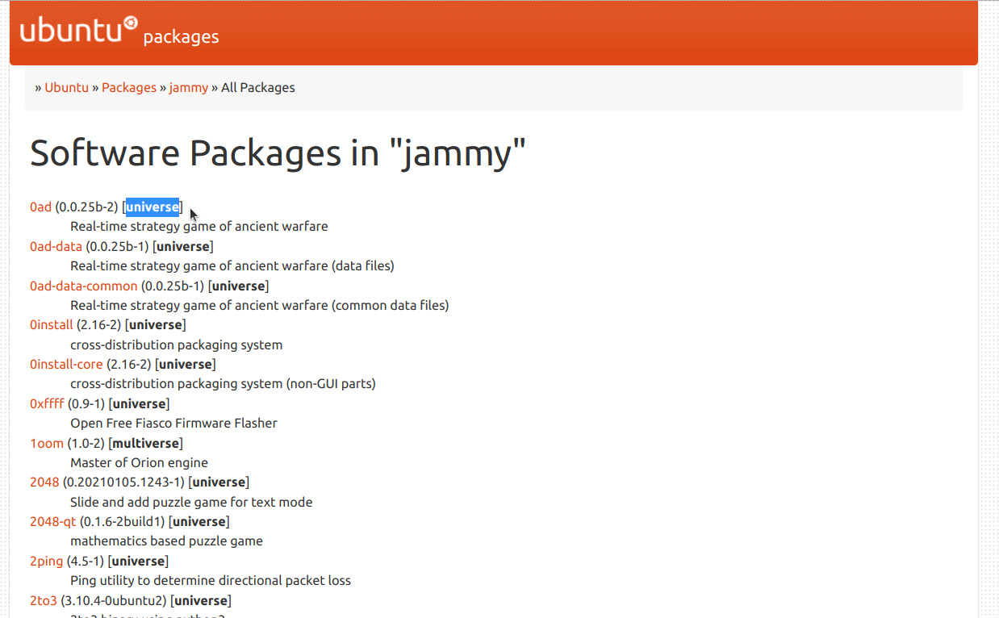<br>
Inside the square of every package the repository name will be given to which that package belong.

One thing more is **Main** repository packages do not have these brackets an all.<br>
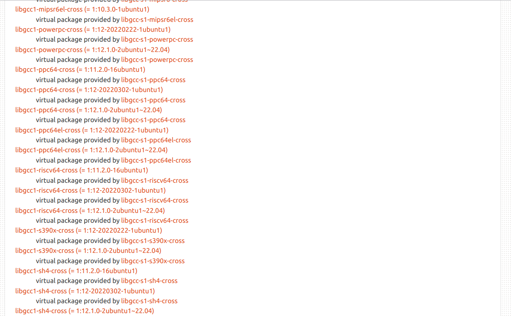<br>
As you can see these packages do not have any square brackets. These all packages are part of **Main** repository which is maintained by Canonical company developers.

In short, every package will have it's parent repository name inside square brackets except for **Main** repository packages.

Lets open a package, I will choose the first one and that's is `0ad (0.0.25b-2) [universe]` and see what is inside it.<br>
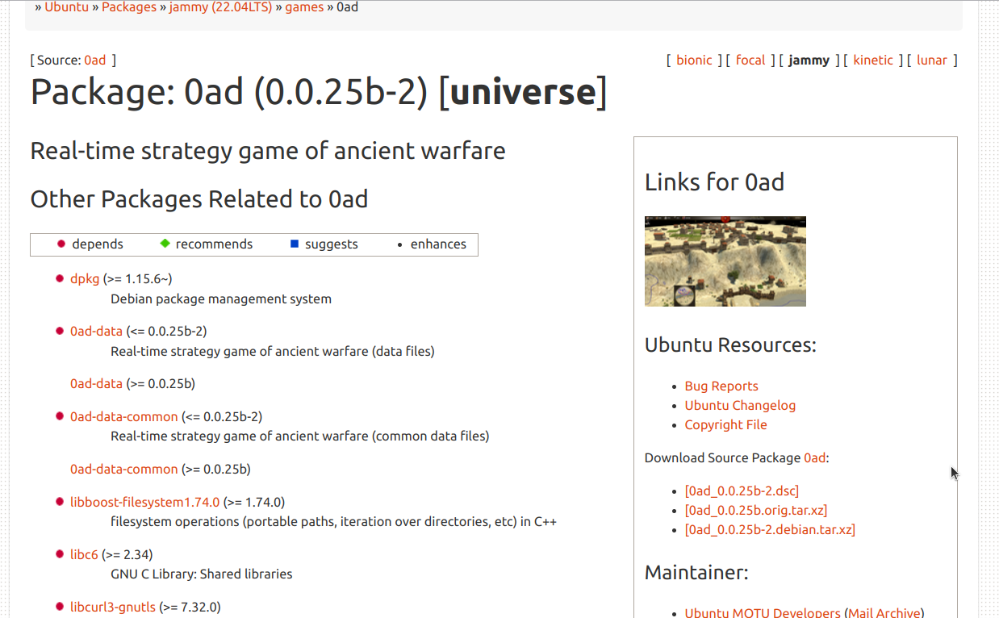<br>

As you can see there are some extra other packages like packages with red 🔴 dot before them. Those are dependencies which we need to first install if we want to run this `0ad` package. And you can see there are other symbols too like recommends,suggestions and enhances.

Well all other 3 are up to us if we want to use those extra packages or not but red ones means depends we must need to first install them if we want to run this `0ad` .

Means you need to first install them and also need to check those dependencies package's version . You need to do all of this just to run this single package. <br>
And most likely every package has other related packages which we need to install first to run our desired package.<br>
Sounds like so much trouble right ?<br>
That's why we have package manager tools like **apt** (in Ubuntu) to handle all of this work so that we can happily do our main work without worrying about all those dependencies installation, correct version number and so many other things.

We will discuss about **apt** in next section.

> Just in case you want to know the architecture of your machine use this command `uname -m` on your terminal and one thing more **amd64** and **x86_64** they both are 64-bit architecture its just they uses different compiler. You can read it more on internet.

That's all for this section.

<div align="right"><b><a href="#index">↥ Back To Top</a></b></div>

<hr>

<div align ="center">
<h2 id ="apt">The apt cache</h2>
</div>

Now package manager is different from distribution to distribution, but on Ubuntu, the package manager
is called **apt**, which stands for "Advanced Packaging Tool".

Now, probably one of the most confusing things for new users of a GNU Linux operating system is understanding
how to get new software.<br>

Now on other operating systems like Windows or Mac every time you want to install a piece of software, you probably just used to download an executable file from the specific software site you want,
opening that executing file by double click,<br>
<br>
hitting next, next, next, next
and a lot of times avoiding reading terms and conditions, but agreeing anyway and celebrating internally
when your new software is installed.
<br>

In Linux ecosystem :<br>

<br>
In Linux it works a bit of a different way.<br>
I mean, you still celebrate internally when the software is installed, but you tend to install it in a way that is much more integrated, standardized, secure and scalable that is possible with the operating systems.

But to get those benefits from using a package manager, we first need to let go of our preconceptions from Windows and Mac and actually get a solid understanding of what is going on in Linux package management because it's not the same at all, but it is a lot better.

**Some features of package manager**:

1. You can search for packages using apt.
2. It uses caching to speed up the performance.

We know there are lots of packages out there in the repositories and to search for them we use package manager(of course this is not the only way).

<br>

Lets start using **apt**, for now we will be searching for packages which will help us working with Microsoft word files.

Now Microsoft Word files have conventionally had the extension`.docx`, so let's find all the packages that are relevant to the text docx.

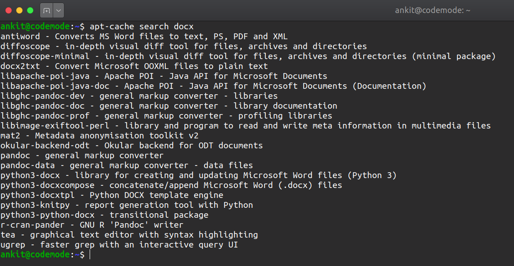

we get a few results back with one package per line and we see that for each package we get the name
of the package on the left and then on the right we get a short description about that package.

Now what if we want to look into any one specific package. For that we will use `apt-cache show packagename` <br>
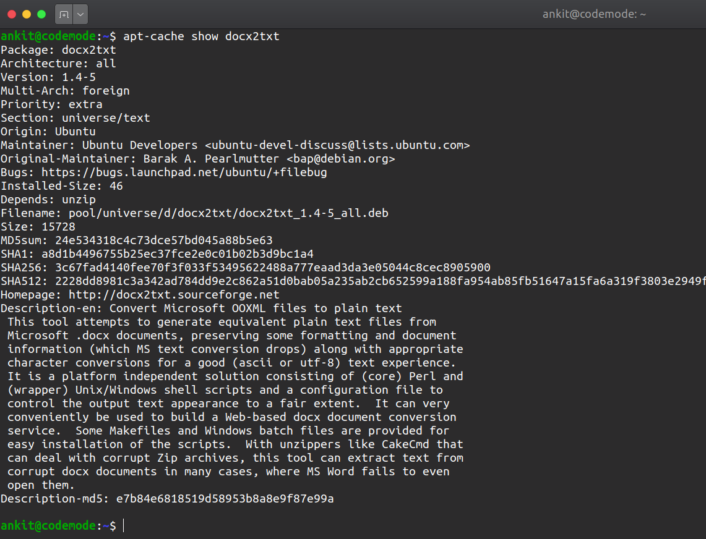

As you can see we got some information related to that specific package.

The use of cache here is to store all the package information in your local system to make the search efficient. So even if you are not connected to internet you can still search for the packages but one thing we need to keep in mind is that these packages would not be up to date so for that we need internet connection.

The default location of cache folder where packages info is stored : `/var/lib/apt/lists/`

The lists of packages that are available inside this folder are from the server which I choose to use, means they are not really installed it's just the information of packages.

<div align="right"><b><a href="#index">↥ Back To Top</a></b></div>

<hr>

<div align ="center">
<h2 id ="updatecache">Updating the cache & Upgrading Software</h2>
</div>

Linux is all about **Open Source** and it also promotes to use open source softwares for daily life utilities. <br>
And anyone can collaborate in these open source softwares and these are the reasons we get so many versions and updates because of large community contribution, awesome right ?

<br>

This is where challenge begin as the new versions coming there is also a possibility that the software needs new dependencies to make it work for our OS, managing and keeping track of these updates will be a nightmare for sure.<br>
That's why we use package manager to automate all of these tedious tasks.

The only thing we need to do is update the cache of our packages using a simple command
```
sudo apt-get update
```
This  will update the cache of our packages and this will tell us the new updates if available. Before executing this command make sure to enable internet because this will fetch the data from the server and update the packages.

After doing this all we need to do is
```
sudo apt-get upgrade
```
This will install all updates and you are done.

>The reason we are using `sudo` here because we are doing some serious changes inside our system.

Updating the cache and installing all the updates is two step process and that's it nothing else.

And if you want to search for any software we use `apt-cache` with `search` option. <br>
For example: <br>
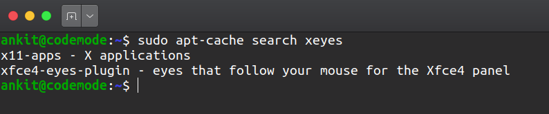<br>

> **NOTE :** `search` option only works with `apt-cache` or `apt` it do not work with `apt-get` 
<div align="right"><b><a href="#index">↥ Back To Top</a></b></div>

<hr>

<ins><h3><u>Small Info</u></h3></ins>

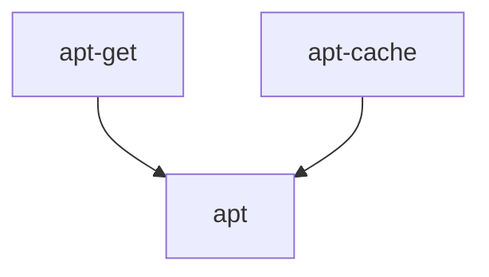
```mermaid
graph TD;
	A[apt-get]-->C[apt]
	B[apt-cache]-->C
```

```
The "apt" command has actually been available in Debian and Ubuntu since version 1.0 was released in 2014.
However, the use of "apt-get" and "apt-cache" has continued to be recommended until recently.

Starting from Ubuntu 16.04 LTS (Xenial Xerus) and Debian 9 (Stretch), the "apt" command has been recommended as the 
new command-line package management tool and is the successor to "apt-get" and "apt-cache". While "apt-get" and 
"apt-cache" are still available and work as expected, they are considered to be deprecated in favor of the "apt" command.

It's worth noting that while "apt" has some advantages over its predecessors, there are still some use cases 
where "apt-get" and "apt-cache" may be preferred. 
For example, some users may prefer the output format of "apt-get" or "apt-cache", 
or may need to use options or features that are not yet available in "apt".
```

<div align="right"><b><a href="#index">↥ Back To Top</a></b></div>

<hr>


<div align ="center">
<h2 id ="install-software">Installing Software</h2>
</div>

To install a software we follow this syntax
```
sudo apt install <package name>
```
Example
```
sudo apt install x11-apps
```
x11-apps contains many interesting mini softwares. Some of them are `xeyes` and `xman`. 

All these softwares are pre compiled binary files, all we need to do is just execute them whenever we want.

<hr>

Now if you want the source code of the software so that you can do some changes and run those changes.

First you need to install another package i.e `dpkg-dev`
```
sudo apt install dpkg-dev
```
`dpkg-dev` contains a series of development tools required to unpack, build and upload Debian source packages. These include: dpkg-source packs and unpacks the source files of a Debian package.

Now the second thing is we need to enable the source code repositories in order to download them and for that we need to do some changes inside `sources.list` file which is present at this path in our system : `/etc/apt/sources.list`
```
sudo nano /etc/apt/sources.list
```
Inside this file we will remove the `#` from `deb-src` (basically we are uncommenting so that we can use those repos).
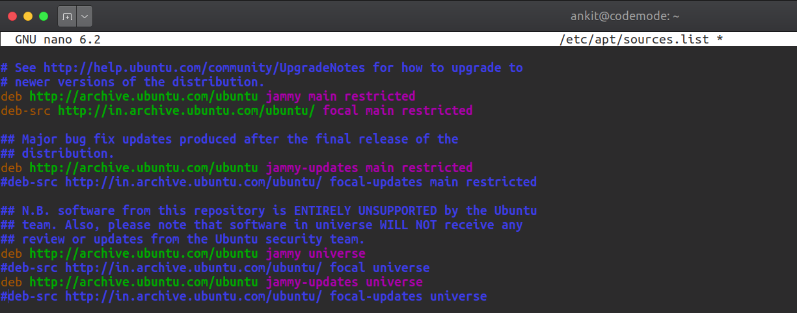<br>
After this we need to update our cache in order to download the source code.
```
sudo apt update
```

After this we can download the source code of the packages.

For example

```
sudo apt source x11-apps
```

After this you can do all the changes you want. For example if I want to check `xeyes` software:
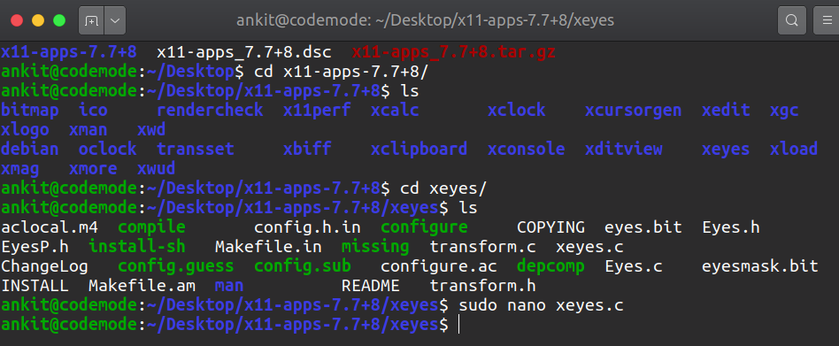<br>

If I want to change anything I will just write it inside `xeyes.c` file and then compile it to make it run the way I want it to do.

That's all.

But one thing I want to remind you that software that installed manually, the `apt` package manager will stop tracking those softwares. That means after this `apt` will not be responsible for further updates.

<br>

[📍Information about sources.list](https://help.ubuntu.com/community/Repositories/CommandLine)


<div align="right"><b><a href="#index">↥ Back To Top</a></b></div>

<hr>


<div align ="center">
<h2 id ="uninstall-software">Uninstalling Software</h2>
</div>


So far we know how to install softwares, but what about uninstall ? 

You do not want to keep those unused dependencies and packages residing on your system just eating up your space. 

So to remove packages there are multiple ways.

First way to remove packages is by using `remove`.<br>
For example

```
sudo apt remove x11-apps
```

What it will do is that this command will remove the package in my case it will be *x11-apps*.

But there is an issue with this way of removing packages and that is this will only remove the x11-apps and not configuration file related to that package.

>This way is useful in case you want to again install the software and want to keep the settings.

So to overcome this problem we use `purge`
```
sudo apt purge x11-apps
```
What it will do is it will remove all the files related to our package.

<hr>

But as we know there might be tens hundreds of dependencies that came during the installation of the package which no longer needed on our system because we uninstalled it using `purge` or the newer version of that software do not need those dependency any more.<br>
So how to remove those dangling dependencies that are no longer required ?

> dependencies : packages that are installed in order to make the software work.

For this case we use `autoremove`
```
sudo apt autoremove
```

What this does is it will remove all the dependencies which is no longer needed. This will free up a lot of your space.

<hr>

Now whenever we install a package the local copy of that package is also get stored in our system.

What exactly happens is that when we run install command with the package name that we want. Package manager first download that package in compressed archive and then unpack that archive and install the software present inside it.<br>
And because of this two step process the compressed archive of the software still exists on our system.

In our file system usually they stored at this file path `/var/cache/apt/archives/`

You can check it using `cd` command.
```
cd /var/cache/apt/archives
```

You can delete all those archives using `clean` command.
```
sudo apt clean
```
This will delete all those archives.


Just in case you wan to delete only those packages(archives) that is no longer downloadable from the repositories then you can use `autoclean` instead of `clean` .
```
sudo apt autoclean
```


**Conclusion :**
- `remove` : only remove the package not configuration files related to that package.
- `purge` : remove all the files related to the package.
- `autoremove`: remove all the unused dependencies.
- `clean`: remove all the archives
- `autoclean`: remove only those archives that are no longer downloadable.

<div align ="center">
<h3><ins><h3><u>\~~ That's THE END of the Course ~~\</u></h3></ins>
<br>
</div>


<div align="right"><b><a href="#index">↥ Back To Top</a></b></div>

<hr>


<div align ="center">
<h2 id ="bonus">A Small Bonus</h2>
<ins><h3><u>Commands that I found useful/fun</u></h3></ins>
</div>

Whenever I will find a command (not part of course) useful I will add it here.

1. `xdg-open` : Ever thought of "**I want to open file manager (GUI) by using terminal**" this is the solution. This command open file manager through terminal.<br>
   Usecase :

   - `xdg-open .`When you hit the command the current directory where you are in your terminal that current directory will then open inside the file manager (this is my favorite❤️).

   - `xdg-open ~/Downloads/` This will open Downloads folder inside file manager.
   - You can also open links directly through terminal e.g. `xdg-open https://google.com` this link will be opened on your system bydefault browser.

     1.1. Recently found out that we can do the same things with `open` command too. Try using it.

<br>

2. `tree` : This command list out all the directories and subdirectories files of any parent directory on which you run this command, in a tree format.

<br>

3. `ls directoryname/ | wc -l` Ever wanted to count the number of files of any specific type this is one way to do that. We will use `ls` and `wc` command and pipe them together.<br>
   E.g. If I want to count the txt files in my Documents directory then I will do like this<br>
   `ls ~/Documents/*.txt | wc -l` <br>
   There are many other ways to count the number of files .

   <details>
   <summary><span style="color:#CC66CC;">One Another way that I found on internet👀</span></summary>
   <br>

   The `wc -l` command counts the number of lines in the output from the `ls` command, so it is possible that it could miscount the number of files if there are any special characters in the filenames.
   A more reliable way to count the number of files with a particular extension would be to use the `find` command instead of `ls`, like this:

   `find /path/to/directory -type f -name "*.txt" | wc -l`
   This command will recursively search for all regular files (excluding directories and other non-regular files) with the _.txt_ extension in the specified directory and its subdirectories, and then it will pass the result to `wc -l` to count the number of lines which also means number of files found in this case.

   The **`-type f`** option specifies that we are searching for regular files, and the **`-name "*.txt"`** option specifies that we are searching for files with the .txt extension.

   Using `find` instead of `ls` can provide a more accurate count of the number of files because it searches for files based on their attributes rather than just listing them based on their name.

   <em>The above solution may not look new to you if you already know or read the `find command` section which is already discussed in the <a href="#find">find command section</a> the only thing is when I was writing about this command in this bonus section I wasn't familiar with `find` command and also I had no idea that this `find` command section is already exist in the course, so you can say 3rd point is not part of bonus. I don't know why I am explaining that to you,peace :)</em>
   </details>

4. Ever confused while reading `man` pages ? I do a lot, there is a good alternative I got and that is `tldr` command, this
   command is much better because it provides examples which you will not see in `man` pages.<br>
   Installation : `sudo apt install tldr` after installation done enter this command in terminal `tldr -u` this will update the tldr database.<br>
   There are multiple alternatives of man command is available [check this link](https://ostechnix.com/3-good-alternatives-man-pages-every-linux-user-know/)
   <br>
   <br>
   `tldr-py` read a little about it on internet not very useful for me but may be it will be for you.

<br>

5. `vnstat` : this command is used to monitor your traffic and provide statistics like your daily, monthly usage.

   Installation : `sudo apt install vnstat`<br>
   Just type `vnstat` and press <kbd>↩️Enter</kbd> in command line and you will see all the network interfaces stats.<br>
   If you want to see any specific network stats then use `-i` option : `vnstat -i your_network_name` and this will show the specific network stats.

   Just in case if your **vnstat** do not work.<br>
   Check the status with the help of `systemctl` command : `systemctl status vnstat` if this gives output as **inactive**.<br>
   Then type `systemctl start vnstat` this will start your service.
   <br>
   <br>
   If you want the stats of vnstat in a picture you can use `vnstati` this is totally different command so you need to install it : <br>`sudo apt install vnstati`<br>
   After installing type this command`vnstati -d -s -i wlp4s0 -o daily.png` and this will generate an png image with all the stats

   - `-d` for days
   - `-s` for summary
   - `-i` for iface : select interface
   - `-o` output

   By the way wlp4s0 is my network interface name through which I am accessing internet. In your case it may be different.

   <br>

6. `cloc` : cloc stands for Count Lines Of Code.<br>
   If you want to count the number of lines of code that you have written so far, this is one command that you need.<br>
   Example, `cloc codefilename` OR `cloc foldername` <br>
   You can run cloc command on a single file or on your whole folder no issue with that, this command will tell you lines of code count, comments count, blank lines count all of this in one line of command. Quite useful.

<br>

7. `expr` : Expression command helps you do the basic maths related tasks on the terminal
   Example,`expr 3 + 5`
    <details><summary> Operations you can do with expr </summary>
      
     ```
      ARG1 | ARG2       ARG1 if it is neither null nor 0, otherwise ARG2
      ARG1 & ARG2       ARG1 if neither argument is null or 0, otherwise 0
     
      ARG1 < ARG2       ARG1 is less than ARG2
      ARG1 <= ARG2      ARG1 is less than or equal to ARG2
      ARG1 = ARG2       ARG1 is equal to ARG2
      ARG1 != ARG2      ARG1 is unequal to ARG2
      ARG1 >= ARG2      ARG1 is greater than or equal to ARG2
      ARG1 > ARG2       ARG1 is greater than ARG2
      
      ARG1 + ARG2       arithmetic sum of ARG1 and ARG2
      ARG1 - ARG2       arithmetic difference of ARG1 and ARG2
     
      ARG1 * ARG2       arithmetic product of ARG1 and ARG2
      ARG1 / ARG2       arithmetic quotient of ARG1 divided by ARG2
      ARG1 % ARG2       arithmetic remainder of ARG1 divided by ARG2
     ```
   </details>

   check manual page for for more info.

   <br>

8. `du` :Disk Usage command can be used if you wanted to check any folder size.<br>
   use `-h` option to make the output format more human readable (if you want to see the file size in kb,mb,gb then use this).<br>
   use `-s` option if you just want to know the total size of the folder only.<br>
   If you want to know the all folders size that is currently inside a folder then you can just use `du -h foldername` and you will get the all folders size.

<br>

9. `tr` : stands for "translate" or "transliterate". It is used to replace or delete specific characters in a text stream. The basic syntax of the tr command is: `tr [options] set1 set2`<br>
   Here, set1 specifies the set of characters to be replaced, and set2 specifies the corresponding set of replacement characters. The tr command reads input from either a file or standard input (stdin), transforms it according to the specified character sets, and writes the transformed output to standard output (stdout).

   Here are some examples of how to use the `tr` command:<br>

   1. To replace all occurrences of the character 'a' with the character 'b' in a file named file.txt,<br>
      you can use the following command: `tr 'a' 'b' < file.txt`

   2. To delete all occurrences of the character 'a' in a file named file.txt,<br>
      you can use the following command: `tr -d 'a' < file.txt`

   3. To replace all occurrences of a set of characters with a corresponding set of replacement characters,<br>
      you can use the following command:`tr 'abc' 'xyz' < file.txt`

   4. To convert all lowercase characters in a file to uppercase,<br>
      you can use the following command: `tr '[:lower:]' '[:upper:]' < file.txt`

<br>

<div align="right"><b><a href="#index">↥ Back To Top</a></b></div>
